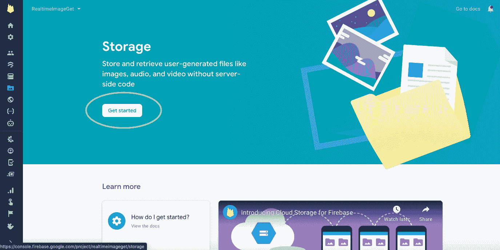
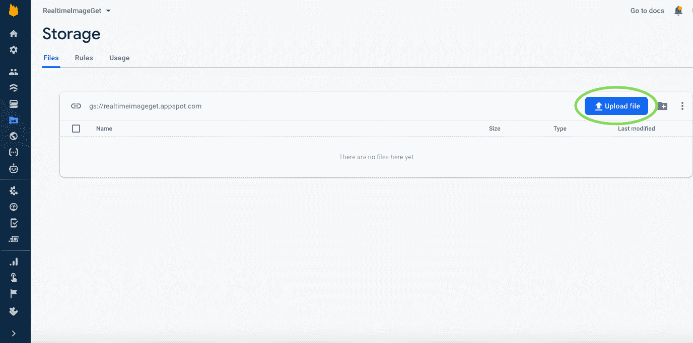
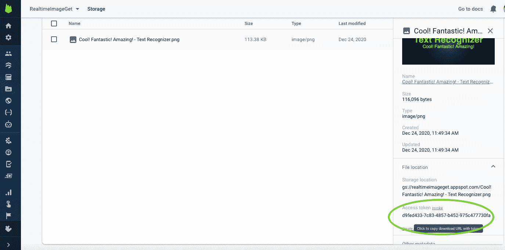
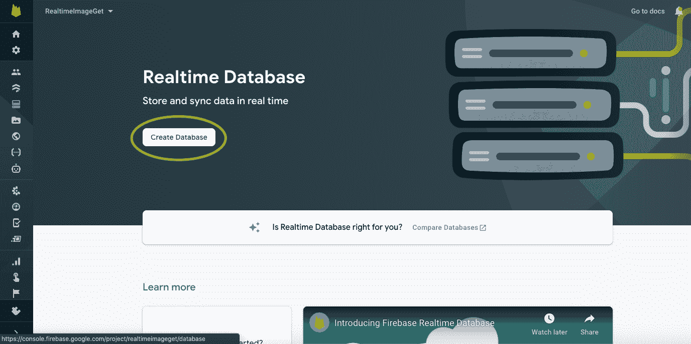
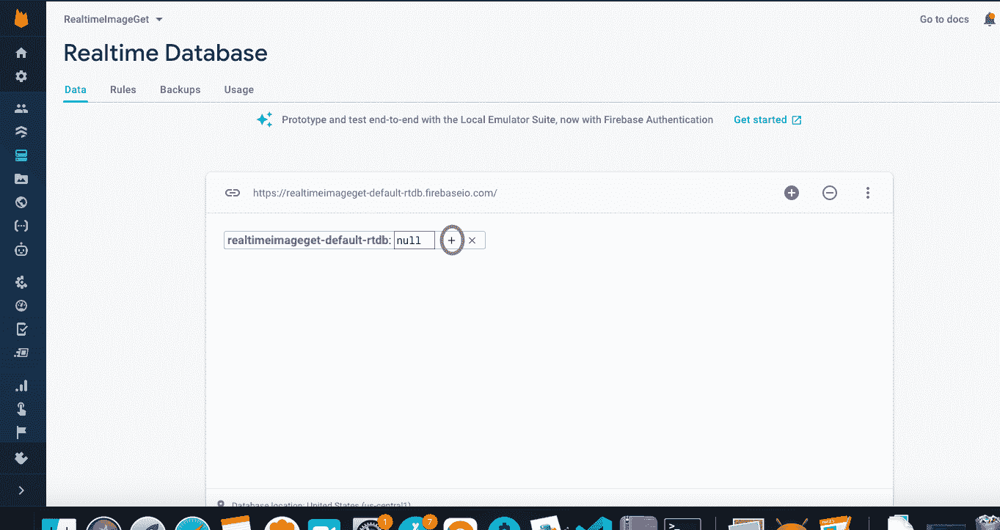
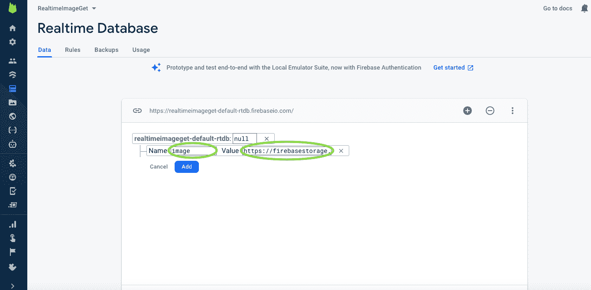
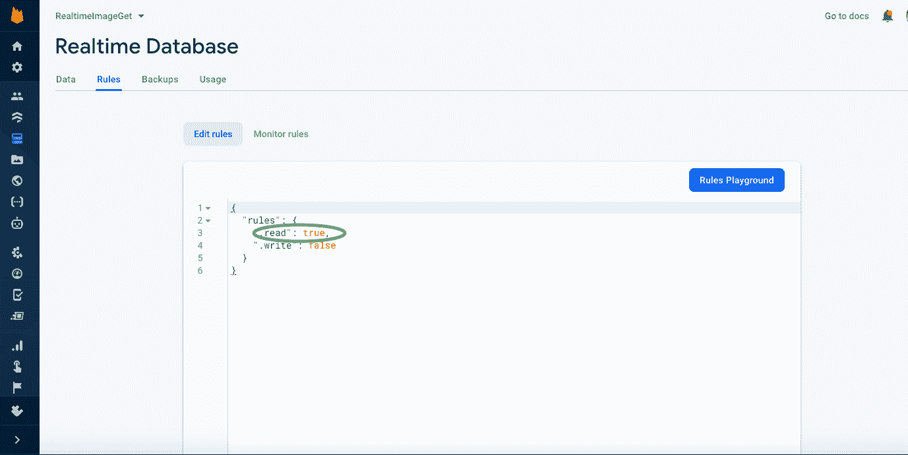

# 如何在安卓系统中实时从 Firebase 中检索图像？

> 原文:[https://www . geeksforgeeks . org/如何从 android 实时 firebase 中检索图像/](https://www.geeksforgeeks.org/how-to-retrieve-image-from-firebase-in-realtime-in-android/)

当我们创建一个安卓应用程序时，我们希望从互联网上获取图片，而不是手动插入图片，通过这个过程，应用程序的大小将变得更小。所以，使用 [firebase](https://www.geeksforgeeks.org/adding-firebase-to-android-app/) 我们可以做到这一点。我们可以创建我们的存储桶，我们可以在那里插入我们的图像，并直接进入我们的应用程序。但是，如果我们想改变那个图像，而不是那个图像，我们想插入新的图像，那么为了做到这一点，我们必须在我们的代码中做改变，但是我们的解决方案来了，我们可以在我们的应用程序中使用实时数据库实时获得那个图像，然后我们可以从 firebase 改变那个图像，并且在实时中，我们的应用程序图像也将改变，我们不必在我们的代码中做改变。注意，我们将使用 **Java** 语言来实现这个项目。

## **实时从 Firebase 中检索图像的步骤**

**第一步:创建新项目**

要在安卓工作室创建新项目，请参考[如何在安卓工作室创建/启动新项目](https://www.geeksforgeeks.org/android-how-to-create-start-a-new-project-in-android-studio/)。注意选择 **Java** 作为编程语言。

**第二步:将你的应用连接到 firebase**

在 android studio 中，转到最顶部栏中的**工具**选项，然后单击 firebase 选项，然后单击连接到 firebase 按钮。请参考了解[如何将应用程序连接到 firebase](https://www.geeksforgeeks.org/adding-firebase-to-android-app/) 。

**第三步:添加依赖项构建. gradle(模块:app)**

导航到**渐变脚本>构建.渐变(模块:应用)**，并在依赖项部分添加以下依赖项。

> 实现' com . Google . firebase:firebase-数据库:19.6.0 '
> 
> 实现' com.squareup .毕加索:毕加索:2.71828 '

现在从**右上角选项同步项目，现在同步**。

**第四步:在 AndroidManifest.xml 文件**中添加互联网权限

导航到 **AndroidManifest.xml** 文件，并添加以下权限，以便在应用程序中获得互联网权限。

**第五步:在 firebase 存储上添加图像，并复制该图像的链接**

在 firebase 中，转到存储选项，然后单击开始按钮



之后，点击上传文件选项，在 firebase 存储中插入一个图像。



之后，点击插入的图像，然后图像细节出现在右侧部分，然后点击访问令牌并复制图像网址。



**第 6 步:将图像网址添加到实时数据库**

转到实时数据库选项，然后单击创建数据库按钮。



单击“入门”按钮后，选择数据库安全规则的“锁定模式”选项。之后，单击+选项为数据库创建一个子节点。



在该名称之后，添加该子节点并在值部分插入图像 URL，然后单击添加按钮。



然后转到规则部分，因为我们在锁定模式下创建了这个数据库，但是我们必须在应用程序中读取该数据库。在规则部分，转到读取部分行，并将该行从 false 更改为 true。



**第 7 步:使用 activity_main.xml 和 MainActivity.java 文件**

转到 **activity_main.xml** 和**MainActivity.java**文件，参考以下代码。下面是 **activity.main.xml** 和**MainActivity.java**文件的代码。

## 可扩展标记语言

```java
<?xml version="1.0" encoding="utf-8"?>
<LinearLayout 
    xmlns:android="http://schemas.android.com/apk/res/android"
    xmlns:tools="http://schemas.android.com/tools"
    android:layout_width="match_parent"
    android:layout_height="match_parent"
    android:orientation="vertical"
    tools:context=".MainActivity">

    <!-- we are using ImageView for displaying image-->
    <ImageView
        android:id="@+id/rImage"
        android:layout_width="match_parent"
        android:layout_height="wrap_content"
        android:layout_marginTop="20dp" />

</LinearLayout>
```

## Java 语言(一种计算机语言，尤用于创建网站)

```java
import android.os.Bundle;
import android.widget.ImageView;
import android.widget.Toast;

import androidx.annotation.NonNull;
import androidx.appcompat.app.AppCompatActivity;

import com.google.firebase.database.DataSnapshot;
import com.google.firebase.database.DatabaseError;
import com.google.firebase.database.DatabaseReference;
import com.google.firebase.database.FirebaseDatabase;
import com.google.firebase.database.ValueEventListener;
import com.squareup.picasso.Picasso;

public class MainActivity extends AppCompatActivity {

    // Initializing the ImageView
    ImageView rImage;

    @Override
    protected void onCreate(Bundle savedInstanceState) {
        super.onCreate(savedInstanceState);
        setContentView(R.layout.activity_main);

        // getting ImageView by its id
        rImage = findViewById(R.id.rImage);

        // we will get the default FirebaseDatabase instance
        FirebaseDatabase firebaseDatabase = FirebaseDatabase.getInstance();

        // we will get a DatabaseReference for the database root node
        DatabaseReference databaseReference = firebaseDatabase.getReference();

        // Here "image" is the child node value we are getting 
        // child node data in the getImage variable
        DatabaseReference getImage = databaseReference.child("image");

        // Adding listener for a single change 
        // in the data at this location.
        // this listener will triggered once 
        // with the value of the data at the location 
        getImage.addListenerForSingleValueEvent(new ValueEventListener() {
            @Override
            public void onDataChange(@NonNull DataSnapshot dataSnapshot) {
                // getting a DataSnapshot for the location at the specified
                // relative path and getting in the link variable
                String link = dataSnapshot.getValue(String.class);

                // loading that data into rImage 
                // variable which is ImageView
                Picasso.get().load(link).into(rImage);
            }

            // this will called when any problem
            // occurs in getting data
            @Override
            public void onCancelled(@NonNull DatabaseError databaseError) {
                // we are showing that error message in toast
                Toast.makeText(MainActivity.this, "Error Loading Image", Toast.LENGTH_SHORT).show();
            }
        });
    }
}
```

### 输出:

<video class="wp-video-shortcode" id="video-533053-1" width="640" height="360" preload="metadata" controls=""><source type="video/mp4" src="https://media.geeksforgeeks.org/wp-content/uploads/20201224140814/output.mp4?_=1">[https://media.geeksforgeeks.org/wp-content/uploads/20201224140814/output.mp4](https://media.geeksforgeeks.org/wp-content/uploads/20201224140814/output.mp4)</video>