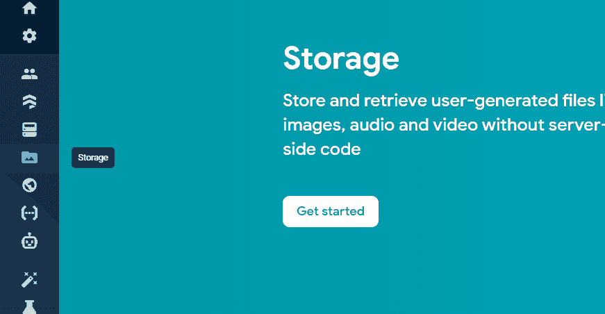
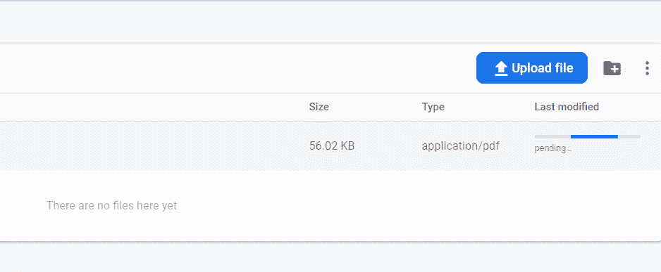
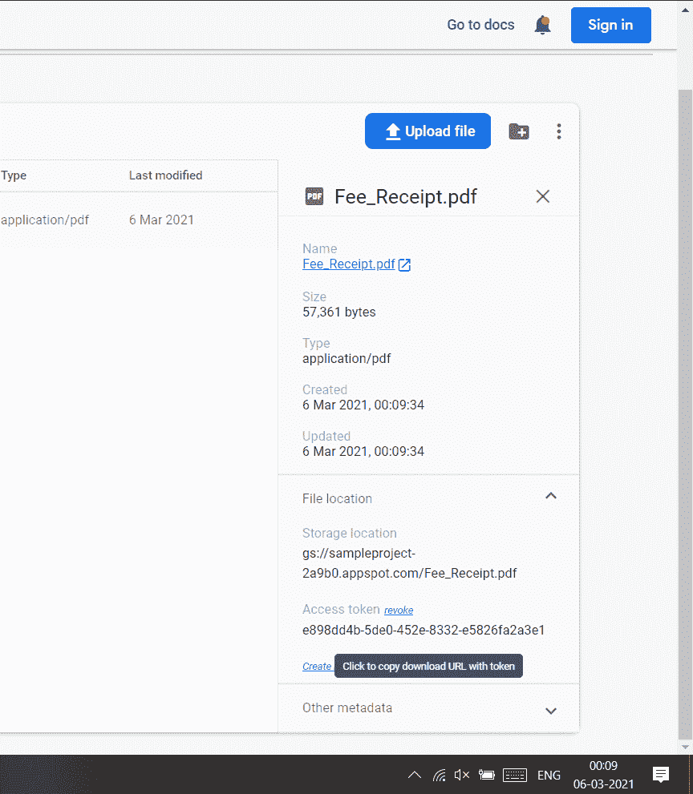
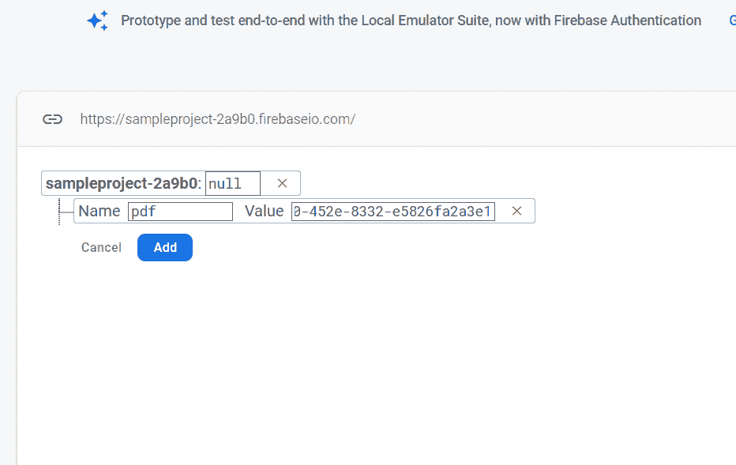

# 如何在安卓中从 Firebase 实时数据库中检索 PDF 文件？

> 原文:[https://www . geeksforgeeks . org/如何检索-pdf-file-from-firebase-real-database-in-Android/](https://www.geeksforgeeks.org/how-to-retrieve-pdf-file-from-firebase-realtime-database-in-android/)

当我们创建一个安卓应用程序时，我们希望使用互联网从 firebase 获取 pdf，而不是手动插入 pdf。 [**<u>Firebase 实时数据库</u>**](https://www.geeksforgeeks.org/firebase-realtime-database-with-operations-in-android-with-examples/) 是由谷歌提供的后端服务，用于为你的安卓应用、IOS 应用以及你的网站处理后端任务。它提供了许多服务，如存储、数据库等等。[<u>Firebase</u>](https://www.geeksforgeeks.org/firebase-introduction/)的特色是其 Firebase 实时数据库。通过在应用程序中使用 Firebase 实时数据库，您可以向用户提供实时数据更新，而无需实际刷新应用程序。我们将创建我们的存储桶，我们可以在那里插入我们的 pdf，并直接将其放入我们的应用程序中。

### 我们将在本文中构建什么？

我们将在这个项目中创建两个[活动](https://www.geeksforgeeks.org/introduction-to-activities-in-android/)。在一个活动中有一个[按钮](https://www.geeksforgeeks.org/button-in-kotlin/)，在另一个活动中，我们正在查看 pdf 文件。因此，当用户点击按钮时，将显示一个[警报框](https://www.geeksforgeeks.org/android-alert-dialog-box-and-how-to-create-it/)，选项有“**下载**”、“**查看**”和“**取消**”。因此，用户将选择他/她是想查看还是下载 pdf。下面给出一个视频样本，来了解一下在本文中我们要做什么。注意，我们将使用 **Java** 语言来实现这个项目。

<video class="wp-video-shortcode" id="video-569299-1" width="640" height="360" preload="metadata" controls=""><source type="video/mp4" src="https://media.geeksforgeeks.org/wp-content/uploads/20210306003141/uploadpdf.mp4?_=1">[https://media.geeksforgeeks.org/wp-content/uploads/20210306003141/uploadpdf.mp4](https://media.geeksforgeeks.org/wp-content/uploads/20210306003141/uploadpdf.mp4)</video>

### **分步实施**

**第一步:创建新项目**

要在安卓工作室创建新项目，请参考[如何在安卓工作室创建/启动新项目](https://www.geeksforgeeks.org/android-how-to-create-start-a-new-project-in-android-studio/)。注意选择 **Java** 作为编程语言。

**第二步:将你的应用连接到 Firebase**

创建新项目后，导航到顶部栏上的“工具”选项。点击火焰基地。点击 Firebase 后，你可以看到截图中下面提到的右栏。


在该列中，导航到 Firebase 实时数据库。点击那个选项，你会看到两个选项:连接应用程序到 Firebase 和添加 Firebase 实时数据库到你的应用程序。单击立即连接，您的应用程序将连接到 Firebase。之后点击第二个选项，现在你的应用程序连接到 Firebase。


完成此过程后，您将看到下面的屏幕。


现在验证你的应用是否连接到 Firebase。转到您的[](https://www.geeksforgeeks.org/android-build-gradle/)<u>文件。导航到**应用程序>渐变脚本>build . grade le**文件，并确保以下依赖项已添加到您的依赖项部分。</u>

> <u>*实现‘com . Google . firebase:firebase-数据库:19 . 6 . 0’*</u>

<u>如果上述依赖项没有添加到您的依赖项部分。添加此依赖项并同步您的项目。现在，我们将转向应用程序的 XML 部分。另外，添加以下依赖项。</u>

> <u>实现' com . github . barteksc:Android-pdf-viewer:2 . 8 . 2 '</u>

<u>现在从**右上角选项同步项目，现在同步**。</u>

<u>**第三步:在 AndroidManifest.xml 文件**中添加互联网权限</u>

<u>导航到 AndroidManifest.xml 文件，并添加以下权限，以便在应用程序中获得互联网权限。</u>

<u>**第 4 步:使用 activity_main.xml 文件**</u>

<u>转到 **activity_main.xml** 文件，参考以下代码。下面是 **activity_main.xml** 文件的代码。</u>

## <u>可扩展标记语言</u>

```java
<?xml version="1.0" encoding="utf-8"?>
<LinearLayout 
    xmlns:android="http://schemas.android.com/apk/res/android"
    xmlns:tools="http://schemas.android.com/tools"
    android:layout_width="match_parent"
    android:layout_height="match_parent"
    android:gravity="center"
    android:orientation="vertical"
    tools:context=".MainActivity">

    <!--We will click on it to view pdf-->
    <Button
        android:id="@+id/view"
        android:layout_width="wrap_content"
        android:layout_height="wrap_content"
        android:layout_marginTop="10dp"
        android:background="@color/black"
        android:padding="10dp"
        android:text="Click here to View pdf "
        android:textSize="10dp" />

</LinearLayout>
```

<u>**步骤 5:使用 MainActivity.java 文件**</u>

<u>转到**MainActivity.java**文件，参考以下代码。以下是**MainActivity.java**文件的代码。代码中添加了注释，以更详细地理解代码。</u>

## <u>Java 语言(一种计算机语言，尤用于创建网站)</u>

```java
import android.content.DialogInterface;
import android.content.Intent;
import android.net.Uri;
import android.os.Bundle;
import android.view.View;
import android.widget.Button;
import android.widget.Toast;

import androidx.annotation.NonNull;
import androidx.appcompat.app.AlertDialog;
import androidx.appcompat.app.AppCompatActivity;

import com.google.firebase.database.DataSnapshot;
import com.google.firebase.database.DatabaseError;
import com.google.firebase.database.DatabaseReference;
import com.google.firebase.database.FirebaseDatabase;
import com.google.firebase.database.ValueEventListener;

public class MainActivity extends AppCompatActivity {

    Button view;
    DatabaseReference database;
    String message;

    @Override
    protected void onCreate(Bundle savedInstanceState) {
        super.onCreate(savedInstanceState);
        setContentView(R.layout.activity_main);
        view = findViewById(R.id.view);

        // Initialising the reference to database
        database = FirebaseDatabase.getInstance().getReference().child("pdf");
        database.addListenerForSingleValueEvent(new ValueEventListener() {
            @Override
            public void onDataChange(@NonNull DataSnapshot dataSnapshot) {
                // getting a DataSnapshot for the location at the specified
                // relative path and getting in the link variable
                message = dataSnapshot.getValue(String.class);
            }

            // this will called when any problem
            // occurs in getting data
            @Override
            public void onCancelled(@NonNull DatabaseError databaseError) {
                // we are showing that error message in toast
                Toast.makeText(MainActivity.this, "Error Loading Pdf", Toast.LENGTH_SHORT).show();
            }
        });
        // After clicking here alert box will come
        view.setOnClickListener(new View.OnClickListener() {
            @Override
            public void onClick(final View v) {
                CharSequence options[] = new CharSequence[]{
                        "Download",
                        "View",
                        "Cancel"
                };
                AlertDialog.Builder builder = new AlertDialog.Builder(v.getContext());
                builder.setTitle("Choose One");
                builder.setItems(options, new DialogInterface.OnClickListener() {
                    @Override
                    public void onClick(DialogInterface dialog, int which) {
                        // we will be downloading the pdf
                        if (which == 0) {
                            Intent intent = new Intent(Intent.ACTION_VIEW, Uri.parse(message));
                            startActivity(intent);
                        }
                        // We will view the pdf
                        if (which == 1) {
                            Intent intent = new Intent(v.getContext(), ViewPdfActivity.class);
                            intent.putExtra("url", message);
                            startActivity(intent);
                        }
                    }
                });
                builder.show();
            }
        });
    }
}
```

<u>**第 6 步:创建一个新的 ViewpdfActivity 类**</u>

<u>请参考 [【如何在安卓工作室创建新活动】](https://www.geeksforgeeks.org/how-to-create-constructor-getter-setter-methods-and-new-activity-in-android-studio-using-shortcuts/) 并将活动命名为**viewpfactory**。本活动用于查看 pdf 文件。</u>

<u>**第 7 步:使用 activity_view_pdf.xml 文件**</u>

<u>导航到 **app > res >布局>activity _ view _ pdf . XML**并将下面的代码添加到该文件中。下面是**activity _ view _ pdf . XML**文件的代码。</u>

## <u>可扩展标记语言</u>

```java
<?xml version="1.0" encoding="utf-8"?>
<LinearLayout 
    xmlns:android="http://schemas.android.com/apk/res/android"
    xmlns:tools="http://schemas.android.com/tools"
    android:layout_width="match_parent"
    android:layout_height="match_parent"
    tools:context=".ViewPdfActivity">

    <com.github.barteksc.pdfviewer.PDFView
        android:id="@+id/abc"
        android:layout_width="match_parent"
        android:layout_height="match_parent" />

</LinearLayout>
```

<u>**第 8 步:使用****ViewpdfActivity.java 文件**</u>

<u>转到**ViewpdfActivity.java**文件，参考以下代码。以下是**ViewpdfActivity.java**文件的代码。代码中添加了注释，以更详细地理解代码。</u>

## <u>Java 语言(一种计算机语言，尤用于创建网站)</u>

```java
import androidx.appcompat.app.AppCompatActivity;

import android.app.ProgressDialog;
import android.os.AsyncTask;
import android.os.Bundle;

import com.github.barteksc.pdfviewer.PDFView;

import java.io.BufferedInputStream;
import java.io.IOException;
import java.io.InputStream;
import java.net.HttpURLConnection;
import java.net.URL;

public class ViewPdfActivity extends AppCompatActivity {

    String urls;
    PDFView pdfView;
    ProgressDialog dialog;

    @Override
    protected void onCreate(Bundle savedInstanceState) {
        super.onCreate(savedInstanceState);
        setContentView(R.layout.activity_view_pdf);
        pdfView = findViewById(R.id.abc);

        // Firstly we are showing the progress 
        // dialog when we are loading the pdf
        dialog = new ProgressDialog(this);
        dialog.setMessage("Loading..");
        dialog.show();

        // getting url of pdf using getItentExtra
        urls = getIntent().getStringExtra("url");
        new RetrivePdfStream().execute(urls);
    }

    // Retrieving the pdf file using url
    class RetrivePdfStream extends AsyncTask<String, Void, InputStream> {

        @Override
        protected InputStream doInBackground(String... strings) {
            InputStream inputStream = null;
            try {

                // adding url
                URL url = new URL(strings[0]);
                HttpURLConnection urlConnection = (HttpURLConnection) url.openConnection();

                // if url connection response code is 200 means ok the execute
                if (urlConnection.getResponseCode() == 200) {
                    inputStream = new BufferedInputStream(urlConnection.getInputStream());
                }
            }
            // if error return null
            catch (IOException e) {
                return null;
            }
            return inputStream;
        }

        @Override
        // Here load the pdf and dismiss the dialog box
        protected void onPostExecute(InputStream inputStream) {
            pdfView.fromStream(inputStream).load();
            dialog.dismiss();
        }
    }
}
```

<u>**第 9 步:** **在 firebase storage 上添加 pdf 并复制该 pdf 的链接**</u>

<u>在 firebase 中，转到**存储**选项，然后点击**开始**按钮</u>

<u></u>

<u>之后点击上传文件选项，在 **firebase storage** 上插入一个 pdf。</u>

<u></u>

<u>之后，单击您插入的 pdf，然后从右侧部分的 pdf 详细信息，然后单击访问令牌并复制 pdf 网址。</u>

<u></u>

<u>**第十步:将该 pdf 网址添加到实时数据库**</u>

<u>转到实时数据库选项，然后将这些值添加到数据库中。在该屏幕中，单击左侧窗口中的实时数据库。</u>

<u></u>

<u>点击此选项后，您将看到右侧的屏幕。在此页面上，单击顶部栏中的规则选项。你会看到下面的屏幕。</u>

<u></u>

<u>在这个项目中，我们将我们的规则添加为真，用于读取和写入，因为我们不使用任何身份验证来验证我们的用户。因此，我们目前将其设置为 true 以测试我们的应用程序。改变规则后。点击右上角的发布按钮，您的规则将保存在那里。现在再次回到数据选项卡。现在，我们将从 Firebase 本身手动向 Firebase 添加数据。在 Firebase 的数据选项卡中，您将看到下面的屏幕。将光标悬停在 null 上，单击右侧的“+”选项，然后单击该选项。点击该选项后。添加下图中添加的数据。请确保在“名称”字段中添加“pdf”，因为我们将 Firebase 的引用设置为“pdf”。所以我们必须把它设置为“pdf”。您可以更改引用，也可以在数据库中更改它。在值字段中，粘贴复制的 pdf 网址。这将是我们要在 pdf 视图中显示的字符串。添加数据后，点击添加按钮，您的数据将被添加到 Firebase 中，这些数据将显示在您的应用程序中。</u>

<u></u>

<u>**输出:**</u>

<u><video class="wp-video-shortcode" id="video-569299-2" width="640" height="360" preload="metadata" controls=""><source type="video/mp4" src="https://media.geeksforgeeks.org/wp-content/uploads/20210306003141/uploadpdf.mp4?_=2">[https://media.geeksforgeeks.org/wp-content/uploads/20210306003141/uploadpdf.mp4](https://media.geeksforgeeks.org/wp-content/uploads/20210306003141/uploadpdf.mp4)</video></u>