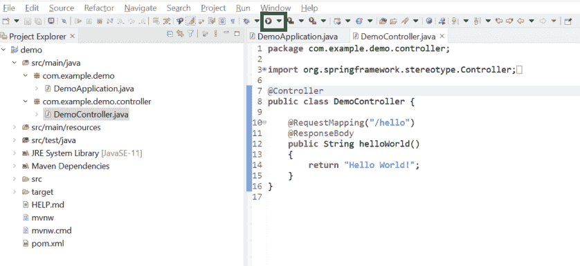

# 如何在 Eclipse IDE 中运行您的第一个 Spring Boot 应用程序？

> 原文:[https://www . geeksforgeeks . org/如何在 eclipse-ide 中运行您的第一个春季启动应用程序/](https://www.geeksforgeeks.org/how-to-run-your-first-spring-boot-application-in-eclipse-ide/)

Spring Boot 建在春天的顶端，包含了春天的所有特征。由于其快速的生产就绪环境，开发人员能够直接专注于逻辑，而不是纠结于配置和设置，因此正成为开发人员的最爱。Spring Boot 是一个基于微服务的框架，在其中制作一个生产就绪的应用程序只需要很少的时间。以下是 Spring Boot 的一些特色:

*   它允许避免春季出现的 XML 的繁重配置
*   它提供了 REST 端点的简单维护和创建
*   它包括嵌入式 Tomcat 服务器
*   部署非常容易，war 和 jar 文件可以很容易地部署在 tomcat 服务器中

更多信息请参考本文:[Spring Boot 简介](https://www.geeksforgeeks.org/introduction-to-spring-boot/)。所以在文章[中，我们已经解释了如何在 Eclipse IDE](https://www.geeksforgeeks.org/how-to-create-and-setup-spring-boot-project-in-eclipse-ide/) 中创建和设置 Spring Boot 项目。在本文中，我们将创建一个简单的**“你好世界”**应用程序，并在我们的 Eclipse IDE 中运行它。

**程序**

1.  在集成开发环境中创建和设置 Spring Boot 项目。
2.  在您的 [pom.xml](https://www.geeksforgeeks.org/page-object-model-pom/) 文件中添加 spring-web 依赖项。
3.  创建一个包并将该包命名为“项目中的控制器”。
4.  运行 Spring Boot 应用程序。

**步骤 1:** 在 Eclipse IDE 中创建和设置 Spring Boot 项目

您可以参考本文[在 Eclipse IDE](https://www.geeksforgeeks.org/how-to-create-and-setup-spring-boot-project-in-eclipse-ide/) 中创建和设置 Spring Boot 项目，并在 **Eclipse IDE 中创建您的第一个 Spring Boot 应用程序。**

**步骤 2:** 在您的 [pom.xml](https://www.geeksforgeeks.org/page-object-model-pom/) 文件中添加 spring-web 依赖项。转到项目内部的 pom.xml 文件，并添加以下 spring-web 依赖项。

## 可扩展标记语言

```java
<dependency>
    <groupId>org.springframework.boot</groupId>
    <artifactId>spring-boot-starter-web</artifactId>
</dependency>
```

**第三步:**在你的项目中创建一个包，并将这个包命名为“控制器”。在控制器中，包创建一个类，并将其命名为 **DemoController** 。

**示例 1A**

## Java 语言(一种计算机语言，尤用于创建网站)

```java
// Java Program to Illustrate DemoController

// Importing package to code module
package com.example.demo.controller;
// Importing required classes
import org.springframework.stereotype.Controller;
import org.springframework.web.bind.annotation.RequestMapping;
import org.springframework.web.bind.annotation.ResponseBody;

// Annotation
@Controller

// Class
public class DemoController {

    @RequestMapping("/hello")
    @ResponseBody

    // Method
    public String helloWorld()
    {

        // Print statement
        return "Hello World!";
    }
}
```

我们在控制器层使用了下面的注释。在这个例子中，URI 路径是***/你好*** 。

*   **@控制器:**用于指定控制器。
*   **@RequestMapping:** 这是用来映射到 Spring MVC 控制器的方法。
*   **@ResponseBody:** 用于将 HTTP 响应体与返回类型中的域对象绑定。

现在，我们的控制器准备好了。让我们在 DemoApplication.java 文件中运行我们的应用程序。没有必要更改**DemoApplication.java**文件中的任何内容。

**示例 1B**

## Java 语言(一种计算机语言，尤用于创建网站)

```java
// Java Program to Illustrate DemoApplication

// Importing package module to code
package com.example.demo;
// Importing required classes
import org.springframework.boot.SpringApplication;
import org.springframework.boot.autoconfigure.SpringBootApplication;

// Annotation
@SpringBootApplication

// Main class
public class DemoApplication {

    // Main driver method
    public static void main(String[] args)
    {
        SpringApplication.run(DemoApplication.class, args);
    }
}
```

**步骤 4:** 运行 Spring Boot 应用程序

要运行应用程序，请点击**绿色图标**，如下图所示。



成功运行应用程序后，您可以看到控制台，如下图所示。您的 Tomcat 服务器在端口 **8989** 上启动。


> 试试这个运行在 ***上的 Tomcat URL http://localhost:8989/hello***

