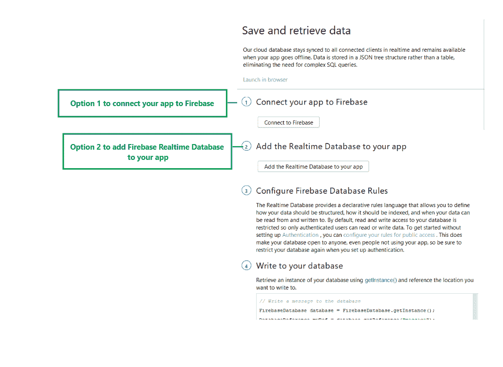
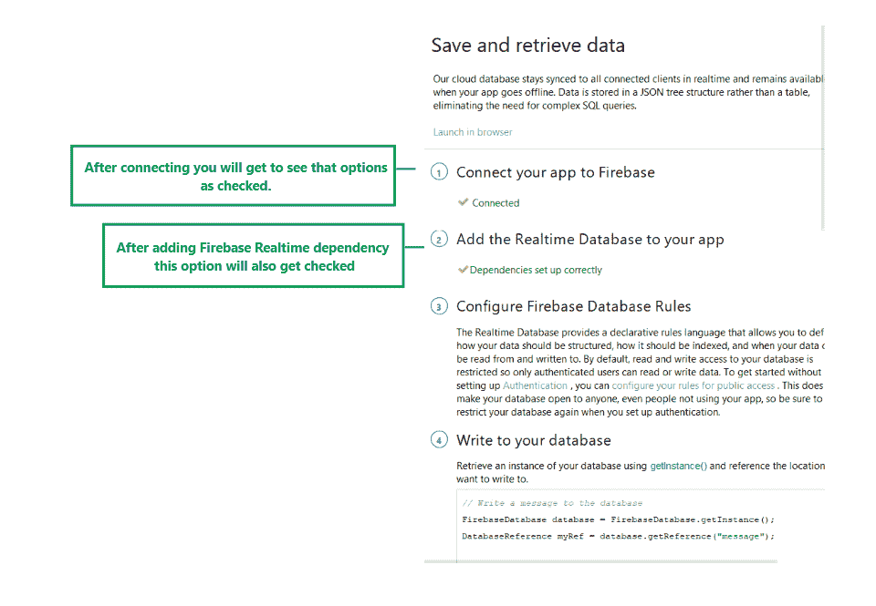
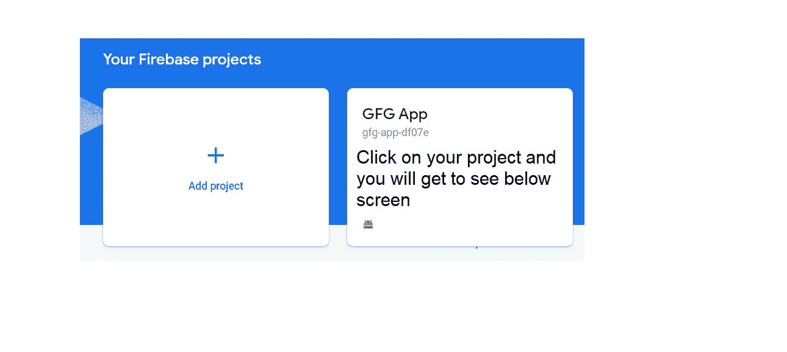
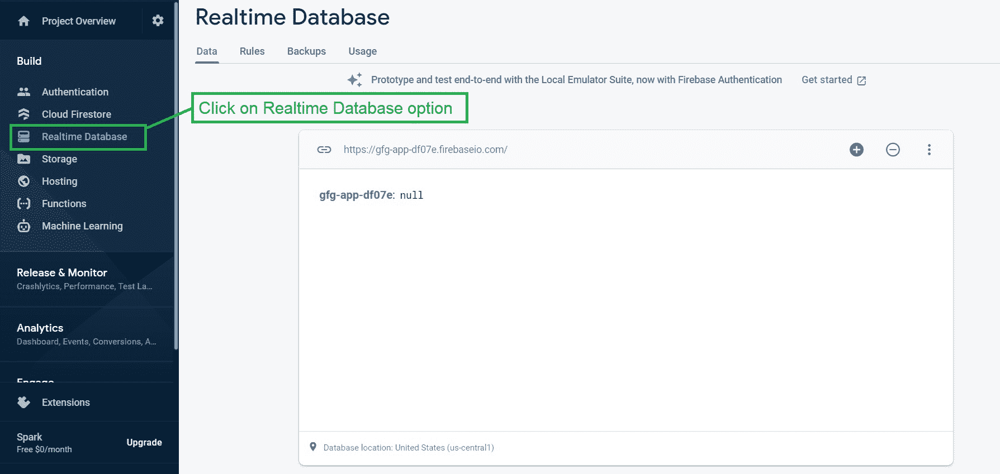
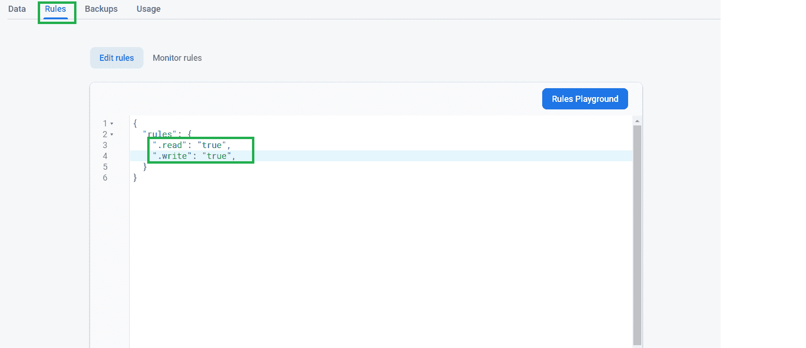
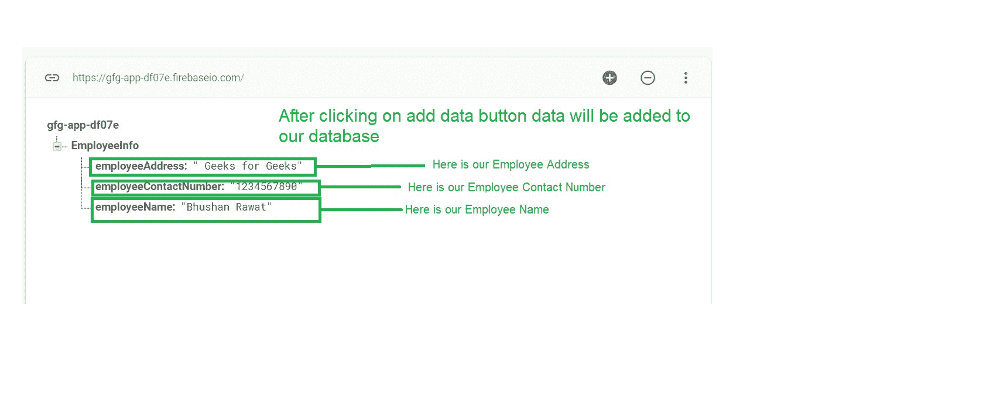

# 如何在安卓系统中将数据保存到 Firebase 实时数据库？

> 原文:[https://www . geeksforgeeks . org/如何将数据保存到 firebase-real-database in Android/](https://www.geeksforgeeks.org/how-to-save-data-to-the-firebase-realtime-database-in-android/)

[Firebase](https://www.geeksforgeeks.org/firebase-introduction/) 是著名的后端平台之一，被如此多的开发者用来为他们的应用和网站提供后端支持。它是谷歌的产品，提供数据库、存储、用户认证等服务。在本文中，我们将创建一个简单的应用程序，其中我们将添加我们的数据到 Firebase 实时数据库。注意，我们将使用 **Java** 语言来实现这个项目。

### 什么是 Firebase 实时数据库？

**Firebase 实时数据库**是一个 [NoSQL](https://www.geeksforgeeks.org/introduction-to-nosql/) 云数据库，用于存储和同步数据。数据库中的数据可以在所有客户端上同步，如安卓、网络和 IOS。数据库中的数据以 [JSON](https://www.geeksforgeeks.org/javascript-json/) 格式存储，并与每个连接的客户端实时更新。

### 使用 Firebase 实时数据库有什么优势？

*   使用 Firebase 实时数据库的主要优点是数据以实时方式更新，并且您不必对数据更新或更改提出任何请求。每当数据发生变化时，数据库都会使用数据同步，这些变化将在几毫秒内反映连接的用户。
*   使用 Firebase 实时数据库时，即使设备失去与数据库的连接，您的应用程序也能保持响应。一旦用户建立了连接，他将从数据库接收数据中所做的更改。
*   存储在 Firebase 数据库中的数据可以通过 Firebase 的门户网站轻松访问。您可以从电脑和移动设备管理您的数据库。您可以管理数据库的规则，这些规则授予对数据库进行读写操作的权限。

### 我们将在本文中构建什么？

在本文中，我们将构建一个简单的应用程序，在这个应用程序中，我们将借助一些**文本字段**从用户那里获取数据，并将这些数据存储在 **Firebase 实时数据库**中。请注意，我们使用的是 Firebase 实时数据库，该应用程序是使用 **JAVA** 语言编写的。

### 逐步实施

**第一步:创建新项目**

要在安卓工作室创建新项目，请参考[如何在安卓工作室创建/启动新项目](https://www.geeksforgeeks.org/android-how-to-create-start-a-new-project-in-android-studio/)。注意选择 **Java** 作为编程语言。

**第二步:将你的应用连接到 Firebase**

创建新项目后，导航至顶部栏上的**工具**选项。在里面点击**火焰基地**。点击 Firebase 后，你可以看到截图中下面提到的右栏。


在该栏中，导航到 Firebase **实时数据库**。点击该选项，您将看到**将应用程序连接到 Firebase** 和**将 Firebase 实时数据库添加到您的应用程序**的两个选项。单击立即连接，您的应用程序将连接到 Firebase。之后点击第二个选项，现在你的应用程序连接到 Firebase。



将您的应用程序连接到 Firebase 后，您将看到下面的屏幕。



之后，验证 Firebase 实时数据库的依赖项已经添加到我们的 Gradle 文件中。现在导航到**应用程序>渐变脚本**，并在该文件中检查是否添加了以下依赖项。如果以下依赖项没有添加到您的 [build.gradle](https://www.geeksforgeeks.org/android-build-gradle/) 文件中。在依赖项部分添加以下依赖项。

> 实现' com . Google . firebase:firebase-数据库:19.6.0 '

添加此依赖项后，同步您的项目，现在我们可以创建我们的应用程序了。如果你想了解更多关于连接你的应用到 Firebase。参考这篇文章，详细了解[在安卓应用中添加 Firebase。](https://www.geeksforgeeks.org/adding-firebase-to-android-app/)

**第三步:使用 AndroidManifest.xml 文件**

为了向 Firebase 添加数据，我们应该授予访问互联网的权限。要添加这些权限，请导航到**应用程序> AndroidManifest.xml** ，并在该文件中添加以下权限。

## 可扩展标记语言

```java
<uses-permission android:name="android.permission.INTERNET"/>
<uses-permission android:name="android.permission.ACCESS_NETWORK_STATE"/>
```

**第 4 步:使用 activity_main.xml 文件**

转到 **activity_main.xml** 文件，参考以下代码。下面是 **activity_main.xml** 文件的代码。

## 可扩展标记语言

```java
<?xml version="1.0" encoding="utf-8"?>
<RelativeLayout 
    xmlns:android="http://schemas.android.com/apk/res/android"
    xmlns:tools="http://schemas.android.com/tools"
    android:layout_width="match_parent"
    android:layout_height="match_parent"
    tools:context=".MainActivity">

    <!--EditText for adding employee name-->
    <EditText
        android:id="@+id/idEdtEmployeeName"
        android:layout_width="match_parent"
        android:layout_height="wrap_content"
        android:layout_centerHorizontal="true"
        android:layout_margin="10dp"
        android:hint="Enter Employee Name"
        android:importantForAutofill="no"
        android:inputType="textPersonName" />

    <!--EditText for adding employee phone-->
    <EditText
        android:id="@+id/idEdtEmployeePhoneNumber"
        android:layout_width="match_parent"
        android:layout_height="wrap_content"
        android:layout_below="@id/idEdtEmployeeName"
        android:layout_margin="10dp"
        android:hint="Enter employee phone number"
        android:importantForAutofill="no"
        android:inputType="phone" />

    <!--EditText for adding employee address-->
    <EditText
        android:id="@+id/idEdtEmployeeAddress"
        android:layout_width="match_parent"
        android:layout_height="wrap_content"
        android:layout_below="@id/idEdtEmployeePhoneNumber"
        android:layout_margin="10dp"
        android:hint="Enter employee address"
        android:inputType="textPostalAddress" />

    <!--Button for adding data to Firebase-->
    <Button
        android:id="@+id/idBtnSendData"
        android:layout_width="match_parent"
        android:layout_height="wrap_content"
        android:layout_below="@id/idEdtEmployeeAddress"
        android:layout_margin="10dp"
        android:text="Add employee details"
        android:textAllCaps="false" />

</RelativeLayout>
```

**第五步:创建一个新的 Java 类来存储我们的数据**

为了将多个数据发送到 Firebase 实时数据库，我们必须创建一个对象类，并将整个对象类发送到 Firebase。要创建一个对象类，导航到**应用程序> java >你的应用程序的包名>右键单击它，然后单击新建> Java 类>给你的类命名**。我的情况是**员工信息**，并在下面添加代码。

## Java 语言(一种计算机语言，尤用于创建网站)

```java
public class EmployeeInfo {

    // string variable for 
    // storing employee name.
    private String employeeName;

    // string variable for storing
    // employee contact number
    private String employeeContactNumber;

    // string variable for storing
    // employee address.
    private String employeeAddress;

    // an empty constructor is 
    // required when using
    // Firebase Realtime Database.
    public EmployeeInfo() {

    }

    // created getter and setter methods
    // for all our variables.
    public String getEmployeeName() {
        return employeeName;
    }

    public void setEmployeeName(String employeeName) {
        this.employeeName = employeeName;
    }

    public String getEmployeeContactNumber() {
        return employeeContactNumber;
    }

    public void setEmployeeContactNumber(String employeeContactNumber) {
        this.employeeContactNumber = employeeContactNumber;
    }

    public String getEmployeeAddress() {
        return employeeAddress;
    }

    public void setEmployeeAddress(String employeeAddress) {
        this.employeeAddress = employeeAddress;
    }
}
```

**步骤 6:使用 MainActivity.java 文件**

转到**MainActivity.java**文件，参考以下代码。以下是**MainActivity.java**文件的代码。代码中添加了注释，以更详细地理解代码。

## Java 语言(一种计算机语言，尤用于创建网站)

```java
import android.os.Bundle;
import android.text.TextUtils;
import android.view.View;
import android.widget.Button;
import android.widget.EditText;
import android.widget.Toast;

import androidx.annotation.NonNull;
import androidx.appcompat.app.AppCompatActivity;

import com.google.firebase.database.DataSnapshot;
import com.google.firebase.database.DatabaseError;
import com.google.firebase.database.DatabaseReference;
import com.google.firebase.database.FirebaseDatabase;
import com.google.firebase.database.ValueEventListener;

public class MainActivity extends AppCompatActivity {

    // creating variables for 
    // EditText and buttons.
    private EditText employeeNameEdt, employeePhoneEdt, employeeAddressEdt;
    private Button sendDatabtn;

    // creating a variable for our
    // Firebase Database.
    FirebaseDatabase firebaseDatabase;

    // creating a variable for our Database 
    // Reference for Firebase.
    DatabaseReference databaseReference;

    // creating a variable for 
    // our object class
    EmployeeInfo employeeInfo;

    @Override
    protected void onCreate(Bundle savedInstanceState) {
        super.onCreate(savedInstanceState);
        setContentView(R.layout.activity_main);

        // initializing our edittext and button
        employeeNameEdt = findViewById(R.id.idEdtEmployeeName);
        employeePhoneEdt = findViewById(R.id.idEdtEmployeePhoneNumber);
        employeeAddressEdt = findViewById(R.id.idEdtEmployeeAddress);

        // below line is used to get the 
        // instance of our FIrebase database.
        firebaseDatabase = FirebaseDatabase.getInstance();

        // below line is used to get reference for our database.
        databaseReference = firebaseDatabase.getReference("EmployeeInfo");

        // initializing our object 
        // class variable.
        employeeInfo = new EmployeeInfo();

        sendDatabtn = findViewById(R.id.idBtnSendData);

        // adding on click listener for our button.
        sendDatabtn.setOnClickListener(new View.OnClickListener() {
            @Override
            public void onClick(View v) {

                // getting text from our edittext fields.
                String name = employeeNameEdt.getText().toString();
                String phone = employeePhoneEdt.getText().toString();
                String address = employeeAddressEdt.getText().toString();

                // below line is for checking weather the 
                // edittext fields are empty or not.
                if (TextUtils.isEmpty(name) && TextUtils.isEmpty(phone) && TextUtils.isEmpty(address)) {
                    // if the text fields are empty 
                    // then show the below message.
                    Toast.makeText(MainActivity.this, "Please add some data.", Toast.LENGTH_SHORT).show();
                } else {
                    // else call the method to add 
                    // data to our database.
                    addDatatoFirebase(name, phone, address);
                }
            }
        });
    }

    private void addDatatoFirebase(String name, String phone, String address) {
        // below 3 lines of code is used to set
        // data in our object class.
        employeeInfo.setEmployeeName(name);
        employeeInfo.setEmployeeContactNumber(phone);
        employeeInfo.setEmployeeAddress(address);

        // we are use add value event listener method
        // which is called with database reference.
        databaseReference.addValueEventListener(new ValueEventListener() {
            @Override
            public void onDataChange(@NonNull DataSnapshot snapshot) {
                // inside the method of on Data change we are setting 
                // our object class to our database reference.
                // data base reference will sends data to firebase.
                databaseReference.setValue(employeeInfo);

                // after adding this data we are showing toast message.
                Toast.makeText(MainActivity.this, "data added", Toast.LENGTH_SHORT).show();
            }

            @Override
            public void onCancelled(@NonNull DatabaseError error) {
                // if the data is not added or it is cancelled then
                // we are displaying a failure toast message.
                Toast.makeText(MainActivity.this, "Fail to add data " + error, Toast.LENGTH_SHORT).show();
            }
        });
    }
}
```

添加此代码后，转到 [Firebase 的此链接。](https://firebase.google.com/)点击此链接后，您将看到下面的页面，在此页面上点击右上角的转到控制台选项。


点击此屏幕后，您将看到下面的屏幕，其中包含您选择项目的所有项目。



在该屏幕中，单击左侧窗口中的实时数据库。



点击此选项后，您将看到右侧的屏幕。在此页面上，点击顶部栏中的**规则**选项。你会看到下面的屏幕。



在此屏幕中，单击规则选项卡，您将看到上面的屏幕，并将规则更改为真，如屏幕截图所示。规则被更改为真，因为我们没有在应用程序中提供身份验证，我们必须将数据写入数据库。这就是为什么我们指定它为真。更改规则后，单击发布规则按钮。单击该选项，您的规则将被发布。现在回到数据库的“数据”选项卡。

### 输出:

下面是我们的应用程序向 Firebase 实时数据库添加数据的视频。

<video class="wp-video-shortcode" id="video-534530-1" width="640" height="360" preload="metadata" controls=""><source type="video/mp4" src="https://media.geeksforgeeks.org/wp-content/uploads/20201225155952/Screenrecorder-2020-12-25-15-48-46-492.mp4?_=1">[https://media.geeksforgeeks.org/wp-content/uploads/20201225155952/Screenrecorder-2020-12-25-15-48-46-492.mp4](https://media.geeksforgeeks.org/wp-content/uploads/20201225155952/Screenrecorder-2020-12-25-15-48-46-492.mp4)</video>

运行该应用程序，并确保将您的设备连接到互联网。之后，在文本字段中添加一些数据，并点击插入数据按钮。数据将被添加到我们的 Firebase 数据库中。下面是我们从应用程序向 Firebase 数据库添加数据后将看到的截图。

