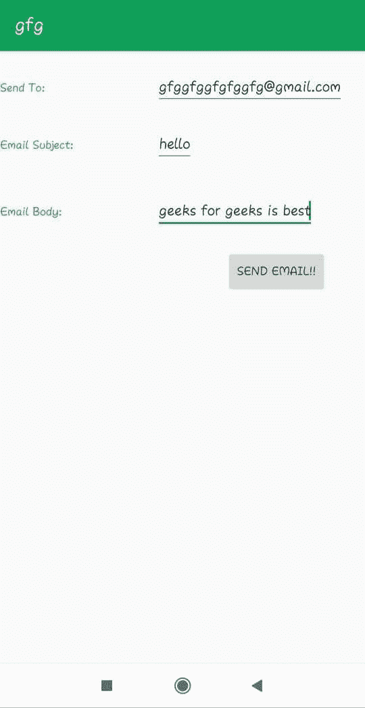
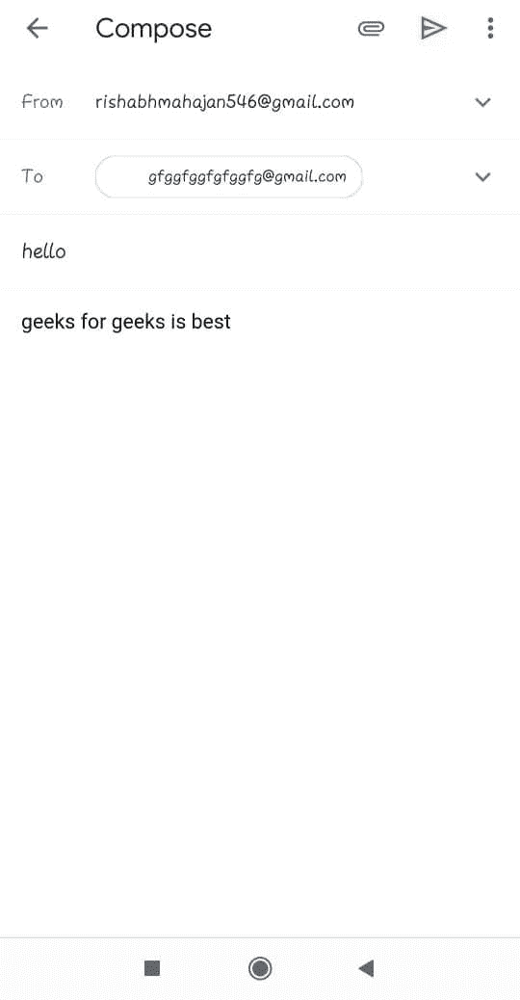

# 如何从你的安卓应用发送邮件？

> 原文:[https://www . geesforgeks . org/如何从你的安卓应用程序发送电子邮件/](https://www.geeksforgeeks.org/how-to-send-an-email-from-your-android-app/)

在本文中，您将制作一个基本的 [android 应用程序](https://www.geeksforgeeks.org/android-app-development-fundamentals-for-beginners/)，可以用来通过您的 android 应用程序发送电子邮件。

您可以在的帮助下这样做，动作与带有额外字段的**动作 _ 发送**相同:

*   **邮件 id** 您要向其发送邮件，
*   **电子邮件主题**和
*   **邮件正文**。

基本上[意图](https://www.geeksforgeeks.org/android-implicit-and-explicit-intents-with-examples/)是一个简单的消息对象，用于在[安卓组件之间进行通信，如活动、内容提供商、广播接收器和服务](https://www.geeksforgeeks.org/components-android-application/)，这里用于发送电子邮件。

这个应用程序基本上包含一个编辑文本的活动，从用户那里输入电子邮件地址、主题和正文，并点击按钮发送该电子邮件。

*   **第一步。activity _ main . XML**
    activity _ main . XML 包含一个相对布局，其中包含三个用于收件人邮件 id 的 Edit 文本、另一个用于邮件主题和最后一个用于邮件正文的 Edit 文本、三个用于标签的 TextViews 和一个用于开始意图或发送邮件的按钮:

    ## activity _ main . XML

    ```
    <?xml version="1.0" encoding="utf-8"?>

    <!--Relative Layout-->
    <RelativeLayout
        xmlns:androclass="http://schemas.android.com/apk/res/android"  
        xmlns:tools="http://schemas.android.com/tools"  
        android:layout_width="match_parent"  
        android:layout_height="match_parent"  
        tools:context=".MainActivity">

        <!--Edit text for email id-->
        <EditText  
            android:id="@+id/editText1"  
            android:layout_width="wrap_content"  
            android:layout_height="wrap_content"  
            android:layout_alignParentRight="true"  
            android:layout_alignParentTop="true"  
            android:layout_marginRight="22dp"  
            android:layout_marginTop="18dp"  
          />  

        <!--Edit text for email subject-->
        <EditText  
            android:id="@+id/editText2"  
            android:layout_width="wrap_content"  
            android:layout_height="wrap_content"  
            android:layout_below="@+id/editText1"  
            android:layout_alignLeft="@+id/editText1"  
            android:layout_marginTop="20dp"  
            />    

        <!--Edit text for email body-->
        <EditText  
            android:id="@+id/editText3"  
            android:layout_width="wrap_content"  
            android:layout_height="wrap_content" 
            android:layout_marginTop="30dp"  
            android:layout_below="@+id/editText2"  
            android:layout_alignLeft="@+id/editText2"    
          />  

        <!--text Views for label-->
        <TextView  
            android:id="@+id/textView1" 
            android:textColor="#0F9D58"
            android:text="Send To:" 
            android:layout_width="wrap_content"  
            android:layout_height="wrap_content"  
            android:layout_alignBaseline="@+id/editText1"  
            android:layout_alignBottom="@+id/editText1"  
            android:layout_alignParentLeft="true"  
            />  

        <TextView  
            android:id="@+id/textView2" 
            android:textColor="#0F9D58"
            android:text="Email Subject:" 
            android:layout_width="wrap_content"  
            android:layout_height="wrap_content"  
            android:layout_alignBaseline="@+id/editText2"  
            android:layout_alignBottom="@+id/editText2"  
            android:layout_alignParentLeft="true"  
            />  

        <TextView  
            android:id="@+id/textView3"  
            android:textColor="#0F9D58"
            android:text="Email Body:"
            android:layout_width="wrap_content"  
            android:layout_height="wrap_content"  
            android:layout_alignBaseline="@+id/editText3"  
            android:layout_alignBottom="@+id/editText3"   
            />  

        <!--Button to send email-->
        <Button  
            android:id="@+id/button"  
            android:text="Send email!!"
            android:layout_width="wrap_content"  
            android:layout_height="wrap_content"  
            android:layout_alignLeft="@+id/editText3"  
            android:layout_below="@+id/editText3"  
            android:layout_marginLeft="76dp"  
            android:layout_marginTop="20dp"  
             />    
    </RelativeLayout>
    ```

*   **Step 2\. MainActivity.java**
    In Main activity Intent object is created and its action is defined to ACTION_SEND to send email, with Intent three extra fields are also added using putExtra function.These fields are:
    *   收件人的电子邮件
    *   电子邮件主题
    *   电子邮件正文

    **setOnClickListener** 附加在带有意图对象的按钮上，以动作为 ACTION_SEND 进行意图，发送电子邮件，意图类型如代码所示。

    下面是完整的 java 代码，用于通过 android 应用程序发送电子邮件:

    ## MainActivity.java

    ```
    package com.geeksforgeeks.phonecall;

    import android.os.Bundle;
    import android.support.v7.app.AppCompatActivity;
    import android.content.Intent;
    import android.widget.EditText;
    import android.view.View;
    import android.view.View.OnClickListener;
    import android.net.Uri;
    import android.widget.Button;

    public class MainActivity extends AppCompatActivity {

        // define objects for edit text and button
        Button button;
        EditText sendto, subject, body;

        @Override
        protected void onCreate(Bundle savedInstanceState)
        {
            super.onCreate(savedInstanceState);
            setContentView(R.layout.activity_main);

            // Getting instance of edittext and button
            sendto = findViewById(R.id.editText1);
            subject = findViewById(R.id.editText2);
            body = findViewById(R.id.editText3);
            button = findViewById(R.id.button);

            // attach setOnClickListener to button
            // with Intent object define in it
            button.setOnClickListener(new OnClickListener() {

                @Override
                public void onClick(View view)
                {
                    String emailsend = sendto.getText().toString();
                    String emailsubject = subject.getText().toString();
                    String emailbody = body.getText().toString();

                    // define Intent object
                    // with action attribute as ACTION_SEND
                    Intent intent = new Intent(Intent.ACTION_SEND);

                    // add three fiels to intent using putExtra function
                    intent.putExtra(Intent.EXTRA_EMAIL,
                                    new String[] { emailsend });
                    intent.putExtra(Intent.EXTRA_SUBJECT, emailsubject);
                    intent.putExtra(Intent.EXTRA_TEXT, emailbody);

                    // set type of intent
                    intent.setType("message/rfc822");

                    // startActivity with intent with chooser
                    // as Email client using createChooser function
                    startActivity(
                        Intent
                            .createChooser(intent,
                                           "Choose an Email client :"));
                }
            });
        }
    }
    ```

**输出:**

*   [](https://media.geeksforgeeks.org/wp-content/uploads/20191231212438/email2.jpeg)
*   [](https://media.geeksforgeeks.org/wp-content/uploads/20191231212521/email1.jpeg)