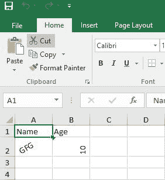

# 如何用 Java 给单元格中的文本设置方向？

> 原文:[https://www . geeksforgeeks . org/如何使用 java 设置单元格内文本的方向/](https://www.geeksforgeeks.org/how-to-set-direction-to-the-text-in-cell-using-java/)

Apache POI 是 Apache 开发的开源库，可以用 Java 创建、修改和显示文件 MS office 文件。它提供了这样做的类和方法。这个 API 提供了各种组件，如 POIFS(糟糕的混淆实现文件系统)、HSSF(糟糕的电子表格格式)、XSSF (XML 电子表格格式)、HPSF(糟糕的属性集格式)、HWPF(糟糕的文字处理器格式)、XWPF (XML 文字处理器格式)、HSLF(糟糕的幻灯片布局格式)。电子表格中的数据总是存储在单元格中。Apache 库允许您对这些单元格执行各种操作，例如更改字体样式、添加超链接、更改文本方向。

Apache 库允许您通过以不同的方向角度显示文本来更改单元格中文本的方向。所以我们在函数中指定一个角度。例如 setRotation((短)20)；

**本例使用 XSSF 组件。**

1.  首先[下载库](https://jar-download.com/artifacts/org.apache.poi/poi-ooxml/3.17/source-code)，它会下载所有需要的 jar 文件。
2.  右键单击包资源管理器中的项目->单击构建路径->配置构建路径->添加库->添加外部 JAR 文件->从解压缩的文件夹中选择 Jar 文件。

**以下是将在代码中使用的类:**

*   XSSFWorkbook:处理 XLSX 的根类。它从文件输入流中读取一个 excel 文件。
*   一个工作簿可以有多个工作表。
*   XSSFRow:用于表示 excel 工作表的一行。
*   XSSFCell:用于表示对应行的单元格。

## Java 语言(一种计算机语言，尤用于创建网站)

```
// Java program to Set the Direction of Cell
import java.io.File;
import java.io.FileOutputStream;

// packages from POI library
import org.apache.poi.xssf.usermodel.XSSFCell;
import org.apache.poi.xssf.usermodel.XSSFCellStyle;
import org.apache.poi.xssf.usermodel.XSSFRow;
import org.apache.poi.xssf.usermodel.XSSFSheet;
import org.apache.poi.xssf.usermodel.XSSFWorkbook;

public class workbook {

    public static void main(String[] args) throws Exception
    {

        // creating workbook
        XSSFWorkbook wb = new XSSFWorkbook();

        // creating spreadsheet named 'sheet1'
        XSSFSheet sheet = wb.createSheet("sheet1");

        // creating first row
        XSSFRow r1 = sheet.createRow(0);
        // creating cells for first row
        // first cell
        XSSFCell r1c1 = r1.createCell(0);
        r1c1.setCellValue("Name");
        // second cell
        XSSFCell r1c2 = r1.createCell(1);
        r1c2.setCellValue("Age");

        // create object of XSSFCellStyle
        // XSSFCellStyle is used for formatting and applying
        // different styles such as rotation, alignment
        XSSFCellStyle style = wb.createCellStyle();
        XSSFCellStyle style1 = wb.createCellStyle();

        // setting rotation angle for object style, style1
        style.setRotation((short)20);
        style1.setRotation((short)30);

        // creating first row
        XSSFRow r2 = sheet.createRow(1);

        // creating cells for second row
        // first cell
        XSSFCell r2c1 = r2.createCell(0);
        r2c1.setCellValue("GFG");

        // applying the object style
        r2c1.setCellStyle(style);

        // second cell
        XSSFCell r2c2 = r2.createCell(1);
        r2c2.setCellValue("10");
        r2c2.setCellStyle(style1);

        FileOutputStream out = new FileOutputStream(
            new File("D:/sheet.xlsx"));
        wb.write(out);
        out.close();
    }
}
```

**Excel 表格输出:**

