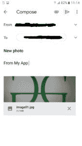

# 如何在安卓系统中将拍摄的图片分享给另一个应用

> 原文:[https://www . geeksforgeeks . org/如何将捕获的图像共享给另一个安卓应用/](https://www.geeksforgeeks.org/how-to-share-a-captured-image-to-another-app-in-android/)

**先决条件:** [如何通过意图打开相机并拍摄图像](https://www.geeksforgeeks.org/android-how-to-open-camera-through-intent-and-display-captured-image/)

在本文中，我们将尝试使用[安卓工作室](https://www.geeksforgeeks.org/guide-to-install-and-set-up-android-studio/)将捕获的图像([)从本文](https://www.geeksforgeeks.org/android-how-to-open-camera-through-intent-and-display-captured-image/)发送到其他应用程序。

**进场:**

1.  捕获的图像存储在外部存储器中。因此我们需要[向用户](https://www.geeksforgeeks.org/android-how-to-request-permissions-in-android-application/)请求访问文件的权限。因此，在清单文件中获取访问外部存储的权限。
2.  这里 **pictureDir(文件)**指的是名为 **DIRECTORY_PICTURES**

    ```
    File pictureDir
        = new File(
            Environment.getExternalStoragePublicDirectory(
                Environment.DIRECTORY_PICTURES),
            "CameraDemo");

    ```

    的外存目录
3.  在 onCreate()方法中，检查目录**图片目录**是否存在。如果没有，那么用下面的代码创建目录

    ```
    if(!pictureDir.exists()){
        pictureDir.mkdirs();
    }

    ```

4.  创建另一个名为**callcamerapp()**的方法，从外部存储器获取被点击的图像。
    *   使用“意图”捕捉图像
    *   创建一个文件，将图像存储在 pictureDir 目录中。
    *   获取此图像文件的 URI 对象
    *   将图像放在意图存储上，以便从应用程序的其他模块访问。
    *   将图像传递给 startActivityForResult()
5.  使用 intent 将此图片分享给其他应用程序。

    ```
    Intent emailIntent = new Intent(android.content.Intent.ACTION_SEND);

    ```

6.  为了这篇文章，我们将选择 Gmail，并将此图片作为邮件附件发送。

    ```
    startActivity(Intent.createChooser(emailIntent, "Send mail..."));

    ```

**以下是上述方法的完整实现:**

## activity_main.xml

```
<?xml version="1.0" encoding="utf-8"?>
<RelativeLayout
    xmlns:android="http://schemas.android.com/apk/res/android"
    xmlns:app="http://schemas.android.com/apk/res-auto"
    xmlns:tools="http://schemas.android.com/tools"
    android:layout_width="match_parent"
    android:layout_height="match_parent"
    tools:context=".MainActivity">

    <!--Textview with title "Camera_Demo!" is given by  -->     
    <TextView
        android:layout_width="wrap_content"
        android:layout_height="wrap_content"
        android:text="Camera Demo!"
        android:id="@+id/tv"
        android:textSize="20sp"
        android:textStyle="bold"
        android:layout_centerHorizontal="true"
        />

    <!-- Add button to take a picture--> 
    <Button
        android:id="@+id/button1"
        android:layout_width="wrap_content"
        android:layout_height="wrap_content"
        android:layout_below="@id/tv"
        android:layout_marginTop="50dp"
        android:text="Take Picture"
        android:textSize="20sp"
        android:textStyle="bold" />

    <!-- Add ImageView to display the captured image--> 
    <ImageView
        android:layout_width="match_parent"
        android:layout_height="match_parent"
        android:id="@+id/imageView1"
        android:layout_below="@id/button1"
        />
</RelativeLayout>
```

## MainActivity.java

```
package com.example.camera_mail;

import android.Manifest;
import android.content.Intent;
import android.content.pm.PackageManager;
import android.net.Uri;
import android.os.Environment;
import android.provider.MediaStore;
import android.support.v4.app.ActivityCompat;
import android.support.v4.content.ContextCompat;
import android.support.v7.app.AppCompatActivity;
import android.os.Bundle;
import android.view.View;
import android.widget.Button;
import android.widget.ImageView;
import android.widget.Toast;

import java.io.File;

public class MainActivity
    extends AppCompatActivity
    implements View.OnClickListener {

    private static final int
        CAMERA_PIC_REQUEST
        = 1337;
    private static final int
        REQUEST_EXTERNAL_STORAGE_RESULT
        = 1;
    private static final String
        FILE_NAME
        = "image01.jpg";

    private Button b1;
    private ImageView img1;

    File pictureDir
        = new File(
            Environment.getExternalStoragePublicDirectory(
                Environment.DIRECTORY_PICTURES),
            "CameraDemo");
    private Uri fileUri;

    // The onCreate() method
    @Override
    protected void onCreate(Bundle savedInstanceState)
    {
        super.onCreate(savedInstanceState);
        setContentView(R.layout.activity_main);

        b1 = (Button)findViewById(R.id.button1);
        img1 = (ImageView)findViewById(R.id.imageView1);
        b1.setOnClickListener(this);
        if (!pictureDir.exists()) {
            pictureDir.mkdirs();
        }
    }

    // Open the camera app to capture the image
    public void callCameraApp()
    {
        Intent intent = new Intent(MediaStore.ACTION_IMAGE_CAPTURE);
        File image = new File(pictureDir, FILE_NAME);
        fileUri = Uri.fromFile(image);
        intent.putExtra(MediaStore.EXTRA_OUTPUT, fileUri);
        startActivityForResult(intent, CAMERA_PIC_REQUEST);
    }

    public void onClick(View arg0)
    {
        if (
            ContextCompat.checkSelfPermission(
                this,
                Manifest
                    .permission
                    .WRITE_EXTERNAL_STORAGE)
            == PackageManager.PERMISSION_GRANTED) {

            callCameraApp();
        }
        else {
            if (
                ActivityCompat
                    .shouldShowRequestPermissionRationale(
                        this,
                        Manifest
                            .permission
                            .WRITE_EXTERNAL_STORAGE)) {
                Toast.makeText(
                         this,
                         "External storage permission"
                             + " required to save images",
                         Toast.LENGTH_SHORT)
                    .show();
            }

            ActivityCompat
                .requestPermissions(
                    this,
                    new String[] {
                        Manifest
                            .permission
                            .WRITE_EXTERNAL_STORAGE },
                    REQUEST_EXTERNAL_STORAGE_RESULT);
        }
    }

    protected void onActivityResult(int requestCode,
                                    int resultCode,
                                    Intent data)
    {

        if (requestCode == CAMERA_PIC_REQUEST
            && resultCode == RESULT_OK) {
            ImageView imageView
                = (android.widget.ImageView)
                    findViewById(R.id.imageView1);

            File image = new File(pictureDir, FILE_NAME);
            fileUri = Uri.fromFile(image);
            imageView.setImageURI(fileUri);
            emailPicture();
        }
        else if (resultCode == RESULT_CANCELED) {
            Toast.makeText(
                     this,
                     "You did not click the photo",
                     Toast.LENGTH_SHORT)
                .show();
        }
    }

    @Override
    public void onRequestPermissionsResult(
        int requestCode,
        String[] permissions,
        int[] grantResults)
    {

        if (requestCode == REQUEST_EXTERNAL_STORAGE_RESULT) {
            if (grantResults[0]
                == PackageManager.PERMISSION_GRANTED) {
                callCameraApp();
            }
            else {
                Toast.makeText(
                         this, "External write permission"
                                   + " has not been granted, "
                                   + " cannot saved images",
                         Toast.LENGTH_SHORT)
                    .show();
            }
        }
        else {
            super.onRequestPermissionsResult(
                requestCode,
                permissions,
                grantResults);
        }
    }

    // Function to send the image through mail
    public void emailPicture()
    {
        Toast.makeText(
                 this,
                 "Now, sending the mail",
                 Toast.LENGTH_LONG)
            .show();

        Intent emailIntent
            = new Intent(
                android.content.Intent.ACTION_SEND);
        emailIntent.setType("application/image");

        emailIntent.putExtra(
            android.content.Intent.EXTRA_EMAIL,
            new String[] {

                // default receiver id
                "enquiry@geeksforgeeks.org" });

        // Subject of the mail
        emailIntent.putExtra(
            android.content.Intent.EXTRA_SUBJECT,
            "New photo");

        // Body of the mail
        emailIntent.putExtra(
            android.content.Intent.EXTRA_TEXT,
            "Here's a captured image");

        // Set the location of the image file
        // to be added as an attachment
        emailIntent.putExtra(Intent.EXTRA_STREAM, fileUri);

        // Start the email activity
        // to with the prefilled information
        startActivity(
            Intent.createChooser(emailIntent,
                                 "Send mail..."));
    }
}
```

## AndroidManifest.xml

```
<?xml version="1.0" encoding="utf-8"?>
<manifest
    xmlns:android="http://schemas.android.com/apk/res/android"
    package="com.example.camera_mail">

    <uses-permission
        android:name="android.permission.WRITE_EXTERNAL_STORAGE"
    />

    <application
        android:allowBackup="true"
        android:icon="@mipmap/ic_launcher"
        android:label="@string/app_name"
        android:roundIcon="@mipmap/ic_launcher_round"
        android:supportsRtl="true"
        android:theme="@style/AppTheme">
        <activity android:name=".MainActivity">
            <intent-filter>
                <action android:name="android.intent.action.MAIN" />

                <category android:name="android.intent.category.LAUNCHER" />
            </intent-filter>
        </activity>
    </application>

</manifest>
```

1.  **启动 app**
    [](https://media.geeksforgeeks.org/wp-content/uploads/20191209114049/Screenshot_20191209-110746.png) 

    启动应用程序

2.  **Capture the image**
    [](https://media.geeksforgeeks.org/wp-content/uploads/20191209114417/Screenshot_20191209-111221.png) 

    Capture the image and provide the user with two options

3.  **选择要共享拍摄图像的应用。这里 GMail 选择的是**
    [](https://media.geeksforgeeks.org/wp-content/uploads/20191209115001/InkedScreenshot_20191209-111246_LI.jpg)
4.  **通过邮件**
    [](https://media.geeksforgeeks.org/wp-content/uploads/20191209120555/InkedScreenshot_20191209-111442_LI.jpg) 

    发送拍摄的图像通过邮件发送捕获的图像

5.  **Image received**
    [](https://media.geeksforgeeks.org/wp-content/uploads/20191209121655/InkedScreenshot_20191209-120940_LI.jpg) 

    Image received by mail