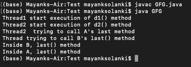

# 如何用 Java 中的线程解决死锁？

> 原文:[https://www . geesforgeks . org/如何使用 java 中的线程解决死锁/](https://www.geeksforgeeks.org/how-to-solve-deadlock-using-threads-in-java/)

如果两个线程永远相互等待，这种类型的无限等待在 java 中被称为[死锁](https://www.geeksforgeeks.org/deadlock-in-java-multithreading/)。 [Synchronized 关键字](https://www.geeksforgeeks.org/synchronized-in-java/)是死锁情况的唯一原因，因此在使用 Synchronized 关键字时，我们必须特别小心。死锁没有解决技术，但有几种预防技术可用。

**实现:**死锁发生

**例 1:**

## Java 语言(一种计算机语言，尤用于创建网站)

```
// Java program to illustrate Deadlock
// where deadlock occurs

// Importing required packages
import java.io.*;
import java.util.*;

// Class 1
// Helper class
class A {

    // Method 1 of this class
    // Synchronized method
    public synchronized void last()
    {

        // Print and display statement
        System.out.println("Inside A, last() method");
    }

    // Method 2 of this class
    // Synchronized method
    public synchronized void d1(B b)
    {
        System.out.println(
            "Thread1 start execution of d1() method");

        // Try block to check for exceptions
        try {

            // Putting the current thread to sleep for
            // specific time using slep() method
            Thread.sleep(2000);
        }

        // Catch block to handle the exceptions
        catch (InterruptedException e) {
            // Display the exception on the console
            System.out.println(e);
        }

        // Display statement
        System.out.println(
            "Thread trying to call B's last() method");

        // Calling the method 1 of this class as created
        // above
        b.last();
    }
}

// Class 2
// Helper class B
class B {

    // Method 1 of this class
    public synchronized void last()
    {

        // Display statement only
        System.out.println("Inside B, last() method");
    }

    // Method 2 of this class
    // Synchronized the method d2
    public synchronized void d2(A a)
    {

        // Display message only
        System.out.println(
            "Thread2 start execution of d2() method");

        // Try block to check for exceptions
        try {

            // Putting the current thread to sleep for
            // certain time using sleep() method
            Thread.sleep(2000);

            // Catch block to handle the exceptions
        }
        catch (InterruptedException e) {

            // Display the exception on the console
            System.out.println(e);
        }

        // Display message only
        System.out.println(
            "Thread2  trying to call A's last method");

        // Again calling the last() method inside this class
        a.last();
    }
}

// Class 3
// Main class
// Deadlock class which is extending Thread class
class GFG extends Thread {

    // Creating object of type class A
    A a = new A();

    // Creating object of type class B
    B b = new B();

    // Method 1
    public void m1()
    {

        // Starting the thread
        this.start();

        // Calling d1 method of class A
        a.d1(b);
    }

    // Method 2
    // run() method for the thread
    public void run()
    {

        // Calling d2 method of class B
        b.d2(a);
    }

    // Method 3
    // Main driver method
    public static void main(String[] args)
    {

        // Creating object of this class
        GFG deadlock = new GFG();

        // Calling m1 method
        deadlock.m1();
    }
}
```

**输出:**


**输出解释:**

这里光标永远显示，因为线程进入死锁状态。在上面的程序中，如果我们删除了至少一个同步关键字，那么程序就不会进入死锁状态。因此，synchronized 关键字是死锁情况的主要原因之一。因此，在使用同步关键字时，我们必须特别小心。

我们可以通过以下方式避免死锁情况:

*   **使用 Thread.join()方法**:如果两个线程无限期地等待对方使用 thread join 完成，我们会得到死锁。那么我们的线程就要等待另一个线程完成，最好总是使用 Thread.join()方法，最长的时间你要等待线程完成。
*   **使用锁排序:**我们必须始终为每个锁分配一个数值，在获取具有较高数值的锁之前，我们必须获取具有较低数值的锁。
*   **避免不必要的锁:**我们应该只对那些需要锁的成员使用锁，不必要的使用锁会导致死锁的情况。并且建议使用无锁的数据结构，如果是可以让你的代码免锁。例如，不要使用同步数组列表，而是使用 ConcurrentLinkedQueue。

**示例 2:** 防止死锁

## Java 语言(一种计算机语言，尤用于创建网站)

```
// Java program to illustrate Deadlock
// where deadlock is pevented from occuring

// Importing required packages
import java.io.*;
import java.util.*;

// Class 1
// Helper class
class A {

    // Method 1 of this class
    // Synchronized method
    public synchronized void last()
    {

        // Print and display statement
        System.out.println("Inside A, last() method");
    }

    // Method 2 of this class
    // Synchronized method
    public synchronized void d1(B b)
    {
        System.out.println(
            "Thread1 start execution of d1() method");

        // Try block to check for exceptions
        try {

            // Putting the current thread to sleep for
            // specific time using slep() method
            Thread.sleep(2000);
        }

        // Catch block to handle the exceptions
        catch (InterruptedException e) {
            // Display the exception on the console
            System.out.println(e);
        }

        // Display statement
        System.out.println(
            "Thread trying to call B's last() method");

        // Calling the method 1 of this class as created
        // above
        b.last();
    }
}

// Class 2
// Helper class B
class B {

    // Method 1 of this class
    public void last()
    {

        // Display statement only
        System.out.println("Inside B, last() method");
    }

    // Method 2 of this class
    // Non-synchronized the method d2
    public void d2(A a)
    {

        // Display message only
        System.out.println(
            "Thread2 start execution of d2() method");

        // Try block to check for exceptions
        try {

            // Putting the current thread to sleep for
            // certain time using sleep() method
            Thread.sleep(2000);

            // Catch block to handle the exceptions
        }
        catch (InterruptedException e) {

            // Display the exception on the console
            System.out.println(e);
        }

        // Display message only
        System.out.println(
            "Thread2  trying to call A's last method");

        // Again calling the last() method inside this class
        a.last();
    }
}

// Class 3
// Main class
// Deadlock class which is extending Thread class
class GFG extends Thread {

    // Creating object of type class A
    A a = new A();

    // Creating object of type class B
    B b = new B();

    // Method 1
    public void m1()
    {

        // Starting the thread
        this.start();

        // Calling d1 method of class A
        a.d1(b);
    }

    // Method 2
    // run() method for the thread
    public void run()
    {

        // Calling d2 method of class B
        b.d2(a);
    }

    // Method 3
    // Main driver method
    public static void main(String[] args)
    {

        // Creating object of this class
        GFG deadlock = new GFG();

        // Calling m1 method
        deadlock.m1();
    }
}
```

**输出:**

