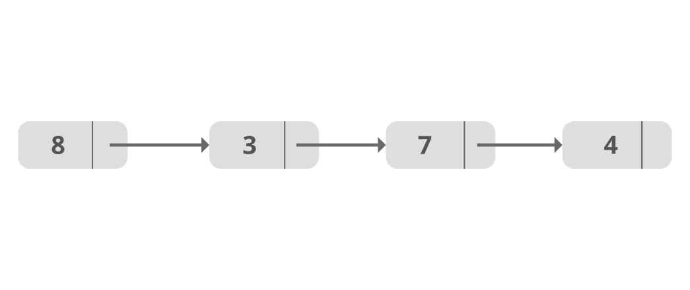
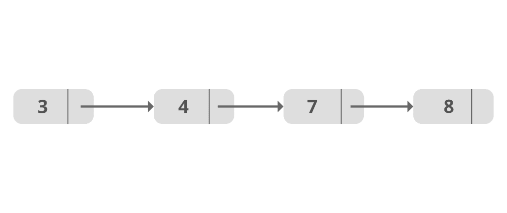

# 如何在 Java 中对链表进行排序？

> 原文:[https://www . geesforgeks . org/how-sort-a-linked list-in-Java/](https://www.geeksforgeeks.org/how-to-sort-a-linkedlist-in-java/)

一个[链表](https://www.geeksforgeeks.org/data-structures/linked-list/)是一个线性数据结构，其中的元素不存储在连续的内存位置。

**按升序对单链表的节点进行排序:**



原始列表



排序列表

**我们可以通过多种排序技术对链表进行排序:**

1.  冒泡排序
2.  插入排序
3.  快速分类
4.  合并排序

**方法一:使用** [**冒泡排序**](https://www.geeksforgeeks.org/bubble-sort/) 进行排序

*   为了完成这个任务，我们维护两个指针:当前指针和索引指针。
*   最初，当前指向头节点，索引将指向当前旁边的节点。
*   通过比较当前数据和索引数据，遍历列表，直到当前指向 null。
*   对于每个当前值，索引是当前节点的下一个，从当前的下一个节点遍历到 null。
*   然后将当前节点的值与其下一个节点到最后一个节点的每个值进行比较，如果该值小于当前值，则交换这些值，这样，最小的值作为当前索引。

## Java 语言(一种计算机语言，尤用于创建网站)

```java
// Java program to sort a Linked List using Bubble Sort

public class SortList {

    // Represent a node of the singly linked list
    class Node {
        int data;
        Node next;

        public Node(int data)
        {
            this.data = data;
            this.next = null;
        }
    }

    // Represent the head and tail of the singly linked list
    public Node head = null;
    public Node tail = null;

    // addNode() will add a new node to the list
    public void addNode(int data)
    {

        // Create a new node
        Node newNode = new Node(data);

        // Checks if the list is empty
        if (head == null) {

            // If list is empty, both head and tail will
            // point to new node
            head = newNode;
            tail = newNode;
        }
        else {

            // newNode will be added after tail such that
            // tail's next will point to newNode
            tail.next = newNode;

            // newNode will become new tail of the list
            tail = newNode;
        }
    }

    // sortList() will sort nodes of the list in ascending
    // order
    public void sortList()
    {

        // Node current will point to head
        Node current = head, index = null;

        int temp;

        if (head == null) {
            return;
        }
        else {
            while (current != null) {
                // Node index will point to node next to
                // current
                index = current.next;

                while (index != null) {
                    // If current node's data is greater
                    // than index's node data, swap the data
                    // between them
                    if (current.data > index.data) {
                        temp = current.data;
                        current.data = index.data;
                        index.data = temp;
                    }

                    index = index.next;
                }
                current = current.next;
            }
        }
    }

    // display() will display all the nodes present in the
    // list
    public void display()
    {
        // Node current will point to head
        Node current = head;

        if (head == null) {
            System.out.println("List is empty");
            return;
        }
        while (current != null) {
            // Prints each node by incrementing pointer
            System.out.print(current.data + " ");
            current = current.next;
        }

        System.out.println();
    }

    public static void main(String[] args)
    {

        SortList sList = new SortList();

        // Adds data to the list
        sList.addNode(8);
        sList.addNode(3);
        sList.addNode(7);
        sList.addNode(4);

        // Displaying original list
        System.out.println("Original list: ");
        sList.display();

        // Sorting list
        sList.sortList();

        // Displaying sorted list
        System.out.println("Sorted list: ");
        sList.display();
    }
}
```

**Output**

```java
Original list: 
8 3 7 4 
Sorted list: 
3 4 7 8
```

**时间复杂度:** O(北^ 2)

**空间复杂度:** O(1)

**方法二:使用** [**插入排序**](https://www.geeksforgeeks.org/insertion-sort-for-singly-linked-list/) 进行排序

*   在插入排序技术中，我们假设列表中当前元素之前的所有元素都已经排序，我们从当前元素开始。
*   将当前元素与其之前的所有元素进行比较，如果没有按顺序进行交换。对所有后续元素重复该过程。
*   一般来说，插入排序技术会将每个元素与其之前的所有元素进行比较，并对元素进行排序，以将其放置在正确的位置。

如前所述，插入排序技术对于较小的数据集更为可行，因此可以使用有效的插入排序对包含少量元素的数组进行排序。

插入排序在对链表数据结构进行排序时特别有用。众所周知，链表有指针指向它的下一个元素(单链表)和前一个元素(双链表)。这使得跟踪上一个和下一个元素变得更加容易。

## Java 语言(一种计算机语言，尤用于创建网站)

```java
// Java program to sort Linked List using Insertion Sort

public class LinkedlistIS
{
    node head;
    node sorted;

    class node
    {
        int val;
        node next;

        public node(int val)
        {
            this.val = val;
        }
    }

    void push(int val)
    {
        // allocate node
        node newnode = new node(val);

        // link the old list off the new node
        newnode.next = head;

        // move the head to point to the new node
        head = newnode;
    }

    // function to sort a singly linked list using insertion sort
    void insertionSort(node headref)
    {
        // Initialize sorted linked list
        sorted = null;
        node current = headref;

        // Traverse the given linked list and insert every
        // node to sorted
        while (current != null)
        {
            // Store next for next iteration
            node next = current.next;

            // insert current in sorted linked list
            sortedInsert(current);

            // Update current
            current = next;
        }

        // Update head_ref to point to sorted linked list
        head = sorted;
    }

    // function to insert a new_node in a list. Note that
    // this function expects a pointer to head_ref as this
    // can modify the head of the input linked list
    // (similar to push())
    void sortedInsert(node newnode)
    {
        // Special case for the head end
        if (sorted == null || sorted.val >= newnode.val)
        {
            newnode.next = sorted;
            sorted = newnode;
        }
        else
        {
            node current = sorted;

            // Locate the node before the point of insertion
            while (current.next != null && current.next.val < newnode.val)
            {
                current = current.next;
            }

            newnode.next = current.next;
            current.next = newnode;
        }
    }

    // Function to print linked list
    void printlist(node head)
    {
        while (head != null)
        {
            System.out.print(head.val + " ");
            head = head.next;
        }
    }

    // Driver program to test above functions
    public static void main(String[] args)
    {
        LinkedlistIS list = new LinkedlistIS();

        list.push(4);
        list.push(7);
        list.push(3);
        list.push(8);

        System.out.println("Linked List before Sorting..");
        list.printlist(list.head);

        list.insertionSort(list.head);

        System.out.println("\nLinkedList After sorting");
        list.printlist(list.head);
    }
}
```

**Output**

```java
Linked List before Sorting..
8 3 7 4 
LinkedList After sorting
3 4 7 8
```