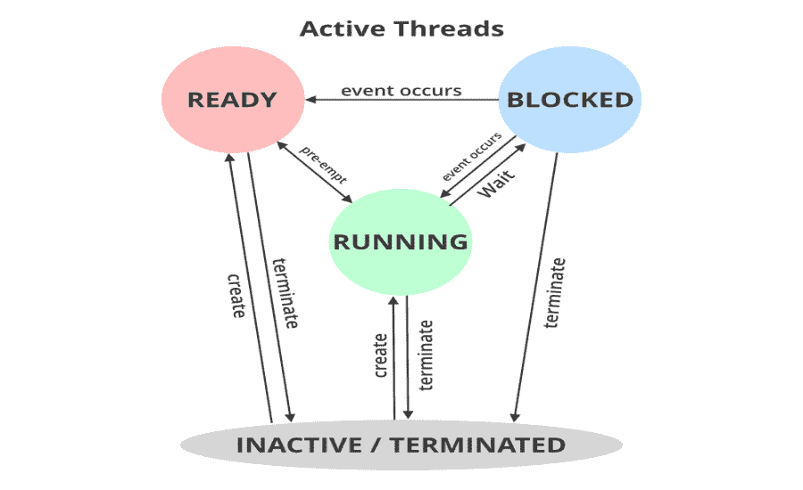

# 如何在 Java 中暂时挂起一个线程？

> 原文:[https://www . geesforgeks . org/如何临时挂起 java 线程/](https://www.geeksforgeeks.org/how-to-temporarily-suspend-a-thread-in-java/)

[Java 中的线程](https://www.geeksforgeeks.org/multithreading-in-java/)是用户可以创建的轻量级子进程。它用于在后台执行复杂的任务，而不会干扰主程序。以便通过使线程从运行状态进入等待状态来暂时挂起线程。用于实现目标的概念是 [***暂停()***](https://www.geeksforgeeks.org/lifecycle-and-states-of-a-thread-in-c-sharp/) 功能。

**方法:**如何暂时挂起线程

*   创建“*神话类**”***，这是扩展了***Java . lang . thread 类***。它有一个 [*run()*](https://www.geeksforgeeks.org/difference-between-thread-start-and-thread-run-in-java/) 函数，其中包含一些要执行的代码。****
*   ****在主函数中，通过使用 [*setName()*](https://www.geeksforgeeks.org/naming-thread-fetching-name-current-thread-java/) 函数，创建了一个名为“*Mythread Class**”***对象，该对象被命名为“GFG”。****
*   ****通过调用[*【start()*](https://www.geeksforgeeks.org/start-function-multithreading-java/)函数启动线程执行任务，并开始执行 run()函数中编写的代码。****

********

****有时由于某些原因，会有挂起这些线程的紧迫性。所以这里程序显示了如何使用 [*【暂停()*](https://www.geeksforgeeks.org/lifecycle-and-states-of-a-thread-in-c-sharp/) 功能来暂时暂停线程。线程将从运行状态进入*等待*状态。该函数使线程暂时停止执行。线程将保持等待状态，直到我们恢复它。因此，在这个程序中，线程保持挂起，直到睡眠时间，即 5 秒(在这个程序中)结束，然后我们使用 resume()函数恢复它。****

******语法:**为了获取当前线程的 ID 号已经创建****

```java
**Thread.currentThread( ).getId( ) ;**
```

******使用的方法:******

1.  ****[start()](https://www.geeksforgeeks.org/start-function-multithreading-java/) :这是一个启动线程功能的方法。****
2.  ****[setName()](https://www.geeksforgeeks.org/naming-thread-fetching-name-current-thread-java/) :这是一个用来设置创建的线程名称的方法。****
3.  ****[sleep(time)](https://www.geeksforgeeks.org/sleep-in-python/) :这是一个让线程休眠几毫秒时间的方法。****
4.  ****[suspend()](https://www.geeksforgeeks.org/green-vs-native-threads-and-deprecated-methods-in-java/) :这是一个用来挂起线程的方法。线程将保持挂起状态，并且在恢复之前不会执行其任务。****
5.  ****[resume()](https://www.geeksforgeeks.org/lifecycle-and-states-of-a-thread-in-c-sharp/) :这是一个用来恢复挂起线程的方法。****

******示例:******

## ****Java 语言(一种计算机语言，尤用于创建网站)****

```java
**// Java program to suspend a thread temporarily

// Importing all classes from
// java.util package
import java.util.*;

// Class- MyThread
class MyThread extends Thread {

    // Remember : Method can be executed multiple times
    public void run()
    {

        // Try block to check if any exception occurs
        try {

            // Print and display the running thread
            // using currentThread() method
            System.out.println(
                "Thread " + Thread.currentThread().getId()
                + " is running");
        }

        // Catch block to handle the exceptions
        catch (Exception e) {

            // Message to be printed if
            // the exception is encountered
            System.out.println("Exception is caught");
        }
    }
}

// Class-Main
public class GFG {

    // Main Driver Method
    public static void main(String[] args) throws Exception
    {

        // Creating a thread
        MyThread thread = new MyThread();

        // Naming thread as "GFG"
        thread.setName("GFG");

        // Start the functioning of a thread
        thread.start();

        // Sleeping thread for specific amount of time
        Thread.sleep(500);

        // Thread GFG suspended temporarily
        thread.suspend();

        // Display message
        System.out.println(
            "Thread going to sleep for 5 seconds");

        // Sleeping thread for specific amount of time
        Thread.sleep(5000);

        // Display message
        System.out.println("Thread Resumed");

        // Thread GFG resumed
        thread.resume();
    }
}**
```

******输出:******

```java
**Thread 13 is running
Thread Suspended
Thread going to sleep for 5 seconds
Thread Resumed**
```