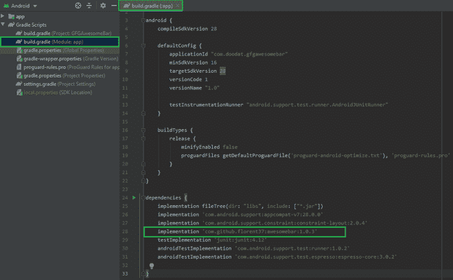

# 如何在安卓 App 中使用 AwesomeBar 库？

> 原文:[https://www . geeksforgeeks . org/使用方法-awesome bar-Android 中的库-app/](https://www.geeksforgeeks.org/how-to-use-awesomebar-library-in-android-app/)

**AwesomeBar** 是一个库，它为应用程序栏中的各种特性和功能(如导航抽屉、动作按钮和溢出菜单)提供动画并使其变得非常容易集成。在本文中，我们将使用 **Java** 语言在安卓应用程序中实现这个库。下面给出了一个示例 GIF，以了解我们将在本文中做什么。


### **分步实施**

**第一步:创建新项目**

要在安卓工作室创建新项目，请参考[如何在安卓工作室创建/启动新项目](https://www.geeksforgeeks.org/android-how-to-create-start-a-new-project-in-android-studio/)。注意选择 **Java** 作为编程语言。

**第二步:添加库依赖**

导航到 **Gradle 脚本> build.gradle(模块:应用)**，在依赖项部分添加库，并同步项目。

```java
dependencies {
    implementation 'com.github.florent37:awesomebar:1.0.3'
}
```



**步骤 3:使用 activity_main.xml 文件**

导航到**应用程序> res >布局> activity_main.xml** 并将下面的代码添加到该文件中。下面是 **activity_main.xml** 文件的代码。

## 可扩展标记语言

```java
<?xml version="1.0" encoding="utf-8"?>
<android.support.v4.widget.DrawerLayout 
    xmlns:android="http://schemas.android.com/apk/res/android"
    android:id="@+id/drawer_layout"
    android:layout_width="match_parent"
    android:layout_height="match_parent">

    <LinearLayout
        android:layout_width="match_parent"
        android:layout_height="match_parent"
        android:orientation="vertical">

        <com.github.florent37.awesomebar.AwesomeBar
            android:id="@+id/bar"
            android:layout_width="match_parent"
            android:layout_height="wrap_content"
            android:background="@android:color/white"
            android:elevation="4dp" />

        <ScrollView
            android:layout_width="match_parent"
            android:layout_height="match_parent">

            <!-- Add main content here-->
            <TextView
                android:layout_width="wrap_content"
                android:layout_height="wrap_content"
                android:layout_gravity="center"
                android:text="@string/app_name" />

        </ScrollView>

    </LinearLayout>

    <!-- Layout for navigation drawer -->
    <FrameLayout
        android:id="@+id/left_drawer"
        android:layout_width="match_parent"
        android:layout_height="match_parent"
        android:layout_gravity="start"
        android:background="@android:color/white" />

</android.support.v4.widget.DrawerLayout>
```

**步骤 4:使用 MainActivity.java 文件**

转到**MainActivity.java**文件，参考以下代码。以下是**MainActivity.java**文件的代码。代码中添加了注释，以更详细地理解代码。

## Java 语言(一种计算机语言，尤用于创建网站)

```java
import android.os.Bundle;
import android.support.v4.widget.DrawerLayout;
import android.support.v7.app.AppCompatActivity;
import android.view.Gravity;
import android.view.View;
import android.widget.Toast;

import com.github.florent37.awesomebar.ActionItem;
import com.github.florent37.awesomebar.AwesomeBar;

public class MainActivity extends AppCompatActivity {

    AwesomeBar bar;
    DrawerLayout drawerLayout;

    @Override
    protected void onCreate(Bundle savedInstanceState) {
        super.onCreate(savedInstanceState);
        setContentView(R.layout.activity_main);

        drawerLayout = findViewById(R.id.drawer_layout);
        bar = findViewById(R.id.bar);

        // adding action button in AwesomeBar with drawable and text
        bar.addAction(R.drawable.awsb_ic_edit_animated, "Add Post");

        // adding the OverFlowItem item in AwesomeBar
        bar.addOverflowItem("Settings");
        bar.addOverflowItem("About");

        bar.setActionItemClickListener(new AwesomeBar.ActionItemClickListener() {
            @Override
            public void onActionItemClicked(int position, ActionItem actionItem) {
                // toast is shown when action item is pressed.
                Toast.makeText(getBaseContext(), actionItem.getText() + " clicked",Toast.LENGTH_SHORT).show();
            }
        });

        bar.setOverflowActionItemClickListener(new AwesomeBar.OverflowActionItemClickListener() {
            @Override
            public void onOverflowActionItemClicked(int position, String item) {
                // toast is shown when an OverFlowAction item is pressed.
                Toast.makeText(getBaseContext(), item + " clicked", Toast.LENGTH_SHORT).show();
            }

        });

        bar.setOnMenuClickedListener(new View.OnClickListener() {
            @Override
            public void onClick(View v) {
                // opens the navigation drawer from start
                Toast.makeText(getBaseContext(), "Opening Navigation  Drawer",Toast.LENGTH_SHORT).show();
                drawerLayout.openDrawer(Gravity.START);
            }
        });

        // setting true changes the clickable icon as "<"
        bar.displayHomeAsUpEnabled(false);
    }
}
```

**输出:**

<video class="wp-video-shortcode" id="video-638376-1" width="640" height="360" preload="metadata" controls=""><source type="video/mp4" src="https://media.geeksforgeeks.org/wp-content/uploads/20210704025426/AwesomeBar.mp4?_=1">[https://media.geeksforgeeks.org/wp-content/uploads/20210704025426/AwesomeBar.mp4](https://media.geeksforgeeks.org/wp-content/uploads/20210704025426/AwesomeBar.mp4)</video>

**GitHub 资源库:** [AwesomeBar 库](https://github.com/garg-lucifer/GFGAwesomeBar)