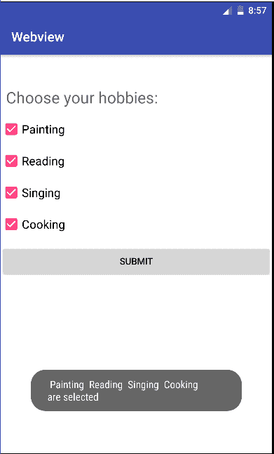

# 如何在安卓系统中使用 CheckBox

> 原文:[https://www . geesforgeks . org/如何在安卓系统中使用复选框/](https://www.geeksforgeeks.org/how-to-use-checkbox-in-android/)

CheckBox 属于 android.widget.CheckBox 类。安卓 CheckBox 类是 CompoundButton 类的子类。它通常用于用户可以从给定的选项列表中选择一个或多个选项的地方。比如选择爱好。

```
*public class* CheckBox *extends* CompoundButton

```

**等级等级:**

```
java.lang.Object
   ↳  android.view.View
        ↳  android.widget.TextView
             ↳  android.widget.Button
                  ↳  android.widget.CompoundButton
                       ↳  android.widget.CheckBox

```

它有两种状态–**选中**或**未选中**。

**CheckBox 类的方法**

*   ***公共布尔 isChecked():*** 如果 CheckBox 处于选中状态，则返回 true，否则返回 false。
*   ***公共虚空设置选中(布尔状态):*** 它改变复选框的状态。

下面是一个例子的代码，用户在 CheckBox 的帮助下从包含绘画、阅读、唱歌和烹饪的列表中选择自己的爱好。

**MainActivity.java**

```
//Below is the code for MainActivity.java
package com.geeksforgeeks.gfg.checkbox;

import android.support.v7.app.AppCompatActivity;
import android.os.Bundle;
import android.view.View;
import android.widget.CheckBox;
import android.widget.Toast;

public class MainActivity extends AppCompatActivity {
    CheckBox ch, ch1, ch2, ch3;

    @Override
    protected void onCreate(Bundle savedInstanceState) {
        super.onCreate(savedInstanceState);

        // Binding MainActivity.java with activity_main.xml file
        setContentView(R.layout.activity_main);

        // Finding CheckBox by its unique ID
        ch=(CheckBox)findViewById(R.id.checkBox);
        ch1=(CheckBox)findViewById(R.id.checkBox2);
        ch2=(CheckBox)findViewById(R.id.checkBox3);
        ch3=(CheckBox)findViewById(R.id.checkBox4);
    }

    // This function is invoked when the button is pressed.
    public void Check(View v)
    {
        String msg="";

        // Concatenation of the checked options in if

        // isChecked() is used to check whether 
        // the CheckBox is in true state or not.

        if(ch.isChecked())        
            msg = msg + " Painting ";
        if(ch1.isChecked())
            msg = msg + " Reading ";
        if(ch2.isChecked())
            msg = msg + " Singing ";
        if(ch3.isChecked())
            msg = msg + " Cooking ";

        // Toast is created to display the 
        // message using show() method.
        Toast.makeText(this, msg + "are selected", 
                       Toast.LENGTH_LONG).show();
    }
}
```

**活动 _main.xml**

activity_main.xml 有一个 TextView、4 个 CheckBoxes 和一个按钮。文本视图提示用户选择他/她的爱好。
首先用户选择其选项，然后按下提交按钮。按下提交按钮后，将生成一个显示所选爱好的吐司。

```
<!-- Below is the code for activity_main.xml -->
<?xml version="1.0" encoding="utf-8"?>
<LinearLayout xmlns:android="http://schemas.android.com/apk/res/android"
    xmlns:app="http://schemas.android.com/apk/res-auto"
    xmlns:tools="http://schemas.android.com/tools"
    android:layout_width="match_parent"
    android:layout_height="match_parent"
    android:background="#ffffff"
    android:orientation="vertical"
    tools:context="com.example.hp.checkbox.MainActivity">

    <TextView
        android:id="@+id/textView"

        <!-- covers the entire width of the screen -->
        android:layout_width="match_parent"

        <!-- covers as much height as required. -->
        android:layout_height="wrap_content"

        <!--create 8dp space from margin ends-->
        android:layout_marginEnd="8dp"

        <!--create 8dp space from start of margin-->
        android:layout_marginStart="8dp"

        <!--create 48dp space from the top of margin-->
        android:layout_marginTop="48dp"

        android:text="Choose your hobbies:"
        android:textSize="24sp"
        app:layout_constraintEnd_toEndOf="parent"
        app:layout_constraintStart_toStartOf="parent"
        app:layout_constraintTop_toTopOf="parent" />

    <CheckBox
        android:id="@+id/checkBox"

        <!-- covers the entire width of the screen -->
        android:layout_width="match_parent"

        <!-- covers as much height as required. -->
        android:layout_height="wrap_content"

        android:text="Painting"
        android:layout_marginTop="16dp"
        android:textSize="18sp" />

    <CheckBox
        android:id="@+id/checkBox2"

        <!-- covers the entire width of the screen -->
        android:layout_width="match_parent"

        <!-- covers as much height as required. -->
        android:layout_height="wrap_content"

        android:text="Reading"
        android:layout_marginTop="16dp"
        android:textSize="18sp" />

    <CheckBox
        android:id="@+id/checkBox3"

        <!-- covers the entire width of the screen -->
        android:layout_width="match_parent"

        <!-- covers as much height as required. -->
        android:layout_height="wrap_content"

        android:layout_marginTop="16dp"
        android:text="Singing"
        android:textSize="18sp"
        app:layout_constraintTop_toTopOf="@+id/textView"
        tools:layout_editor_absoluteX="382dp" />

    <CheckBox
        android:id="@+id/checkBox4"

        <!-- covers the entire width of the screen -->
        android:layout_width="match_parent"

        <!-- covers as much height as required. -->
        android:layout_height="wrap_content"

        android:text="Cooking"
        android:layout_marginTop="16dp"
        android:textSize="18sp"
        app:layout_constraintTop_toBottomOf="@+id/checkBox"
        tools:layout_editor_absoluteX="386dp" />

    <Button
        android:id="@+id/button"

        <!-- covers the entire width of the screen -->
        android:layout_width="match_parent"

        <!-- covers as much height as required. -->
        android:layout_height="wrap_content"

        android:layout_marginTop="16dp"
        android:onClick="Check"
        android:text="submit" />
</LinearLayout>
```

**输出:**
