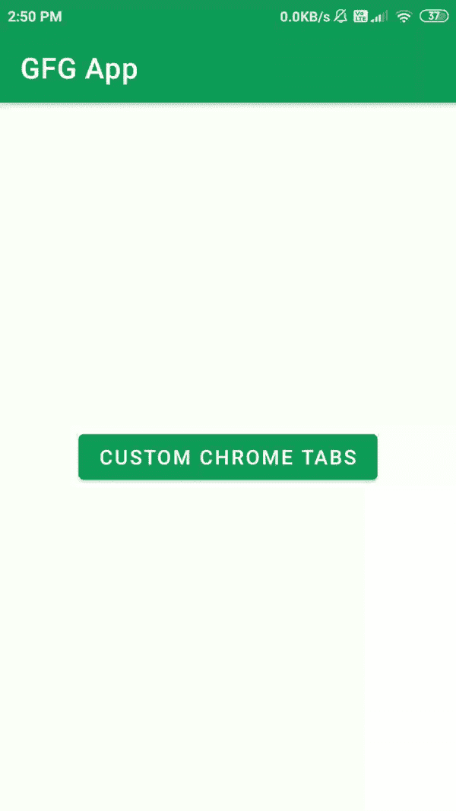

# 如何在安卓系统中使用自定义 Chrome 标签？

> 原文:[https://www . geesforgeks . org/使用方法-自定义-chrome-tab in-Android/](https://www.geeksforgeeks.org/how-to-use-custom-chrome-tabs-in-android/)

许多应用程序必须在其应用程序中显示不同类型的网页。在安卓系统中显示网页有很多功能，我们可以在安卓应用程序中显示网页。开发人员通常更喜欢使用[网络视图](https://www.geeksforgeeks.org/android-webview-in-kotlin/)或将用户重定向到他们应用程序中的任何浏览器。但是，在浏览器中打开网页以及在安卓网络视图中显示网页有时会成为我们不得不执行的繁重任务。而不是使用 WebView 并在浏览器中打开网页。我们可以简单地在我们的应用程序中使用定制的 chrome 标签，使这项任务变得更容易和更轻。许多应用程序使用自定义 chrome 标签的这一功能，通过自定义 chrome 标签将用户从应用程序重定向到任何网页。所以在本文中，我们将看一下定制 Chrome 标签在 Android 中的实现。

## 安卓系统中自定义 Chrome 标签的实现

使用自定义 Chrome 标签，我们只需在安卓应用中点击一个按钮就可以显示 GFG 网页。下面给出了一个示例 GIF，从中您将了解我们在本文中要做什么。注意，我们使用的是 **Java** 语言来实现 Android 中的 Chrome 标签。



### 逐步实施

**第一步:创建新项目**

在安卓工作室创建新项目请参考 [<u>【如何在安卓工作室创建/启动新项目】</u>](https://www.geeksforgeeks.org/android-how-to-create-start-a-new-project-in-android-studio/) 。注意选择 **Java** 作为编程语言。

**第二步:添加依赖项进行构建. gradle(模块:app)**

导航到**渐变脚本>构建.渐变(模块:应用)**，并在依赖项部分添加以下依赖项。

> 实现“androidx.browser:browser:1.2.0”

现在同步选项将出现在右上角点击立即同步选项。

**步骤 3:使用 activity_main.xml 文件**

转到 **activity_main.xml** 文件，参考以下代码。下面是 **activity_main.xml** 文件的代码。

## 可扩展标记语言

```java
<?xml version="1.0" encoding="utf-8"?>
<RelativeLayout 
    xmlns:android="http://schemas.android.com/apk/res/android"
    xmlns:tools="http://schemas.android.com/tools"
    android:layout_width="match_parent"
    android:layout_height="match_parent"
    tools:context=".MainActivity">

    <Button
        android:id="@+id/idBtnCustomChromeTab"
        android:layout_width="wrap_content"
        android:layout_height="wrap_content"
        android:layout_centerInParent="true"
        android:text="Custom Chrome Tabs" />

</RelativeLayout>
```

**步骤 4:使用 MainActivity.java 文件**

转到**MainActivity.java**文件，参考以下代码。以下是**MainActivity.java**文件的代码。代码中添加了注释，以更详细地理解代码。

## Java 语言(一种计算机语言，尤用于创建网站)

```java
import android.app.Activity;
import android.content.Intent;
import android.net.Uri;
import android.os.Bundle;
import android.view.View;
import android.widget.Button;

import androidx.appcompat.app.AppCompatActivity;
import androidx.browser.customtabs.CustomTabsIntent;
import androidx.core.content.ContextCompat;

public class MainActivity extends AppCompatActivity {

    Button customChromeTabBtn;

    // url for loading in custom chrome tab
    String url = "https://www.geeksforgeeks.org/";

    @Override
    protected void onCreate(Bundle savedInstanceState) {
        super.onCreate(savedInstanceState);
        setContentView(R.layout.activity_main);

        // initializing button for opening custom chrome tabs.
        customChromeTabBtn = findViewById(R.id.idBtnCustomChromeTab);
        customChromeTabBtn.setOnClickListener(new View.OnClickListener() {
            @Override
            public void onClick(View v) {

                // initializing object for custom chrome tabs.
                CustomTabsIntent.Builder customIntent = new CustomTabsIntent.Builder();

                // below line is setting toolbar color 
                // for our custom chrome tab.
                customIntent.setToolbarColor(ContextCompat.getColor(MainActivity.this, R.color.purple_200));

                // we are calling below method after 
                // setting our toolbar color.
                openCustomTab(MainActivity.this, customIntent.build(), Uri.parse(url));
            }
        });
    }

    public static void openCustomTab(Activity activity, CustomTabsIntent customTabsIntent, Uri uri) {
        // package name is the default package
        // for our custom chrome tab
        String packageName = "com.android.chrome";
        if (packageName != null) {

            // we are checking if the package name is not null
            // if package name is not null then we are calling 
            // that custom chrome tab with intent by passing its
            // package name.
            customTabsIntent.intent.setPackage(packageName);

            // in that custom tab intent we are passing 
            // our url which we have to browse.
            customTabsIntent.launchUrl(activity, uri);
        } else {
            // if the custom tabs fails to load then we are simply 
            // redirecting our user to users device default browser.
            activity.startActivity(new Intent(Intent.ACTION_VIEW, uri));
        }
    }
}
```

### 输出:

<video class="wp-video-shortcode" id="video-532961-1" width="640" height="360" preload="metadata" controls=""><source type="video/mp4" src="https://media.geeksforgeeks.org/wp-content/uploads/20201222145642/Screenrecorder-2020-12-22-14-50-19-635.mp4?_=1">[https://media.geeksforgeeks.org/wp-content/uploads/20201222145642/Screenrecorder-2020-12-22-14-50-19-635.mp4](https://media.geeksforgeeks.org/wp-content/uploads/20201222145642/Screenrecorder-2020-12-22-14-50-19-635.mp4)</video>