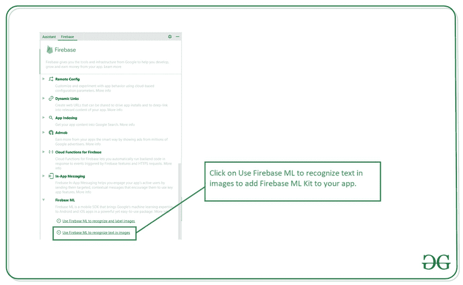

# 如何在安卓系统中使用 Firebase ML 套件智能回复？

> 原文:[https://www . geeksforgeeks . org/使用方法-firebase-ml-kit-smart-repries-in-Android/](https://www.geeksforgeeks.org/how-to-use-firebase-ml-kit-smart-replies-in-android/)

我们已经看到在安卓系统中使用聊天机器人来回答用户最常见的问题。在本文中，我们将看一下 **Firebase ML Kit 智能回复在安卓**中的实现。Firebase ML 工具包智能回复用于对使用 Firebase ML 工具包的用户提出的问题提供智能回复。

### 我们将在本文中构建什么？

我们将构建一个简单的应用程序，其中我们将制作一个类似聊天的界面，用户将在聊天框中发布他的查询，根据用户的查询，我们将看到来自 Firebase ML Kit 的消息。下面给出一个示例 视频 来了解一下我们在本文中要做什么。注意，我们将使用 **Java** 语言来实现这个项目。

<video class="wp-video-shortcode" id="video-562892-1" width="640" height="360" preload="metadata" controls=""><source type="video/mp4" src="https://media.geeksforgeeks.org/wp-content/uploads/20210220222745/Screenrecorder-2021-02-20-20-24-43-1.mp4?_=1">[https://media.geeksforgeeks.org/wp-content/uploads/20210220222745/Screenrecorder-2021-02-20-20-24-43-1.mp4](https://media.geeksforgeeks.org/wp-content/uploads/20210220222745/Screenrecorder-2021-02-20-20-24-43-1.mp4)</video>

### **分步实施**

**第一步:创建新项目**

要在安卓工作室创建新项目，请参考[如何在安卓工作室创建/启动新项目](https://www.geeksforgeeks.org/android-how-to-create-start-a-new-project-in-android-studio/)。注意选择 **Java** 作为编程语言。

**第二步:将你的应用连接到 Firebase**

在 Android Studio 中创建新项目后，将您的应用程序连接到 Firebase。用于将您的应用程序连接到 firebase。导航到顶部栏上的工具。之后点击 Firebase。右侧将打开一个新窗口。在该窗口中，单击 Firebase ML，然后单击在安卓系统中使用 Firebase ML 工具包。你可以看到截图下面的选项。



点击此选项后，在下一个屏幕点击 **连接到 Firebase** 选项，将你的应用连接到 Firebase。

**第三步:添加语言翻译的依赖项，建立. gradle 文件**

导航至 **Gradle 脚本> build.gradle(模块:app)** 并在依赖项部分添加以下依赖项。

> *//火基核心依赖。*
> 
> *实现‘com . Google . firebase:firebase-core:15 . 0 . 2’*
> 
> *// Firebase ML 依赖关系*
> 
> *实现‘com . Google . firebase:firebase-ml-vision:24 . 0 . 3’*
> 
> //智能回复的相关性
> 
> 实现' com . Google . firebase:firebase-ml-自然语言-smart-reply-model:20.0.7 '

在同一个文件中。在安卓部分添加下面的代码。

> aaptOptions {
> 
> 不可思议的" tflite "
> 
> }

现在同步你的项目，让我们开始实现 Firebase ML 工具包智能回复。

**第 4 步:使用 activity_main.xml 文件**

导航到**应用程序> res >布局> activity_main.xml** 并将下面的代码添加到该文件中。下面是 **activity_main.xml** 文件的代码。

## 可扩展标记语言

```
<?xml version="1.0" encoding="utf-8"?>
<RelativeLayout 
    xmlns:android="http://schemas.android.com/apk/res/android"
    xmlns:app="http://schemas.android.com/apk/res-auto"
    xmlns:tools="http://schemas.android.com/tools"
    android:layout_width="match_parent"
    android:layout_height="match_parent"
    tools:context=".MainActivity">

    <!--recycler view for displaying our chat messages-->
    <androidx.recyclerview.widget.RecyclerView
        android:id="@+id/idRVMessage"
        android:layout_width="match_parent"
        android:layout_height="match_parent"
        android:layout_above="@id/idLLmessage" />

    <LinearLayout
        android:id="@+id/idLLmessage"
        android:layout_width="match_parent"
        android:layout_height="wrap_content"
        android:layout_alignParentBottom="true"
        android:orientation="horizontal"
        android:weightSum="5">

        <!--edit text for entering user message-->
        <EditText
            android:id="@+id/idEdtUserMsg"
            android:layout_width="0dp"
            android:layout_height="wrap_content"
            android:layout_gravity="bottom"
            android:layout_weight="4.5" />

        <!--fab for sending message-->
        <com.google.android.material.floatingactionbutton.FloatingActionButton
            android:id="@+id/idBtnFAB"
            android:layout_width="0dp"
            android:layout_height="wrap_content"
            android:layout_margin="5dp"
            android:layout_weight="0.5"
            android:src="@drawable/ic_baseline_send_24"
            app:backgroundTint="@color/purple_200"
            app:fabSize="mini"
            app:tint="@color/white" />
    </LinearLayout>

</RelativeLayout>
```