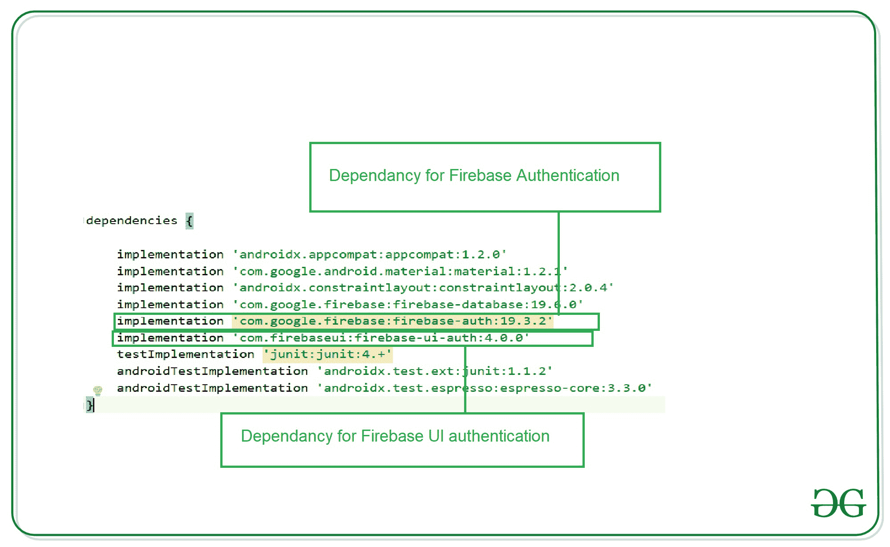

# 如何在安卓系统中使用 Firebase UI 认证库？

> 原文:[https://www . geeksforgeeks . org/使用方法-firebase-ui-身份验证-安卓库/](https://www.geeksforgeeks.org/how-to-use-firebase-ui-authentication-library-in-android/)

Firebase UI 是 [Firebase](https://www.geeksforgeeks.org/firebase-introduction/) 为安卓应用提供的一个库，在安卓系统中集成 Firebase 的同时，可以轻松完成或多或少的任务。这个库提供了如此多的额外功能，以至于我们可以非常容易地集成到我们的安卓系统中。在本文中，我们将看看如何在我们的安卓应用程序中使用这个库来添加身份验证。

### 使用 Firebase 用户界面身份验证库有什么好处？

*   通过使用这个库，我们集成任何特定身份验证所需的代码减少了，用户身份验证流程将变得更加容易。
*   使用这个库，我们可以在我们的应用程序中一次使用多个身份验证提供程序，如电子邮件和密码、脸书、电话、谷歌等等。
*   使用此库时，帐户管理任务变得很容易。
*   每个身份验证提供程序的登录用户界面都是由这个库自己创建的。您可以根据需要自定义用户界面。
*   使用此库，您将能够安全地链接不同身份的用户帐户。
*   有了这个库，您可以为跨设备登录的密码添加与智能锁的自动集成。

### 我们将使用 Firebase 用户界面身份验证库构建什么？

使用这个库，我们只是创建了一个应用程序，我们将要求用户使用不同的登录选项登录，如谷歌，电子邮件和密码，以及电话号码。成功认证我们的用户后。我们将把用户重定向到一个新的屏幕，在那里我们将向用户显示一条简单的欢迎消息。在该屏幕中，我们将添加一个简单的按钮，用于从应用程序中注销用户，并将该用户重定向到登录屏幕进行身份验证。下面是 GIF，您可以从中了解我们将在这个应用程序中构建什么。注意，我们将使用 **Java** 语言来实现这个项目。

**1)电话认证**


**2)邮件认证**


**3)谷歌认证**


### **分步实施**

**第一步:新建安卓工作室项目**

要在安卓工作室创建新项目，请参考[如何在安卓工作室创建/启动新项目](https://www.geeksforgeeks.org/android-how-to-create-start-a-new-project-in-android-studio/)。注意选择 **Java** 作为编程语言。

**第二步:将你的应用连接到 Firebase**

在 Android Studio 中创建新项目后。将您的应用程序连接到 Firebase。用于将您的应用程序连接到 firebase。导航到顶部栏上的工具。之后点击 Firebase。右侧将打开一个新窗口。在该窗口中，单击身份验证，然后单击电子邮件和密码身份验证。


点击电子邮件和密码认证后，您将看到下面的屏幕。在此屏幕中，单击第一个选项连接到 firebase，然后单击第二个选项将 Firebase 身份验证添加到您的应用程序中。


**第三步:在依赖项下添加** **构建. gradle 文件**

> 实现“com . fire base ui:fire base-ui-auth:4 . 0 . 0”

您的 Gradle 文件应该在依赖项部分具有以下依赖项。



**第四步:在 AndroidManifest.xml 文件**中添加互联网权限

导航到该文件中的**应用程序> AndroidManifest.xml** 文件，添加互联网权限。在**和**文件中添加以下行。

## 可扩展标记语言

```
<uses-permission android:name="android.permission.INTERNET" />
<uses-permission android:name="android.permission.ACCESS_NETWORK_STATE" />
```