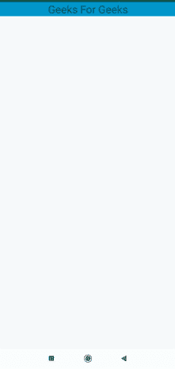

# 如何在安卓 App 中使用 FoldingCell 库？

> 原文:[https://www . geesforgeks . org/how-用法-folding cell-library in-Android-app/](https://www.geeksforgeeks.org/how-to-use-foldingcell-library-in-android-app/)

在本文中，我们将实现 FoldingCell 特性。此功能可用于在页面上显示说明。就像当我们创建一个测验应用程序时，我们可以有这个功能，这样用户可以随时查看指令。让我们看看这个特性的实现。下面给出了一个示例 GIF，以了解我们将在本文中做什么。注意，我们将使用 **Java** 语言来实现这个项目。



### **分步实施**

**第一步:创建新项目**

要在安卓工作室创建新项目，请参考[如何在安卓工作室创建/启动新项目](https://www.geeksforgeeks.org/android-how-to-create-start-a-new-project-in-android-studio/)。注意选择 **Java** 作为编程语言。

**第二步:添加依赖和 JitPack 存储库**

导航到**渐变脚本>构建.渐变(模块:应用)**，并在依赖项部分添加以下依赖项。

> 实现' com . ramo tion . folding cell:folding-cell:1 . 2 . 3 '

**步骤 3:使用 activity_main.xml 文件**

导航到**应用程序> res >布局> activity_main.xml** 并将下面的代码添加到该文件中。下面是 **activity_main.xml** 文件的代码。

## 可扩展标记语言

```
<?xml version="1.0" encoding="utf-8"?>
<LinearLayout
    xmlns:android="http://schemas.android.com/apk/res/android"
    xmlns:tools="http://schemas.android.com/tools"
    android:layout_width="match_parent"
    android:layout_height="match_parent"
    android:clipChildren="false"
    android:clipToPadding="false"
    tools:context=".MainActivity">

    <com.ramotion.foldingcell.FoldingCell
        android:id="@+id/folding_cell"
        android:layout_width="match_parent"
        android:layout_height="wrap_content">

        <!--Add the Layout -->
        <LinearLayout
            android:id="@+id/cell_content_view"
            android:layout_width="match_parent"
            android:layout_height="wrap_content"
            android:background="@android:color/holo_green_dark"
            android:orientation="vertical"
            android:visibility="gone">

            <TextView
                android:layout_width="match_parent"
                android:layout_height="wrap_content"
                android:background="@android:color/holo_blue_dark"
                android:gravity="center"
                android:text="About Geeks for Geeks"
                android:textSize="24dp" />

            <TextView
                android:layout_width="match_parent"
                android:layout_height="wrap_content"
                android:background="@android:color/holo_blue_dark"
                android:gravity="center"
                android:text="It is a Computer Science portal for geeks. "
                android:textSize="24dp" />

        </LinearLayout>

        <!--Add the Layout -->
        <LinearLayout
            android:id="@+id/cell_title_view"
            android:layout_width="match_parent"
            android:layout_height="wrap_content"
            android:orientation="vertical">

            <TextView
                android:layout_width="match_parent"
                android:layout_height="wrap_content"
                android:background="@android:color/holo_blue_dark"
                android:gravity="center"
                android:text="Geeks For Geeks"
                android:textSize="24dp" />

        </LinearLayout>

    </com.ramotion.foldingcell.FoldingCell>

</LinearLayout>
```

**第四步:使用****MainActivity.java 文件**

转到**MainActivity.java**文件，参考以下代码。以下是**MainActivity.java**文件的代码。代码中添加了注释，以更详细地理解代码。

## Java 语言(一种计算机语言，尤用于创建网站)

```
import android.os.Bundle;
import android.view.View;

import androidx.appcompat.app.AppCompatActivity;

public class MainActivity extends AppCompatActivity {

    @Override
    protected void onCreate(Bundle savedInstanceState) {
        super.onCreate(savedInstanceState);
        setContentView(R.layout.activity_main);

        final com.ramotion.foldingcell.FoldingCell fc = findViewById(R.id.folding_cell);

        // attach click listener to folding cell
        fc.setOnClickListener(new View.OnClickListener() {
            @Override
            public void onClick(View v) {
                fc.toggle(false);
            }
        });
    }
}
```

**输出:**

<video class="wp-video-shortcode" id="video-592995-1" width="640" height="360" preload="metadata" controls=""><source type="video/mp4" src="https://media.geeksforgeeks.org/wp-content/uploads/20210420234719/folding.mp4?_=1">[https://media.geeksforgeeks.org/wp-content/uploads/20210420234719/folding.mp4](https://media.geeksforgeeks.org/wp-content/uploads/20210420234719/folding.mp4)</video>