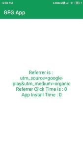
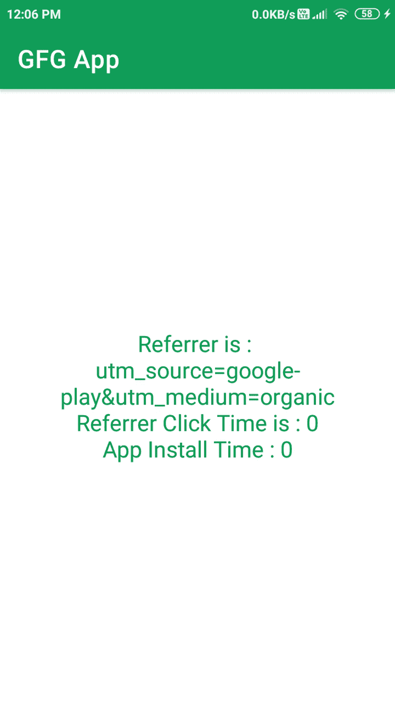

# 如何在 Android 中使用 Google Play 安装 Referrer API？

> 原文:[https://www . geesforgeks . org/使用方法-Google-play-install-referrer-API-in-Android/](https://www.geeksforgeeks.org/how-to-use-google-play-install-referrer-api-in-android/)

Google Play Install Referrer 是大多数应用程序中使用的应用编程接口，但它在应用程序中没有出现。这一功能在幕后工作，用于检查应用程序获得大部分下载的来源。谷歌播放安装推荐应用编程接口告诉我们，从哪里安装应用和来源。这将有助于我们提高我们的应用在不同平台上的存在。

### Google Play Referrer API 有什么用？

Google Play Referrer API 为我们提供了安装我们应用程序的位置信息，无论它是 play store 还是任何其他平台。在这个应用编程接口的帮助下，我们可以跟踪用户下载我们的应用所采取的行动。下面是一些我们可以使用这个应用编程接口收集的重要数据。

*   在这个应用编程接口的帮助下，我们可以跟踪用户从哪里安装了我们的应用程序。我们可以获得下载我们应用程序的网址。
*   当用户点击推荐网址时，我们可以得到时间戳。
*   当用户从特定的网址下载我们的应用程序时，我们可以获得用户的时间戳。
*   我们可以在首次安装应用时获得应用版本。
*   我们可以跟踪用户在之前的 7 天内是否使用过该应用的即时体验。

### 我们将在本文中构建什么？

我们将构建一个简单的应用程序，在其中我们将添加我们的谷歌游戏推荐应用编程接口，我们将在一个简单的文本视图中显示该应用编程接口跟踪的数据。请注意，由于我们尚未向谷歌游戏发布我们的应用程序。因此，我们将只获得我们的应用程序作为有机安装的来源。下面是截图，从中我们可以看到我们将在本文中构建什么。注意，我们将使用 **Java** 语言来实现这个项目。



### **分步实施**

**第一步:创建新项目**

要在安卓工作室创建新项目，请参考[如何在安卓工作室创建/启动新项目](https://www.geeksforgeeks.org/android-how-to-create-start-a-new-project-in-android-studio/)。注意选择 **Java** 作为编程语言。

**第二步:在 build.gradle 文件**中添加 Google Play Referrer API 的依赖项

导航到渐变脚本，然后导航到[构建.渐变(模块)](https://www.geeksforgeeks.org/android-build-gradle/)级别。在 dependencies 部分的 build.gradle 文件中添加以下行。

> //下面是 referer 的依赖关系
> 
> 实现“com . Android . install referrer:install referrer:2.2”

**步骤 3:使用 activity_main.xml 文件**

导航到**应用程序> res >布局> activity_main.xml** 并将下面的代码添加到该文件中。下面是 **activity_main.xml** 文件的代码。

## 可扩展标记语言

```
<?xml version="1.0" encoding="utf-8"?>
<RelativeLayout
    xmlns:android="http://schemas.android.com/apk/res/android"
    xmlns:tools="http://schemas.android.com/tools"
    android:layout_width="match_parent"
    android:layout_height="match_parent"
    android:orientation="vertical"
    tools:context=".MainActivity">

    <!--text view for displaying referer details-->
    <TextView
        android:id="@+id/idTVRefrer"
        android:layout_width="match_parent"
        android:layout_height="wrap_content"
        android:layout_centerInParent="true"
        android:layout_margin="3dp"
        android:gravity="center_horizontal"
        android:padding="4dp"
        android:text="Refrer"
        android:textAlignment="center"
        android:textColor="@color/purple_200"
        android:textSize="18sp" />

</RelativeLayout>
```

**第四步:使用****MainActivity.java 文件**

转到**MainActivity.java**文件，参考以下代码。以下是**MainActivity.java**文件的代码。代码中添加了注释，以更详细地理解代码。

## Java 语言(一种计算机语言，尤用于创建网站)

```
import android.os.Bundle;
import android.os.RemoteException;
import android.widget.TextView;
import android.widget.Toast;

import androidx.appcompat.app.AppCompatActivity;

import com.android.installreferrer.api.InstallReferrerClient;
import com.android.installreferrer.api.InstallReferrerStateListener;
import com.android.installreferrer.api.ReferrerDetails;

public class MainActivity extends AppCompatActivity {

    // creating variables for text view.
    private TextView refrerTV;

    // variable for install referer client.
    InstallReferrerClient referrerClient;

    // creating an empty string for our referer.
    String refrer = "";

    @Override
    protected void onCreate(Bundle savedInstanceState) {
        super.onCreate(savedInstanceState);
        setContentView(R.layout.activity_main);

        // initializing all our variables.
        refrerTV = findViewById(R.id.idTVRefrer);

        // on below line we are building our install referrer client and building it.
        referrerClient = InstallReferrerClient.newBuilder(this).build();

        // on below line we are starting its connection.
        referrerClient.startConnection(new InstallReferrerStateListener() {
            @Override
            public void onInstallReferrerSetupFinished(int responseCode) {
                // this method is called when install referer setup is finished.
                switch (responseCode) {
                    // we are using switch case to check the response.
                    case InstallReferrerClient.InstallReferrerResponse.OK:
                        // this case is called when the status is OK and
                        ReferrerDetails response = null;
                        try {
                            // on below line we are getting referrer details
                            // by calling get install referrer.
                            response = referrerClient.getInstallReferrer();

                            // on below line we are getting referrer url.
                            String referrerUrl = response.getInstallReferrer();

                            // on below line we are getting referrer click time.
                            long referrerClickTime = response.getReferrerClickTimestampSeconds();

                            // on below line we are getting app install time
                            long appInstallTime = response.getInstallBeginTimestampSeconds();

                            // on below line we are getting our time when 
                            // user has used our apps instant experience.
                            boolean instantExperienceLaunched = response.getGooglePlayInstantParam();

                            // on below line we are getting our
                            // apps install referrer.
                            refrer = response.getInstallReferrer();

                            // on below line we are setting all detail to our text view.
                            refrerTV.setText("Referrer is : \n" + referrerUrl + "\n" + "Referrer Click Time is : " + referrerClickTime + "\nApp Install Time : " + appInstallTime);
                        } catch (RemoteException e) {
                            // handling error case.
                            e.printStackTrace();
                        }
                        break;
                    case InstallReferrerClient.InstallReferrerResponse.FEATURE_NOT_SUPPORTED:
                        // API not available on the current Play Store app.
                        Toast.makeText(MainActivity.this, "Feature not supported..", Toast.LENGTH_SHORT).show();
                        break;
                    case InstallReferrerClient.InstallReferrerResponse.SERVICE_UNAVAILABLE:
                        // Connection couldn't be established.
                        Toast.makeText(MainActivity.this, "Fail to establish connection", Toast.LENGTH_SHORT).show();
                        break;
                }
            }

            @Override
            public void onInstallReferrerServiceDisconnected() {
                // Try to restart the connection on the next request to
                // Google Play by calling the startConnection() method.
                Toast.makeText(MainActivity.this, "Service disconnected..", Toast.LENGTH_SHORT).show();
            }
        });
    }
}
```

现在运行您的应用程序，并查看应用程序的输出。

> **注意:**由于我们的 app 没有在 Google Play 上发布，所以我们只会将推荐人的详细信息作为有机的，其他的详细信息将作为零。

**输出:**

