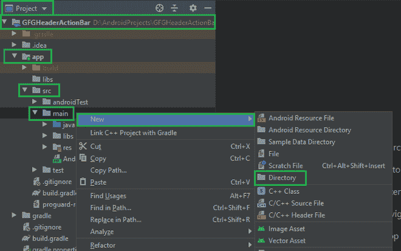
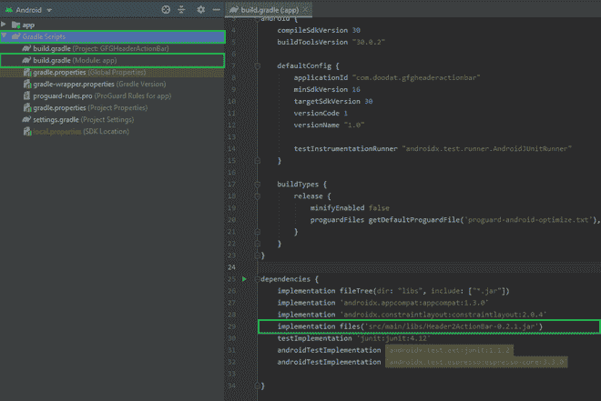

# 如何在安卓 App 中使用 Header2ActionBar 库？

> 原文:[https://www . geesforgeks . org/how-用法-header 2 action bar-Android 中的库-app/](https://www.geeksforgeeks.org/how-to-use-header2actionbar-library-in-android-app/)

**Header2ActionBar** 是一个库，实现了一个不错的淡入/淡出动作栏动画效果。它还提供了在动作栏中添加标题图像、标题和副标题的功能。在本文中，我们将使用 Java 语言在安卓应用程序中实现这个库。下面给出了一个示例 GIF，以了解我们将在本文中做什么。请注意，我们将使用 **Java** 语言来实现这个项目。


### **分步实施**

**第一步:创建新项目**

在安卓工作室创建新项目请参考 [<u>【如何在安卓工作室创建/启动新项目】</u>](https://www.geeksforgeeks.org/android-how-to-create-start-a-new-project-in-android-studio/) 。请注意，选择 Java 作为编程语言。

**第二步:添加库依赖**

*   导航至**项目>项目名称> app > src >主**
*   右键点击**主**，选择**新建>目录**
*   键入 **libs** 作为目录名
*   从 [**<u>这里</u>**](https://github.com/AChep/Header2ActionBar/blob/master/sample/Header2ActionBarDemo/src/main/libs/Header2ActionBar-0.2.1.jar) 下载库，粘贴到 libs 目录里面。
*   导航到 **Gradle 脚本> build.gradle(模块:应用)**，在依赖项部分添加库，并同步项目。

```java
dependencies {
    implementation files('src/main/libs/Header2ActionBar-0.2.1.jar')
}
```

 

**步骤 3:使用 activity_main.xml 文件**

导航至**应用程序> res >布局> activity_main.xml** 并参考以下代码。下面是 **activity_main.xml** 文件的代码。

## 可扩展标记语言

```java
<FrameLayout 
    xmlns:android="http://schemas.android.com/apk/res/android"
    xmlns:tools="http://schemas.android.com/tools"
    android:id="@+id/container"
    android:layout_width="match_parent"
    android:layout_height="match_parent"
    tools:context=".MainActivity"
    tools:ignore="MergeRootFrame" />
```

**第 4 步:使用 styles.xml 文件**

导航至**应用程序> res >值>style . XML**并参考以下代码。下面是**style . XML**文件的代码。

## 可扩展标记语言

```java
<resources>
    <!-- Base application theme. -->

    <!--Change the appTheme for activity-->
    <style name="AppTheme" parent="android:Theme.Holo.Light.DarkActionBar">
        <item name="android:windowActionBarOverlay">true</item>
        <item name="android:windowContentOverlay">@null</item>
        <!-- Customize your theme here. -->
        <item name="colorPrimary">@color/colorPrimary</item>
        <item name="colorPrimaryDark">@color/colorPrimaryDark</item>
        <item name="colorAccent">@color/colorAccent</item>
    </style>

</resources>
```