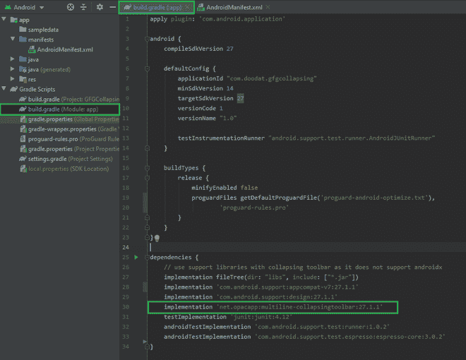

# 如何在安卓 App 中使用多线拼贴工具栏库？

> 原文:[https://www . geesforgeks . org/使用方法-multiline-collapsingtoolbar-library in-Android-app/](https://www.geeksforgeeks.org/how-to-use-multiline-collapsingtoolbar-library-in-android-app/)

顾名思义，Multiline-CollapsingToolbar 库允许我们在 CollapsingToolbar 布局中有多行。使用这个库，我们可以用一个漂亮的淡入淡出动画来处理扩展状态下的多行标题(具有可定制的最大行数)。在本文中，我们将使用 **Java** 语言在安卓应用程序中实现这个库。下面给出了一个示例 GIF，以了解我们将在本文中做什么。


### **分步实施**

**第一步:创建新项目**

在安卓工作室创建新项目请参考 [<u>【如何在安卓工作室创建/启动新项目】</u>](https://www.geeksforgeeks.org/android-how-to-create-start-a-new-project-in-android-studio/) <u>。</u>注意选择 **Java** 作为编程语言。

> ***注意:**在创建新项目时请确保使用安卓支持库，因为*multiline-collapsingtoolbar l*ibrary 不支持* AndroidX *。*

**第二步:添加** **库依赖**

导航到 **Gradle 脚本> build.gradle(模块:应用程序)**在依赖项部分添加库，并同步项目。

```
dependencies {
    // use the same version of Android support libraries as of collapsing toolbar
    implementation 'net.opacapp:multiline-collapsingtoolbar:27.1.1' 
}
```



**步骤 3:使用 activity_main.xml 文件**

导航到**应用程序> res >布局> activity_main.xml** 并将下面的代码添加到该文件中。下面是 **activity_main.xml** 文件的代码。代码中添加了注释，以详细理解代码。

## 可扩展标记语言

```
<?xml version="1.0" encoding="utf-8"?>
<android.support.design.widget.CoordinatorLayout 
    xmlns:android="http://schemas.android.com/apk/res/android"
    xmlns:app="http://schemas.android.com/apk/res-auto"
    xmlns:tools="http://schemas.android.com/tools"
    android:layout_width="match_parent"
    android:layout_height="match_parent"
    android:fitsSystemWindows="true"
    tools:context=".MainActivity">

    <android.support.design.widget.AppBarLayout
        android:layout_width="match_parent"
        android:layout_height="192dp"
        android:background="?attr/colorPrimary"
        android:fitsSystemWindows="true"
        android:theme="@style/AppTheme.AppBarOverlay">

        <!-- Adding CollapsingToolbarLayout-->
        <!-- maxLines sets the maximum no of lines to be displayed in expanded form-->
        <net.opacapp.multilinecollapsingtoolbar.CollapsingToolbarLayout
            android:layout_width="match_parent"
            android:layout_height="match_parent"
            android:theme="@style/AppTheme.AppBarOverlay"
            app:expandedTitleTextAppearance="@style/TextAppearance.ExpandedTitle"
            app:layout_scrollFlags="scroll|exitUntilCollapsed"
            app:lineSpacingMultiplier="1.2"
            app:maxLines="3"
            app:title="GeeksForGeeks is an amazing website for DS and Algorithms. ">

            <android.support.v7.widget.Toolbar
                android:id="@+id/toolbar"
                android:layout_width="match_parent"
                android:layout_height="?attr/actionBarSize"
                app:layout_collapseMode="pin"
                app:popupTheme="@style/AppTheme.PopupOverlay" />

        </net.opacapp.multilinecollapsingtoolbar.CollapsingToolbarLayout>

    </android.support.design.widget.AppBarLayout>

    <!--Nested Scroll view contains the main_content-->
    <android.support.v4.widget.NestedScrollView
        android:layout_width="match_parent"
        android:layout_height="match_parent"
        app:layout_behavior="@string/appbar_scrolling_view_behavior">

        <TextView
            android:layout_width="wrap_content"
            android:layout_height="wrap_content"
            android:layout_margin="15dp"
            android:text="@string/app_name" />

    </android.support.v4.widget.NestedScrollView>

</android.support.design.widget.CoordinatorLayout>
```

**第 4 步:使用 styles.xml 文件**

导航到**应用程序> res >值>style . XML**，并将下面的代码添加到该文件中。下面是**style . XML**文件的代码。

## 可扩展标记语言

```
<resources>
    <!-- Base application theme. -->
    <style name="AppTheme" parent="Theme.AppCompat.Light.DarkActionBar">
        <!-- Customize your theme here. -->
        <item name="colorPrimary">@color/colorPrimary</item>
        <item name="colorPrimaryDark">@color/colorPrimaryDark</item>
        <item name="colorAccent">@color/colorAccent</item>

    </style>

    <style name="AppTheme.NoActionBar">
        <item name="windowActionBar">false</item>
        <item name="windowNoTitle">true</item>
    </style>

    <style name="AppTheme.AppBarOverlay" parent="ThemeOverlay.AppCompat.Dark.ActionBar" />

    <style name="AppTheme.PopupOverlay" parent="ThemeOverlay.AppCompat.Light" />

<!--    Sets the textSize of Title in Collapsing Toolbar-->
    <style name="TextAppearance.ExpandedTitle"
        parent="TextAppearance.AppCompat.Widget.ActionBar.Title">
        <item name="android:textSize">26sp</item>
    </style>

</resources>
```

**步骤 5:使用 MainActivity.java 文件**

转到**MainActivity.java 文件**并参考以下代码。以下是**MainActivity.java**文件的代码。

## Java 语言(一种计算机语言，尤用于创建网站)

```
import android.support.v7.app.AppCompatActivity;
import android.os.Bundle;
import android.support.v7.widget.Toolbar;

public class MainActivity extends AppCompatActivity {

    @Override
    protected void onCreate(Bundle savedInstanceState) {
        super.onCreate(savedInstanceState);
        setContentView(R.layout.activity_main);

        // set the toolbar as the action bar for the activity
        Toolbar toolbar = findViewById(R.id.toolbar);
        setSupportActionBar(toolbar);
    }
}
```

**第 6 步:使用 AndroidManifest.xml 文件**

导航到**应用程序** > **清单** > **安卓清单. xml** 并在主要活动标签中添加以下代码。

```
android:theme="@style/AppTheme.NoActionBar"
```


**输出:**

<video class="wp-video-shortcode" id="video-638366-1" width="640" height="360" preload="metadata" controls=""><source type="video/mp4" src="https://media.geeksforgeeks.org/wp-content/uploads/20210704025746/MultilineCollapsing.mp4?_=1">[https://media.geeksforgeeks.org/wp-content/uploads/20210704025746/MultilineCollapsing.mp4](https://media.geeksforgeeks.org/wp-content/uploads/20210704025746/MultilineCollapsing.mp4)</video>

**GitHub 资源库:** [多线-折叠工具栏库](https://github.com/garg-lucifer/GFGMultilineToolbar)