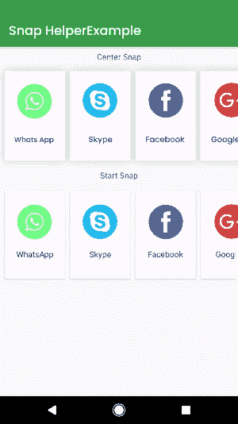

# 如何在安卓的 RecyclerView 中使用 SnapHelper？

> 原文:[https://www . geeksforgeeks . org/how-用法-snap helper-in-recycle view-in-Android/](https://www.geeksforgeeks.org/how-to-use-snaphelper-in-recyclerview-in-android/)

快照助手是一个惊人的功能，在[回收视图](https://www.geeksforgeeks.org/android-recyclerview/)中可以看到。借助该功能，我们可以使 RecyclerView 的项目正确可见。大多数应用程序中都有回收视图的这一功能，但它不可见。这个功能通常在谷歌 Play 应用程序中看到，当我们滚动水平回收器视图时，我们将只能看到特定数量的回收器视图项目可见。当我们使用正常的回收视图时，我们可以看到滚动时，一些项目一半出现在设备屏幕上。所以要在安卓回收机视图中解决这个问题。我们必须在回收视图中使用快照助手。在本文中，我们将看看如何在我们的应用程序中实现这个 RecyclerView。

### 什么是 SnapHelper？

SnapHelper 是一个助手类，用于捕捉我们的 RecyclerView 的任何子对象。在这个类的帮助下，我们可以在我们的屏幕上显示回收视图项目的具体数量，并且我们可以避免回收视图中的回收视图儿童显示。此功能通常在谷歌 Play 商店使用的 RecyclerView 中可见。



### 我们将在本文中构建什么？

我们将构建一个简单的应用程序，在其中我们将在我们的回收视图中显示课程列表。在这个回收视图中，我们将实现**快照助手**类功能，以避免元素部分出现在用户的设备中。下面是视频，我们将在其中看到我们将在本文中构建的内容。注意，我们将使用 **Java** 语言来实现这个项目。

<video class="wp-video-shortcode" id="video-587055-1" width="640" height="360" preload="metadata" controls=""><source type="video/mp4" src="https://media.geeksforgeeks.org/wp-content/uploads/20210404223711/20210404_223611.mp4?_=1">[https://media.geeksforgeeks.org/wp-content/uploads/20210404223711/20210404_223611.mp4](https://media.geeksforgeeks.org/wp-content/uploads/20210404223711/20210404_223611.mp4)</video>

### **分步实施**

**第一步:创建新项目**

要在安卓工作室创建新项目，请参考[如何在安卓工作室创建/启动新项目](https://www.geeksforgeeks.org/android-how-to-create-start-a-new-project-in-android-studio/)。注意选择 **Java** 作为编程语言。

**步骤 2:使用 activity_main.xml 文件**

导航到**应用程序> res >布局> activity_main.xml** 并将下面的代码添加到该文件中。下面是 **activity_main.xml** 文件的代码。

## 可扩展标记语言

```java
<?xml version="1.0" encoding="utf-8"?>
<RelativeLayout 
    xmlns:android="http://schemas.android.com/apk/res/android"
    xmlns:tools="http://schemas.android.com/tools"
    android:layout_width="match_parent"
    android:layout_height="match_parent"
    android:orientation="vertical"
    tools:context=".MainActivity">

    <!--adding recycler view in our app-->
    <androidx.recyclerview.widget.RecyclerView
      android:id="@+id/idRVCourses"
      android:layout_width="match_parent"
      android:layout_height="wrap_content"
      android:orientation="horizontal" />

</RelativeLayout>
```

**第三步:创建一个模态类来存储我们的数据**

导航到**应用> java >你的应用的包名>右键点击它>新建> Java 类**并将其命名为 **CourseModal** 并添加下面的代码。代码中添加了注释，以便更详细地了解。

## Java 语言(一种计算机语言，尤用于创建网站)

```java
public class CourseModal {

    // variables for our course name, description and duration
    private String courseName;
    private String courseDescription;
    private String courseDuration;

    // constructor class.
    public CourseModal(String courseName, String courseDescription, String courseDuration) {
        this.courseName = courseName;
        this.courseDescription = courseDescription;
        this.courseDuration = courseDuration;
    }

    // getter and setter methods.
    public String getCourseName() {
        return courseName;
    }

    public void setCourseName(String courseName) {
        this.courseName = courseName;
    }

    public String getCourseDescription() {
        return courseDescription;
    }

    public void setCourseDescription(String courseDescription) {
        this.courseDescription = courseDescription;
    }

    public String getCourseDuration() {
        return courseDuration;
    }

    public void setCourseDuration(String courseDuration) {
        this.courseDuration = courseDuration;
    }
}
```