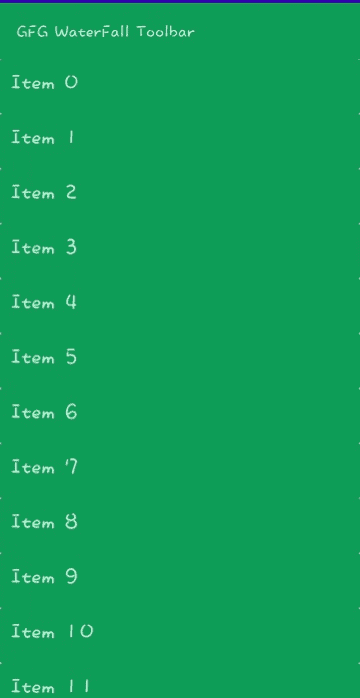

# 如何在安卓 App 中使用瀑布工具栏库？

> 原文:[https://www . geesforgeks . org/使用方法-瀑布-工具栏-安卓图书馆-app/](https://www.geeksforgeeks.org/how-to-use-waterfall-toolbar-library-in-android-app/)

**瀑布工具栏库**是一个安卓库，旨在为工具栏提供一些动态效果，使应用程序看起来更好。所以这个库实际上做的是动态化一个普通的工具栏，当相关视图滚动时增加和减少它的阴影。视图可以是[循环视图](https://www.geeksforgeeks.org/android-recyclerview/)或[滚动视图](https://www.geeksforgeeks.org/scrollview-in-android/)。下面给出了一个 GIF 示例，来了解一下 我们在本文中要做什么 。注意，我们将使用 **Java** 语言来实现这个项目。



现在让我们看看如何在你的安卓应用程序中使用瀑布工具栏库。

### **分步实施**

**第一步:创建新项目**

所以第一步是在安卓工作室的欢迎屏幕上创建一个新项目，点击创建新项目，如果你已经打开了一个项目，**转到文件>新建>新项目**。然后选择一个项目模板窗口，选择空活动，然后单击下一步。在名称字段中输入您的应用名称，并从语言下拉菜单中选择 Java。

**第二步:添加依赖和 JitPack 存储库**

要添加库依赖项**请转到应用程序** > **梯度脚本** > **梯度构建(模块:应用程序)**并添加以下依赖项。

```java
dependencies {
    // library required to add the waterfall effect
    implementation 'com.github.hugocastelani:waterfall-toolbar:0.5.0'

    // for adding recyclerview
    implementation 'androidx.recyclerview:recyclerview:1.2.0'

    // for adding cardview
    implementation 'androidx.cardview:cardview:1.0.0'
}
```

将 JitPack 存储库添加到构建文件中。将其添加到 allprojects{ }部分内存储库末尾的 root build.gradle 中。

> *所有项目{*
> 
> *存储库{*
> 
> *……*
> 
> *maven { URL " https://jitpack . io " }*
> 
> *}*
> 
> *}*

添加这个依赖项后，同步您的项目，现在我们将开始实现它。

**第三步:转到 activity_main.xml，添加如下代码**

在 **activity_main.xml** 中添加瀑布工具栏和 recycle view 给它，或者也可以用 ScrollView 代替 recycle view。如果你不了解 recycle views，可以参考[使用 Java 的<u>recycle view</u>](https://www.geeksforgeeks.org/android-recyclerview/)或者[使用 kotlin 的](https://www.geeksforgeeks.org/android-recyclerview-in-kotlin/)recycle view。导航到 **app > res >布局> activity_main.xml** 并将下面的代码添加到该文件中。下面是**activity _ main . XML**文件的代码。

## 可扩展标记语言

```java
<?xml version="1.0" encoding="utf-8"?>
<LinearLayout 
    xmlns:android="http://schemas.android.com/apk/res/android"
    xmlns:tools="http://schemas.android.com/tools"
    android:layout_width="match_parent"
    android:layout_height="match_parent"
    android:orientation="vertical"
    tools:context=".MainActivity">

    <!-- Adding waterfall toolbar -->
    <com.hugocastelani.waterfalltoolbar.WaterfallToolbar
        android:id="@+id/waterfall_toolbar"
        android:layout_width="match_parent"
        android:layout_height="wrap_content">

        <!-- adding toolbar -->
        <androidx.appcompat.widget.Toolbar
            android:id="@+id/toolbar"
            android:layout_width="match_parent"
            android:layout_height="?actionBarSize"
            android:background="#0F9D58" />

    </com.hugocastelani.waterfalltoolbar.WaterfallToolbar>

    <!-- Adding the recyclerview -->
    <androidx.recyclerview.widget.RecyclerView
        android:id="@+id/recyclerview"
        android:layout_width="match_parent"
        android:layout_height="match_parent"
        tools:itemCount="5"
        tools:listitem="@layout/recyclerview_items" />

</LinearLayout>
```