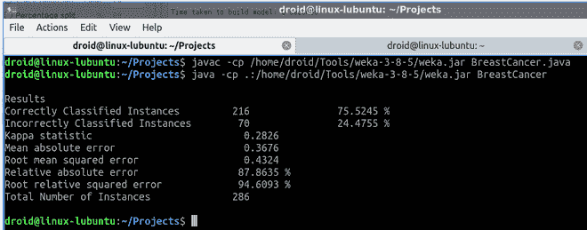

# 如何使用 Weka Java API？

> 原文:[https://www.geeksforgeeks.org/how-to-use-weka-java-api/](https://www.geeksforgeeks.org/how-to-use-weka-java-api/)

要使用 weka API，您需要根据您的操作系统安装 [weka](https://waikato.github.io/weka-wiki/downloading_weka/) 。下载并提取存档文件后，您会发现 weka.jar 文件。JAR 文件包含所有需要的类文件，即 weka API。现在我们可以在 [Weka Java API 文档](https://weka.sourceforge.io/doc.stable-3-8/)中找到关于类和方法的所有信息。我们需要将这个 jar 作为类路径添加到我们的程序中。

此外，让我们先讨论类路径，然后再讨论实现部分。所以类路径是告诉 JDK 关于外部库(用户类文件)的东西。为了添加类路径，推荐的方法是使用 JDK 命令的 *-cp* 选项。如果您正在使用任何框架，那么可以将类路径添加到相应的清单文件中。

**示例:**

## Java 语言(一种计算机语言，尤用于创建网站)

```
// Java Program to Illustrate Usage of Weka API

// Importing required classes
import java.io.BufferedReader;
import java.io.FileReader;
import java.util.Random;
import weka.classifiers.Evaluation;
import weka.classifiers.trees.J48;
import weka.core.Instances;

// Main class
// BreastCancer
public class GFG {

    // Main driver method
    public static void main(String args[])
    {

        // Try block to check for exceptions
        try {

            // Create J48 classifier by
            // creating object of J48 class
            J48 j48Classifier = new J48();

            // Dataset path
            String breastCancerDataset
                = "/home/droid/Tools/weka-3-8-5/data/breast-cancer.arff";

            // Creating bufferedreader to read the dataset
            BufferedReader bufferedReader
                = new BufferedReader(
                    new FileReader(breastCancerDataset));

            // Create dataset instances
            Instances datasetInstances
                = new Instances(bufferedReader);

            // Set Target Class
            datasetInstances.setClassIndex(
                datasetInstances.numAttributes() - 1);

            // Evaluating by creating object of Evaluation
            // class
            Evaluation evaluation
                = new Evaluation(datasetInstances);

            // Cross Validate Model with 10 folds
            evaluation.crossValidateModel(
                j48Classifier, datasetInstances, 10,
                new Random(1));

            System.out.println(evaluation.toSummaryString(
                "\nResults", false));
        }

        // Catch block to handle the exceptions
        catch (Exception e) {

            // Print message on the console
            System.out.println("Error Occurred!!!! \n"
                               + e.getMessage());
        }
    }
}
```

**输出:**

> 使用 weka API 对模型进行编码后，可以使用以下命令运行程序
> 
> **$ javac-CP WEKA-3-8-5/WEKA . jar program.java**
> 
> $ java -cp。:weka-3-8-5/weka.jar 程序
> 
> weka-3-8-5/weka.jar 是安装中可用的 jar 文件的路径。

这将是如下所示生成的所需输出:

