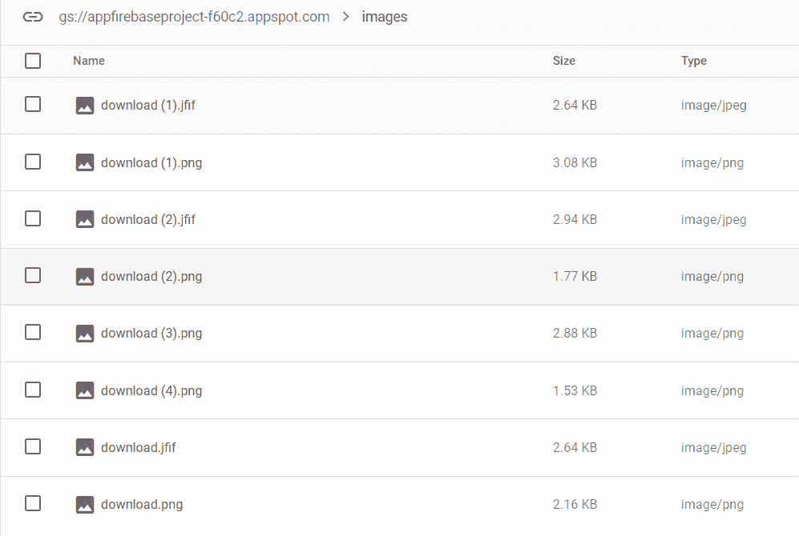

# 如何查看 Firebase Storage 中所有上传的图片？

> 原文:[https://www . geeksforgeeks . org/如何查看所有上传的映像-在 firebase-storage/](https://www.geeksforgeeks.org/how-to-view-all-the-uploaded-images-in-firebase-storage/)

在本文中，我们将从 Firebase Storage 加载所有图像，并在[recycle view](https://www.geeksforgeeks.org/android-recyclerview/)中显示它们。通常，我们会在向实时数据库添加链接后显示图像。假设我们想展示我们在图库中看到的所有上传的图像。我们将只是查看所有图像。因此，这里我们将显示上传到 firebase 存储在特定文件夹中的图像。但是这里我们将显示在[数组列表](https://www.geeksforgeeks.org/arraylist-in-java/)中添加所有图像网址后的图像。

### **分步实施**

**第一步:创建新项目**

要在安卓工作室创建新项目，请参考[如何在安卓工作室创建/启动新项目](https://www.geeksforgeeks.org/android-how-to-create-start-a-new-project-in-android-studio/)。注意选择 **Java** 作为编程语言。

**第二步:把这个添加到 AndroidManifest.xml 文件**

```java
<uses-permission android:name="android.permission.INTERNET"/>
```

将此添加到 **build.gradle** 文件中

```java
implementation 'com.google.firebase:firebase-storage:19.1.1'
implementation 'com.github.bumptech.glide:glide:4.11.0'
annotationProcessor 'com.github.bumptech.glide:compiler:4.11.0'
annotationProcessor 'com.github.bumptech.glide:compiler:4.11.0'
```

**步骤 3:使用 item.xml 文件**

转到 **app > res >布局>新建>布局资源文件**并将文件命名为**项**。转到 **item.xml** 文件并参考以下代码。下面是 **item.xml** 文件的代码。

## 可扩展标记语言

```java
<?xml version="1.0" encoding="utf-8"?>
<androidx.cardview.widget.CardView
    xmlns:android="http://schemas.android.com/apk/res/android"
    xmlns:app="http://schemas.android.com/apk/res-auto"
    android:orientation="vertical"
    android:layout_width="match_parent"
    android:layout_height="250dp"
    android:layout_marginTop="5dp"
    app:cardCornerRadius="8dp">

<ImageView
    android:layout_width="match_parent"
    android:layout_height="match_parent"
    android:id="@+id/item"
    android:scaleType="centerCrop"/>

</androidx.cardview.widget.CardView>
```

**步骤 4:使用 ImageAdapter.java 文件**

[在 android studio](https://www.geeksforgeeks.org/how-to-create-classes-in-android-studio/) 中创建新的 java 类，并将该类命名为 **ImageAdapter。**转到**ImageAdapter.java**文件，参考以下代码。以下是**ImageAdapter.java**文件的代码。

## Java 语言(一种计算机语言，尤用于创建网站)

```java
import android.content.Context;
import android.view.LayoutInflater;
import android.view.View;
import android.view.ViewGroup;
import android.widget.ImageView;

import androidx.annotation.NonNull;
import androidx.recyclerview.widget.RecyclerView;

import com.anni.uploaddataexcelsheet.R;
import com.bumptech.glide.Glide;

import java.util.ArrayList;

public class ImageAdapter extends RecyclerView.Adapter<ImageAdapter.ViewHolder> {

    private ArrayList<String> imageList;

    public ImageAdapter(ArrayList<String> imageList, Context context) {
        this.imageList = imageList;
        this.context = context;
    }

    private Context context;
    @NonNull
    @Override
    public ImageAdapter.ViewHolder onCreateViewHolder(@NonNull ViewGroup parent, int viewType) {
        View view = LayoutInflater.from(parent.getContext()).inflate(R.layout.item,parent,false);
        return new ViewHolder(view);
    }

    @Override
    public void onBindViewHolder(@NonNull ImageAdapter.ViewHolder holder, int position) {
      // loading the images from the position 
      Glide.with(holder.itemView.getContext()).load(imageList.get(position)).into(holder.imageView);
    }

    @Override
    public int getItemCount() {
        return imageList.size();
    }

    public class ViewHolder extends RecyclerView.ViewHolder {
        ImageView imageView;
        public ViewHolder(@NonNull View itemView) {
            super(itemView);
            imageView=itemView.findViewById(R.id.item);
        }
    }
}
```

**第 5 步:使用 activity_showallimages.xml 文件**

您可以使用**主活动**或[在安卓工作室](https://www.geeksforgeeks.org/how-to-create-constructor-getter-setter-methods-and-new-activity-in-android-studio-using-shortcuts/)中创建另一个新的空练习。转到**活动 _showallimages.xml** 文件并参考以下代码。下面是**activity _ showallimages . XML**文件的代码

## 可扩展标记语言

```java
<?xml version="1.0" encoding="utf-8"?>
<FrameLayout
    xmlns:android="http://schemas.android.com/apk/res/android"
    xmlns:app="http://schemas.android.com/apk/res-auto"
    xmlns:tools="http://schemas.android.com/tools"
    android:layout_width="match_parent"
    android:layout_height="match_parent"
    tools:context=".ShowAllImagesFromStorage">

<androidx.recyclerview.widget.RecyclerView
    android:layout_width="match_parent"
    android:layout_height="wrap_content"
    android:id="@+id/recyclerview"
    app:layoutManager="androidx.recyclerview.widget.LinearLayoutManager"
    tools:listitem="@layout/item"/>

    <ProgressBar
        android:layout_width="wrap_content"
        android:layout_height="wrap_content"
        android:id="@+id/progress"
        android:layout_gravity="center"
        android:indeterminate="true"/>

</FrameLayout>
```

**步骤 6:使用 ShowAllImagesFromStorage.java 文件**

转到**ShowAllImagesFromStorage.java**文件，参考以下代码。以下是**ShowAllImagesFromStorage.java**文件的代码。将物品装入火焰基地仓库。

```java
listRef.listAll().addOnSuccessListener(new OnSuccessListener<ListResult>() {
            @Override
            public void onSuccess(ListResult listResult) {
                for(StorageReference file:listResult.getItems()){
                    file.getDownloadUrl().addOnSuccessListener(new OnSuccessListener<Uri>() {
                        @Override
                        public void onSuccess(Uri uri) {
                            // adding the url in the arraylist
                            imagelist.add(uri.toString());
                            Log.e("Itemvalue",uri.toString());
                        }
                    }).addOnSuccessListener(new OnSuccessListener<Uri>() {
                        @Override
                        public void onSuccess(Uri uri) {
                            recyclerView.setAdapter(adapter);
                            progressBar.setVisibility(View.GONE);
                        }
                    });
                }
            }
        });
```

以下是**ShowAllImagesFromStorage.java**文件的完整代码。

## Java 语言(一种计算机语言，尤用于创建网站)

```java
import androidx.annotation.NonNull;
import androidx.appcompat.app.AppCompatActivity;
import androidx.recyclerview.widget.LinearLayoutManager;
import androidx.recyclerview.widget.RecyclerView;

import android.net.Uri;
import android.os.Bundle;
import android.util.Log;
import android.view.View;
import android.widget.ProgressBar;

import com.google.android.gms.tasks.OnCompleteListener;
import com.google.android.gms.tasks.OnSuccessListener;
import com.google.android.gms.tasks.Task;
import com.google.firebase.storage.FileDownloadTask;
import com.google.firebase.storage.FirebaseStorage;
import com.google.firebase.storage.ListResult;
import com.google.firebase.storage.StorageReference;

import java.util.ArrayList;

public class ShowAllImagesFromStorage extends AppCompatActivity {
    ArrayList<String> imagelist;
    RecyclerView recyclerView;
    StorageReference root;
    ProgressBar progressBar;
    ImageAdapter adapter;
    @Override
    protected void onCreate(Bundle savedInstanceState) {
        super.onCreate(savedInstanceState);
        setContentView(R.layout.activity_show_all_images_from_storage);
        imagelist=new ArrayList<>();
        recyclerView=findViewById(R.id.recyclerview);
        adapter=new ImageAdapter(imagelist,this);
        recyclerView.setLayoutManager(new LinearLayoutManager(null));
        progressBar=findViewById(R.id.progress);
        progressBar.setVisibility(View.VISIBLE);
        StorageReference listRef = FirebaseStorage.getInstance().getReference().child("images");
        listRef.listAll().addOnSuccessListener(new OnSuccessListener<ListResult>() {
            @Override
            public void onSuccess(ListResult listResult) {
                for(StorageReference file:listResult.getItems()){
                    file.getDownloadUrl().addOnSuccessListener(new OnSuccessListener<Uri>() {
                        @Override
                        public void onSuccess(Uri uri) {
                            imagelist.add(uri.toString());
                            Log.e("Itemvalue",uri.toString());
                        }
                    }).addOnSuccessListener(new OnSuccessListener<Uri>() {
                        @Override
                        public void onSuccess(Uri uri) {
                            recyclerView.setAdapter(adapter);
                            progressBar.setVisibility(View.GONE);
                        }
                    });
                }
            }
        });
    }
}
```

**输出:**

<video class="wp-video-shortcode" id="video-587637-1" width="640" height="360" preload="metadata" controls=""><source type="video/mp4" src="https://media.geeksforgeeks.org/wp-content/uploads/20210402150914/allimages.mp4?_=1">[https://media.geeksforgeeks.org/wp-content/uploads/20210402150914/allimages.mp4](https://media.geeksforgeeks.org/wp-content/uploads/20210402150914/allimages.mp4)</video>

**在 Firebase 存储中上传的文件:**

