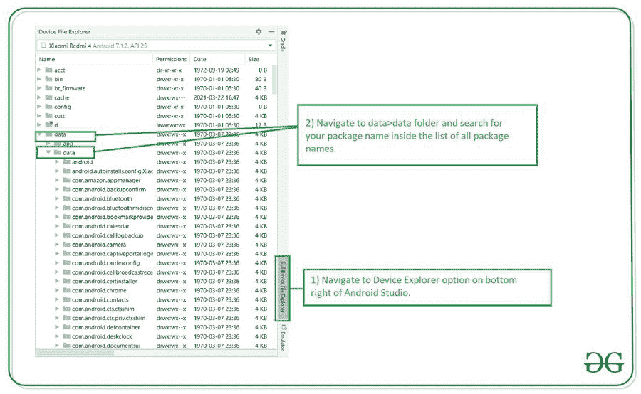
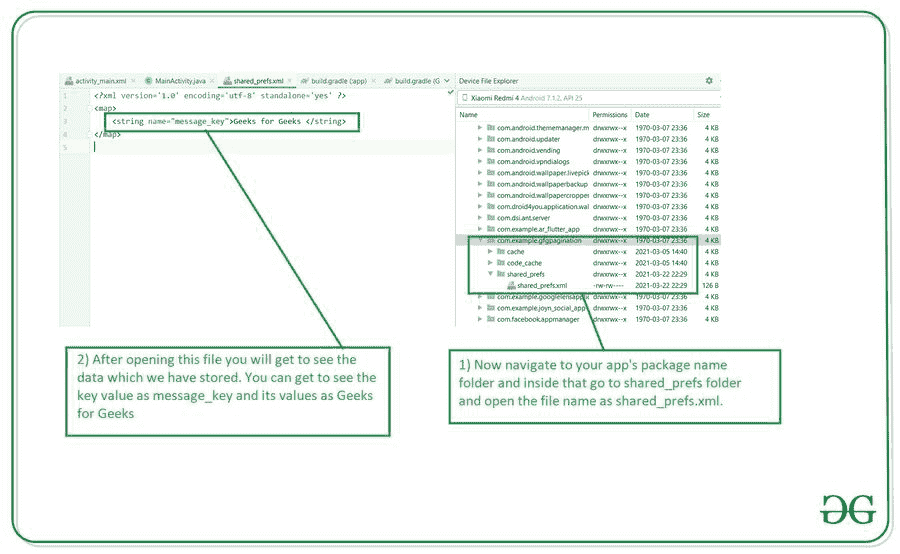

# 如何在 Android Studio 中查看共享首选项中存储的数据？

> 原文:[https://www . geeksforgeeks . org/如何查看数据-存储在共享首选项-在 android-studio/](https://www.geeksforgeeks.org/how-to-view-data-stored-in-shared-preferences-in-android-studio/)

[Android 中的共享首选项](https://www.geeksforgeeks.org/shared-preferences-in-android-with-examples/)是本地存储，我们可以使用密钥和值对保存数据。它通常用于在用户设备中存储数据。在我们使用登录功能的安卓应用程序中，共享首选项也用于会话管理。在本文中，我们将看看**如何在** [安卓工作室](https://www.geeksforgeeks.org/android-studio-main-window/)中查看共享首选项中的数据存储。

### 我们将在本文中构建什么？

我们将构建一个简单的应用程序，其中我们将使用一个简单的[编辑文本](https://www.geeksforgeeks.org/edittext-widget-in-android-using-java-with-examples/)字段在共享首选项中保存数据。之后，我们会在 Android Studio 中看到这个存储在这个文件中的数据。

### **分步实施**

**第一步:创建新项目**

在安卓工作室创建新项目请参考 [<u>【如何在安卓工作室创建/启动新项目】</u>](https://www.geeksforgeeks.org/android-how-to-create-start-a-new-project-in-android-studio/) 。注意选择 **Java** 作为编程语言。

**步骤 2:使用 activity_main.xml 文件**

导航到**应用程序> res >布局> activity_main.xml** 并将下面的代码添加到该文件中。下面是 **activity_main.xml** 文件的代码。

## 可扩展标记语言

```java
<?xml version="1.0" encoding="utf-8"?>
<LinearLayout
    xmlns:android="http://schemas.android.com/apk/res/android"
    xmlns:tools="http://schemas.android.com/tools"
    android:id="@+id/idNestedSV"
    android:layout_width="match_parent"
    android:layout_height="match_parent"
    android:orientation="vertical"
    tools:context=".MainActivity">

    <!--Edit text for getting user input-->
    <EditText
        android:id="@+id/idEdtMessage"
        android:layout_width="match_parent"
        android:layout_height="wrap_content"
        android:layout_marginStart="10dp"
        android:layout_marginTop="50dp"
        android:layout_marginEnd="10dp"
        android:hint="Enter your message" />

    <!--button for saving data-->
    <Button
        android:id="@+id/idBtnSaveData"
        android:layout_width="match_parent"
        android:layout_height="wrap_content"
        android:layout_marginStart="10dp"
        android:layout_marginTop="40dp"
        android:layout_marginEnd="10dp"
        android:text="Save Data"
        android:textAllCaps="false" />

</LinearLayout>
```

**第三步:使用****MainActivity.java 文件**

转到**MainActivity.java**文件，参考以下代码。以下是**MainActivity.java**文件的代码。代码中添加了注释，以更详细地理解代码。

## Java 语言(一种计算机语言，尤用于创建网站)

```java
package com.example.gfgpagination;

import android.content.Context;
import android.content.SharedPreferences;
import android.os.Bundle;
import android.text.TextUtils;
import android.view.View;
import android.widget.Button;
import android.widget.EditText;
import android.widget.Toast;

import androidx.appcompat.app.AppCompatActivity;

public class MainActivity extends AppCompatActivity {
    // creating constant keys for shared preferences.
    public static final String SHARED_PREFS = "shared_prefs";
    // key for storing email.
    public static final String MESSAGE_KEY = "message_key";
    // variable for shared preferences.
    SharedPreferences sharedpreferences;
    // creating variables for our edit text and button.
    private EditText messageEdt;

    @Override
    protected void onCreate(Bundle savedInstanceState) {
        super.onCreate(savedInstanceState);
        setContentView(R.layout.activity_main);
        // getting the data which is stored in shared preferences.
        sharedpreferences = getSharedPreferences(SHARED_PREFS, Context.MODE_PRIVATE);
        // initializing our variables.
        messageEdt = findViewById(R.id.idEdtMessage);
        Button saveBtn = findViewById(R.id.idBtnSaveData);
        // adding on click listener for our button.
        saveBtn.setOnClickListener(new View.OnClickListener() {
            @Override
            public void onClick(View v) {
                // inside on click we are checking if the entered data
                // by user is empty or not.
                String msg = messageEdt.getText().toString();
                if (TextUtils.isEmpty(msg)) {
                    // if the input is empty we are displaying a toast message.
                    Toast.makeText(MainActivity.this, "Please enter your message", Toast.LENGTH_SHORT).show();
                } else {
                    // if the input is not empty we are calling a method to save
                    // data to shared prefs.
                    saveMessage(msg);
                }
            }
        });
    }

    private void saveMessage(String msg) {
        SharedPreferences.Editor editor = sharedpreferences.edit();
        // below lines will put values for
        // message in shared preferences.
        editor.putString(MESSAGE_KEY, msg);
        // to save our data with key and value.
        editor.apply();
        // on below line we are displaying a toast message after adding data to shared prefs.
        Toast.makeText(this, "Message saved to Shared Preferences", Toast.LENGTH_SHORT).show();
        // after that we are setting our edit text to empty
        messageEdt.setText("");
    }
}
```

现在运行您的应用程序，并在编辑文本字段中添加一些数据，然后单击按钮将数据保存到共享首选项中。您可以在下面的视频中看到这一过程:

**输出:**

<video class="wp-video-shortcode" id="video-580357-1" width="640" height="360" preload="metadata" controls=""><source type="video/mp4" src="https://media.geeksforgeeks.org/wp-content/uploads/20210322224851/Screenrecorder-2021-03-22-22-29-39-615.mp4?_=1">[https://media.geeksforgeeks.org/wp-content/uploads/20210322224851/Screenrecorder-2021-03-22-22-29-39-615.mp4](https://media.geeksforgeeks.org/wp-content/uploads/20210322224851/Screenrecorder-2021-03-22-22-29-39-615.mp4)</video>

**第四步:查看共享首选项**中存储的数据

现在在安卓工作室的右下角，你会看到选项为**设备文件浏览器**。点击该选项，您将看到下面的屏幕。在此屏幕内，导航至**数据>数据文件夹**。



**第五步:打开包含共享首选项的文件**

现在在里面检查你的应用程序的包名。单击应用程序的软件包名称。之后点击 **shared_prefs** 文件夹，在里面打开 **shared_prefs.xml** 文件。现在，您将从我们的应用程序中看到我们存储在共享首选项中的数据。

