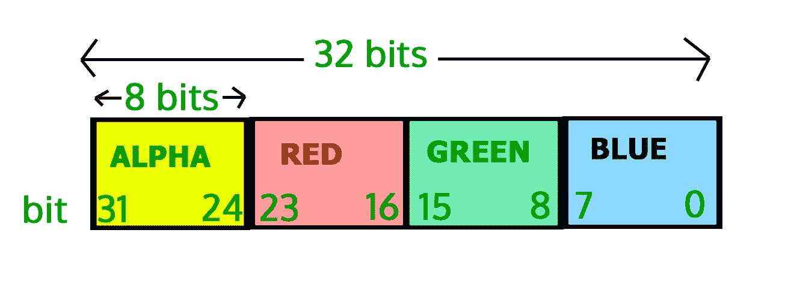

# Java 中的图像处理–获取和设置像素

> 原文:[https://www . geesforgeks . org/image-processing-in-Java-get-and-set-pixels/](https://www.geeksforgeeks.org/image-processing-in-java-get-and-set-pixels/)

**先决条件–**[Java 中的图像处理–读写](https://www.geeksforgeeks.org/image-processing-in-java-read-and-write/)

在这一集里，我们将学习图像的像素，如何**获取图像的**像素值，如何**使用 Java 编程语言设置图像的**像素值。**像素**是图像的最小单位，包括四个分量 Alpha(透明度度量)、Red、Green、Blue，简而言之就是 ARGB。所有组件的值都在 0 到 255 之间，包括 0 和 255。零表示组件不存在，255 表示组件完全存在。

> **注意:**由于 2 <sup>8</sup> = 256，像素分量的值在 0 到 255 之间，所以我们只需要 8 位来存储这些值。

因此，存储 ARGB 值所需的总位数是 8*4=32 位或 4 字节。正如顺序所示，Alpha 获取最左边的 8 位。蓝色获取最右边的 8 位。

**因此位位置:**

*   对于 7-0 的蓝色分量，
*   对于 15-8 的绿色组分，
*   对于 23-16 的红色分量，
*   对于 31-24 的α分量，

#### 索引的图示:



#### 示例:

## Java 语言(一种计算机语言，尤用于创建网站)

```
// Java program to demonstrate get
// and set pixel values of an image

import java.awt.image.BufferedImage;
import java.io.File;
import java.io.IOException;
import javax.imageio.ImageIO;

public class GetSetPixels {
    public static void main(String args[])
        throws IOException
    {
        BufferedImage img = null;
        File f = null;

        // read image
        try {
            f = new File(
                "C:/Users/hp/Desktop/Image Processing in Java/gfg-logo.png");
            img = ImageIO.read(f);
        }
        catch (IOException e) {
            System.out.println(e);
        }

        // get image width and height
        int width = img.getWidth();
        int height = img.getHeight();

        // Since, Inp.jpg is a single pixel image so, we
        // will not be using the width and height variable
        // get pixel value (the arguments in the getRGB
        // method denotes the  coordinates of the image from
        // which the pixel values need to be extracted)
        int p = img.getRGB(0, 0);

        // We, have seen that the components of pixel occupy
        // 8 bits. To get the bits we have to first right
        // shift the 32 bits of the pixels by bit
        // position(such as 24 in case of alpha) and then
        // bitwise ADD it with 0xFF. 0xFF is the hexadecimal
        // representation of the decimal value 255.

        // get alpha
        int a = (p >> 24) & 0xff;

        // get red
        int r = (p >> 16) & 0xff;

        // get green
        int g = (p >> 8) & 0xff;

        // get blue
        int a = p & 0xff;

        // for simplicity we will set the ARGB
        // value to 255, 100, 150 and 200 respectively.

        a = 255;
        r = 100;
        g = 150;
        b = 200;

        // set the pixel value
        p = (a << 24) | (r << 16) | (g << 8) | b;
        img.setRGB(0, 0, p);

        // write image
        try {
            f = new File(
                "C:/Users/hp/Desktop/Image Processing in Java/GFG.png");
            ImageIO.write(img, "png", f);
        }
        catch (IOException e) {
            System.out.println(e);
        }
    }
}
```

#### 输出–

<video class="wp-video-shortcode" id="video-139669-1" width="640" height="360" preload="metadata" controls=""><source type="video/mp4" src="https://media.geeksforgeeks.org/wp-content/uploads/20211109160428/Image-Processing-In-Java---Set-2-1.mp4?_=1">[https://media.geeksforgeeks.org/wp-content/uploads/20211109160428/Image-Processing-In-Java---Set-2-1.mp4](https://media.geeksforgeeks.org/wp-content/uploads/20211109160428/Image-Processing-In-Java---Set-2-1.mp4)</video>

> **注意**:这个代码不会在联机 IDE 上运行，因为它需要磁盘上的映像。

本文由 **Pratik Agarwal** 供稿。如果你喜欢 GeeksforGeeks 并想投稿，你也可以使用[write.geeksforgeeks.org](https://write.geeksforgeeks.org)写一篇文章或者把你的文章邮寄到 review-team@geeksforgeeks.org。看到你的文章出现在极客博客主页上，帮助其他极客。如果你发现任何不正确的地方，或者你想分享更多关于上面讨论的话题的信息，请写评论。