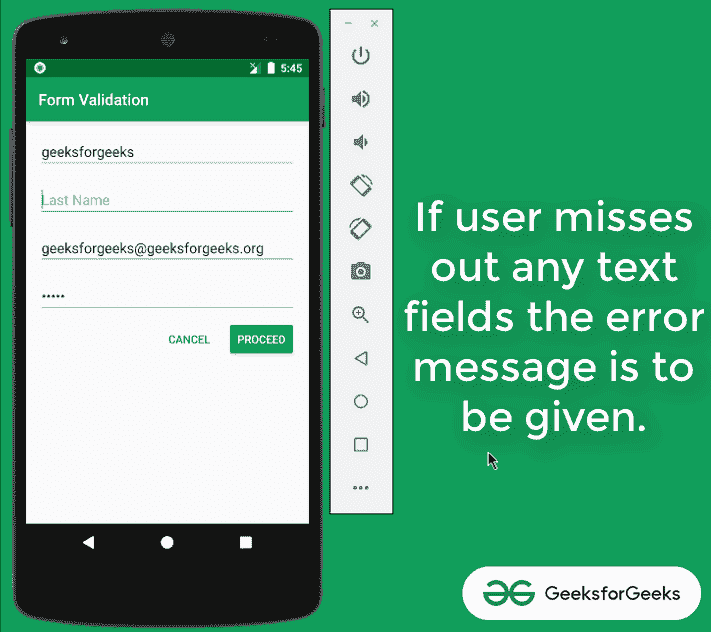
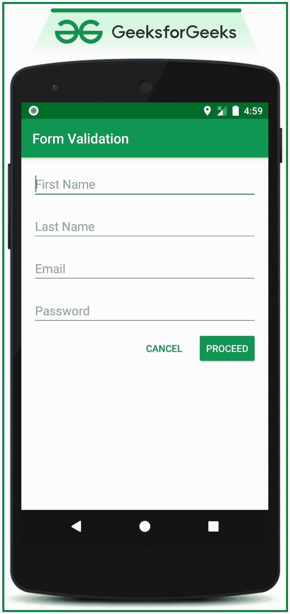

# 在安卓系统中实现表单验证(编辑文本出错)

> 原文:[https://www . geesforgeks . org/implement-form-validation-error-to-edit-text-in-Android/](https://www.geeksforgeeks.org/implement-form-validation-error-to-edittext-in-android/)

在许多已经存在的安卓应用程序中，当涉及到表单时，它包含了用户的详细信息。如果用户在文本字段中输入了错误的信息，或者用户离开文本字段时没有填写，则需要向未填写且包含错误信息的[文本字段](https://www.geeksforgeeks.org/edittext-widget-in-android-using-java-with-examples/)提供一定的提醒信息。因此，在本文中，已经逐步讨论了如何向用户提供错误文本。请看下图，了解在本次讨论中需要实施的内容。注意，我们将使用 **Java** 语言来实现这个项目。



在本讨论中，两个示例活动用于演示目的，因为在第一个活动中实现了文本字段。如果在文本字段中输入的所有数据都符合要求，那么用户应该继续下一个活动。

## **在安卓系统中实现表单验证的步骤**

**第一步:创建一个空的活动项目**

*   创建一个空的活动安卓工作室项目。并选择编程语言为 **JAVA** 。
*   参考[安卓|如何在安卓工作室创建/启动新项目？](https://www.geeksforgeeks.org/android-how-to-create-start-a-new-project-in-android-studio/)了解如何创建一个空的活动安卓工作室项目。

**步骤 2:使用 activity_main.xml**

*   在本例中，出于演示目的，只实现了四个文本字段，即名字、姓氏、电子邮件和密码。
*   在 **activity_main.xml** 文件中调用以下代码。

## 可扩展标记语言

```java
<?xml version="1.0" encoding="utf-8"?>
<LinearLayout
    xmlns:android="http://schemas.android.com/apk/res/android"
    xmlns:tools="http://schemas.android.com/tools"
    android:layout_width="match_parent"
    android:layout_height="match_parent"
    android:orientation="vertical"
    tools:context=".MainActivity"
    tools:ignore="HardcodedText">

    <EditText
        android:id="@+id/firstName"
        android:layout_width="match_parent"
        android:layout_height="wrap_content"
        android:layout_marginStart="16dp"
        android:layout_marginTop="16dp"
        android:layout_marginEnd="16dp"
        android:hint="First Name"
        android:inputType="text" />

    <EditText
        android:id="@+id/lastName"
        android:layout_width="match_parent"
        android:layout_height="wrap_content"
        android:layout_marginStart="16dp"
        android:layout_marginTop="16dp"
        android:layout_marginEnd="16dp"
        android:hint="Last Name"
        android:inputType="text" />

    <EditText
        android:id="@+id/email"
        android:layout_width="match_parent"
        android:layout_height="wrap_content"
        android:layout_marginStart="16dp"
        android:layout_marginTop="16dp"
        android:layout_marginEnd="16dp"
        android:hint="Email"
        android:inputType="textEmailAddress" />

    <EditText
        android:id="@+id/password"
        android:layout_width="match_parent"
        android:layout_height="wrap_content"
        android:layout_marginStart="16dp"
        android:layout_marginTop="16dp"
        android:layout_marginEnd="16dp"
        android:hint="Password"
        android:inputType="textPassword" />

    <LinearLayout
        android:layout_width="match_parent"
        android:layout_height="wrap_content"
        android:layout_marginTop="8dp"
        android:gravity="end"
        android:orientation="horizontal">

        <Button
            android:id="@+id/cancelButton"
            style="@style/Widget.AppCompat.Button.Borderless"
            android:layout_width="wrap_content"
            android:layout_height="wrap_content"
            android:layout_marginEnd="4dp"
            android:text="CANCEL"
            android:textColor="@color/colorPrimary" />

        <Button
            android:id="@+id/proceedButton"
            android:layout_width="wrap_content"
            android:layout_height="wrap_content"
            android:layout_marginEnd="16dp"
            android:backgroundTint="@color/colorPrimary"
            android:text="PROCEED"
            android:textColor="@android:color/white"
            tools:ignore="ButtonStyle" />

    </LinearLayout>
</LinearLayout>
```

### **输出 UI:**



**第三步:创建另一个空活动**

*   用 activity_main2.xml 创建另一个空活动，并调用下面的代码，该代码包含一个简单的文本“Activity 2”以避免混淆。
*   只有当用户在第一个活动中给出的文本字段中正确输入数据时，用户才应继续进行此活动。

## 可扩展标记语言

```java
<?xml version="1.0" encoding="utf-8"?>
<RelativeLayout
    xmlns:android="http://schemas.android.com/apk/res/android"
    xmlns:tools="http://schemas.android.com/tools"
    android:layout_width="match_parent"
    android:layout_height="match_parent"
    tools:context=".MainActivity2"
    tools:ignore="HardcodedText">

    <TextView
        android:layout_width="wrap_content"
        android:layout_height="wrap_content"
        android:layout_centerInParent="true"
        android:text="ACTIVITY 2"
        android:textSize="18sp" />

</RelativeLayout>
```

**步骤 4:使用 MainActivity.java 文件**

*   这里对于 EditText 类的实例，将调用***【setError()***。

> 当文本字段中填写的数据有误时-->
> 
> //这将向特定文本字段提供错误消息
> 
> //其中包含错误的数据。
> 
> edittext 1 . set error(" error message ")；
> 
> 当用户修正用户数据时-->
> 
> //当用户
> 
> //更正错误输入的文本字段。
> 
> editText1.setError（null）;

*   调用以下代码。添加注释是为了更好地理解。

## Java 语言(一种计算机语言，尤用于创建网站)

```java
import androidx.appcompat.app.AppCompatActivity;
import android.content.Intent;
import android.os.Bundle;
import android.view.View;
import android.widget.Button;
import android.widget.EditText;

public class MainActivity extends AppCompatActivity {

    // two buttons
    Button bCancel, bProceed;

    // four text fields
    EditText etFirstName, etLastName, etEmail, etPassword;

    // one boolean variable to check whether all the text fields
      // are filled by the user, properly or not.
    boolean isAllFieldsChecked = false;

    @Override
    protected void onCreate(Bundle savedInstanceState) {
        super.onCreate(savedInstanceState);
        setContentView(R.layout.activity_main);

        // register buttons with their proper IDs.
        bProceed = findViewById(R.id.proceedButton);
        bCancel = findViewById(R.id.cancelButton);

        // register all the EditText fields with their IDs.
        etFirstName = findViewById(R.id.firstName);
        etLastName = findViewById(R.id.lastName);
        etEmail = findViewById(R.id.email);
        etPassword = findViewById(R.id.password);

        // handle the PROCEED button
        bProceed.setOnClickListener(new View.OnClickListener() {
            @Override
            public void onClick(View v) {

                // store the returned value of the dedicated function which checks
                // whether the entered data is valid or if any fields are left blank.
                isAllFieldsChecked = CheckAllFields();

                // the boolean variable turns to be true then
                  // only the user must be proceed to the activity2
                if (isAllFieldsChecked) {
                    Intent i = new Intent(MainActivity.this, MainActivity2.class);
                    startActivity(i);
                }
            }
        });

        // if user presses the cancel button then close the
          // application or the particular activity.
        bCancel.setOnClickListener(new View.OnClickListener() {
            @Override
            public void onClick(View v) {
                MainActivity.this.finish();
                System.exit(0);
            }
        });
    }

    // function which checks all the text fields
      // are filled or not by the user.
    // when user clicks on the PROCEED button
      // this function is triggered.
    private boolean CheckAllFields() {
        if (etFirstName.length() == 0) {
            etFirstName.setError("This field is required");
            return false;
        }

        if (etLastName.length() == 0) {
            etLastName.setError("This field is required");
            return false;
        }

        if (etEmail.length() == 0) {
            etEmail.setError("Email is required");
            return false;
        }

        if (etPassword.length() == 0) {
            etPassword.setError("Password is required");
            return false;
        } else if (etPassword.length() < 8) {
            etPassword.setError("Password must be minimum 8 characters");
            return false;
        }

          // after all validation return true.
        return true;
    }
}
```

### **输出:在仿真器上运行**

<video class="wp-video-shortcode" id="video-520167-1" width="640" height="360" preload="metadata" controls=""><source type="video/mp4" src="https://media.geeksforgeeks.org/wp-content/uploads/20201128174330/Untitled-Project.mp4?_=1">[https://media.geeksforgeeks.org/wp-content/uploads/20201128174330/Untitled-Project.mp4](https://media.geeksforgeeks.org/wp-content/uploads/20201128174330/Untitled-Project.mp4)</video>