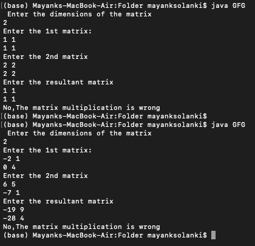

# 在 Java 中实现科波菲尔算法

> 原文:[https://www . geesforgeks . org/impering-copper Smith-freivalds-algorithm-in-Java/](https://www.geeksforgeeks.org/implementing-coppersmith-freivalds-algorithm-in-java/)

**概念:**科波菲尔算法是检查矩阵 A 乘以矩阵 B 是否等于给定的矩阵 c，用于验证矩阵乘法。借助于 A*(B*r)-(C*r)=0 的方程进行了验证，其中 r 是仅由 0/1 组成的随机列向量。

插图:

```
Input:

Enter the dimensions of the matrices:  

2

Enter the 1st matrix:  

-2 1

0  4

Enter the 2st matrix:  

6  5

-7  1

Enter the result matrix:  

-19  9

-28  4

Output: Yes, The matrix multiplication is correct.
```

### **进场:**

将矩阵的大小作为用户的输入。

**目标:**根据方程我们需要验证矩阵 A *矩阵 B =矩阵 c。

取矩阵 A(n*n)矩阵 B(n*n)和结果矩阵 C(n*n)的输入作为输入。

1)随机取数组 r[n][1]，该数组仅由 0/1 的元素组成。

2)计算矩阵 B*r，矩阵 C*r，然后计算矩阵 A*(矩阵 B*r)来计算表达式矩阵 A*(矩阵 B * r)–(矩阵 C*r)

3)检查方程矩阵 A*(矩阵 B * r)–(矩阵 C*r)=0 与否。

4)如果为零，则打印“是”，否则打印“否”。

**实现:**输入要按照上面显示的顺序进行，否则会导致错误的结果。下面是考虑的例子

## Java 语言(一种计算机语言，尤用于创建网站)

```
// Importing class to create objects
// generating pseudo random numbers
import java.util.Random;

// Importing class to take input from user
import java.util.Scanner;

public class GFG {
    public static double[][] multiplyVector(double[][] a,
                                            double[][] b,
                                            int n)
    // Method to check the result of the equation.
    {
        double result[][] = new double[n][1];
        for (int i = 0; i < n; i++) {
            for (int j = 0; j < 1; j++) {
                for (int k = 0; k < n; k++) {
                    result[i][j]
                        = result[i][j] + a[i][k] * b[i][j];
                }
            }
        }
        return result;
    }

    public static void main(String args[])
    {
        // Driver main method
        Scanner input = new Scanner(System.in);

        System.out.println(
            " Enter the dimensions of the matrix");
        int n = input.nextInt();

        // n- size or dimensions of matrix
        System.out.println("Enter the 1st matrix:");

        // Taking input for 1st matrix
        double a[][] = new double[n][n];

        for (int i = 0; i < n; i++) {
            for (int j = 0; j < n; j++) {
                a[i][j] = input.nextDouble();
            }
        }

        //
        System.out.println("Enter the 2nd matrix");
        double b[][] = new double[n][n];

        // Taking input for second matrix
        for (int i = 0; i < n; i++) {
            for (int j = 0; j < n; j++) {
                b[i][j] = input.nextDouble();
            }
        }

        // Covering up Resultant matrix
        System.out.println("Enter the resultant matrix");
        double c[][] = new double[n][n];
        // the resultant matrix
        for (int i = 0; i < n; i++) {
            for (int j = 0; j < n; j++) {
                c[i][j] = input.nextDouble();
            }
        }

        // generating random matrix r consisting of 0/1 only
        double[][] r = new double[n][1];
        Random random = new Random();
        for (int i = 0; i < n; i++) {
            r[i][0] = random.nextInt(2);
        }

        // testing of the standard equation A*(B*r)-(C*r)=0
        double br[][] = new double[n][1];
        double cr[][] = new double[n][1];
        double abr[][] = new double[n][1];
        br = multiplyVector(b, r, n);
        cr = multiplyVector(c, r, n);
        abr = multiplyVector(a, br, n);

        // check for all zeroes in abr
        boolean flag = true;
        // Setting flag with true

        for (int i = 0; i < n; i++) {
            if (abr[i][0] == 0)
                continue;
            else

                // Set flag to false(change flag)
                flag = false;
        }

        // Boolean comparison resulting in message printing
        if (flag == true)

            System.out.println(
                "Yes,The matrix multiplication is correct");
        else
            System.out.println(
                "No,The matrix multiplication is wrong");
        input.close();
    }
}
```

**输出:**2 阶随机矩阵的自定义输入



**时间复杂度:** O(kN^2)其中 n 是矩阵的大小。