# 通过企业 Java Beans 在 Netbeans 中实现消息队列技术

> 原文:[https://www . geesforgeks . org/implementing-message-queue-technology-in-netbeans-through-enterprise-Java-beans/](https://www.geeksforgeeks.org/implementing-message-queuing-technique-in-netbeans-through-enterprise-java-beans/)

一个消息队列，允许一个或多个进程写一个消息供其他进程读取。消息队列被实现为消息的链接列表，并存储在内核中。每个消息队列由一个消息队列标识符标识。内核跟踪系统中创建的所有消息队列。

通过企业 Java Beans 在 Netbeans 中实现消息队列技术的过程步骤按顺序列出。只需按照以下步骤在 Netbeans 中实现消息驱动 bean，如下所示:

1.  打开 Netbeans，选择*Java EE–>企业应用*
2.  在相应的文本框中输入项目名称
3.  选择 **Glashfish** 服务器
4.  点击完成。
5.  在 EJB 组件中创建一个消息驱动 Bean。
6.  右键单击 EJB 并选择消息驱动 Beans 选项，输入 EJB 名称和包名称，然后单击加载项项目目标并创建目标资源。
7.  输入名称并选择队列，然后单击确定和下一步。
8.  现在创建一个*队列。编辑 index.html*文件，创建与 bean 的交互。
9.  为通信 bean 创建一个 servlet
10.  右键单击应用程序并选择清理和构建选项。

**步骤 1:** 打开 Netbeans，选择 Java EE- >企业应用

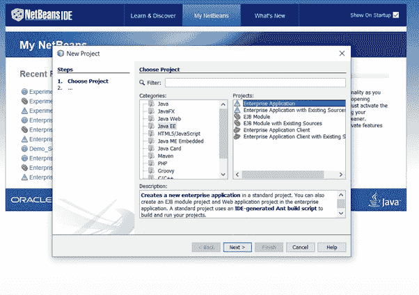

选择项目作为 Java EE->企业应用程序

**第二步:**在对应的文本框中输入项目名称

*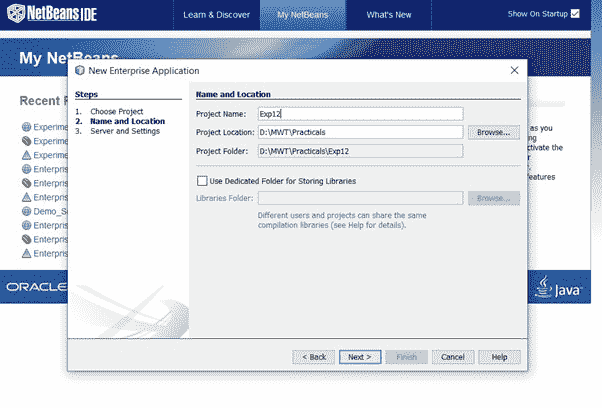

输入项目名称* 

***步骤 3:** 选择 Glassfish 服务器*

*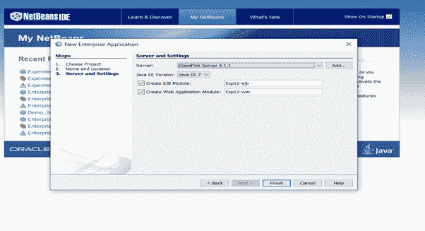

选择 glassfish 服务器* 

***第 4 步:**点击完成。将创建三个文件。1.申请，2。EJB 和 3 号。战争文件被创建*

*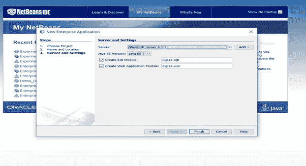*

*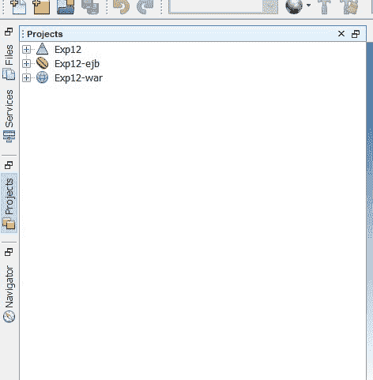*

***步骤 5:** 在 EJB 组件中创建一个消息驱动 Bean。*

***步骤 6:** 右键单击 EJB，选择消息驱动 Beans 选项，输入 EJB 名称和包名称，然后单击外接程序项目目标，并创建目标资源。*

*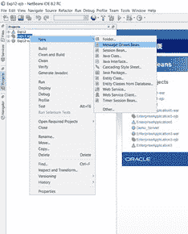*

*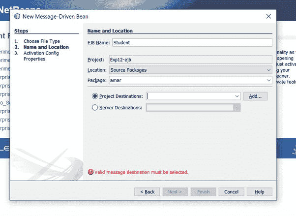*

***第 7 步:**输入名称，选择队列，点击确定和下一步。*

> ***注意:**这里我们实现的是排队技术，所以目的地类型应该是 Queue。*

*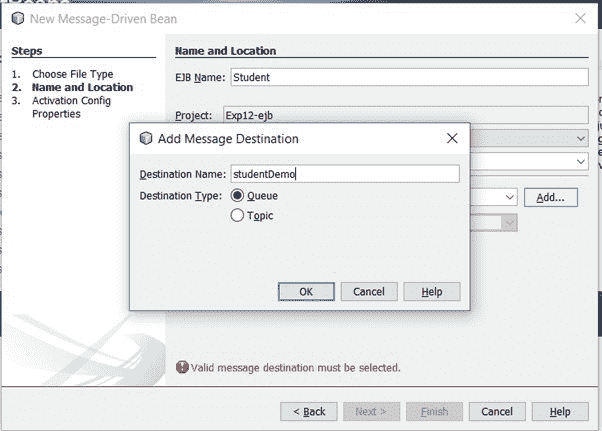*

*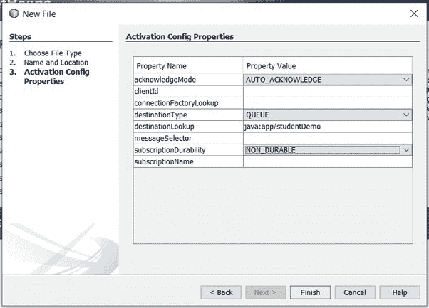*

***步骤 8:** 创建队列*

***实施:***

*   *要更改此许可证头，请在项目属性中选择许可证头。*
*   *要更改此模板文件，请选择工具|模板*
*   *并在编辑器中打开模板。*

***例***

```
*package amar;

import javax.ejb.ActivationConfigProperty;
import javax.ejb.MessageDriven;
import javax.jms.JMSDestinationDefinition;
import javax.jms.Message;
import javax.jms.MessageListener;
import javax.jms.TextMessage;

@JMSDestinationDefinition(name = "java:app/studentDemo", interfaceName = "javax.jms.Queue", 
                                resourceAdapter = "jmsra", destinationName = "studentDemo")

@MessageDriven(activationConfig = {

    @ActivationConfigProperty(propertyName = "destinationLookup", propertyValue = "java:app/studentDemo")

    ,

    @ActivationConfigProperty(propertyName = "destinationType", propertyValue = "javax.jms.Queue")

})

// Class implementing MessageListener interface
public class Student implements MessageListener {

    // Constructor
    public Student() {}

    // Method 1
    // @Override
    public void onMessage(Message message) {

        // Try block to check foe exceptions
        try {

            TextMessage msg = (TextMessage) message;

            System.out.println("This is the message retrieved from Queue:" + msg.getText());

            if (msg.getText() == "Abhin")

            {

                System.out.println("OK");

            } else {

                System.out.println("No");
            }
        }

        // Catch block to handle the exceptions
        catch (Exception e) {

            System.out.println("Error Message:" + e.getMessage());
        }
    }
}*
```

***步骤 10:** 编辑 index.html 文件，创建与 bean 的交互。*

***实施:**要更改此许可证标题，请在项目属性中选择许可证标题。要更改此模板文件，请选择工具|模板并在编辑器中打开模板。*

***例***

```
*<!DOCTYPE html>
<html>
   <head>
       <title>TODO supply a title</title>
       <meta charset="UTF-8">
       <meta name="viewport" content="width=device-width, initial-scale=1.0">
   </head>
   <body>
       <div>Message Driven Bean Project</div>
       <form action="Student_Demo" method="POST">
           <input type="text" name="msg"><br><!-- comment -->
           <input type="submit" value="Add"/>
       </form>
   </body>
</html>*
```

***步骤 11:** 创建一个用于通信 bean 的 servlet*

***实施:***

*   *要更改此许可证头，请在项目属性中选择许可证头。*
*   *要更改此模板文件，请选择工具|模板*
*   *并在编辑器中打开模板。*

***例***

```
*package amar;

import java.io.IOException;
import java.io.PrintWriter;
import javax.annotation.Resource;
import javax.jms.Connection;
import javax.jms.ConnectionFactory;
import javax.jms.MessageProducer;
import javax.jms.Queue;
import javax.jms.Session;
import javax.jms.TextMessage;
import javax.servlet.ServletException;
import javax.servlet.annotation.WebServlet;
import javax.servlet.http.HttpServlet;
import javax.servlet.http.HttpServletRequest;
import javax.servlet.http.HttpServletResponse;

@WebServlet(name = "Student_Demo", urlPatterns = {"/Student_Demo"})

public class Student_Demo extends HttpServlet {

    @Resource(mappedName = "jms/__defaultConnectionFactory")

    ConnectionFactory cf;

    @Resource(mappedName = "java:app/studentDemo")

    Queue dest;

     // Processes requests for both
     // HTTP <code>GET</code> and <code>POST</code> methods

      // Servlet request
      //@param request
      // Servlet response
      //@param response

     // If a servlet-specific error occurs
     // @throws ServletException
     // If an I/O error occurs
     // @throws IOException

    protected void processRequest(HttpServletRequest request, HttpServletResponse response)

    throws ServletException, IOException {

        response.setContentType("text/html;charset=UTF-8");

        try (PrintWriter out = response.getWriter()) {

            // TODO output your page here
            // Sample code to be used here

            String msg = request.getParameter("msg");

            out.println("<!DOCTYPE html>");
            out.println("<html>");
            out.println("<head>");
            out.println("<title>Servlet Student_Demo</title>");
            out.println("</head>");
            out.println("<body>");

            send(msg);

            out.println("<h1>Message Queued</h1>");
            out.println("</body>");
            out.println("</html>");

        }

    }

    // Method
    private void send(String message) {

        try {

            // Creating object of Connection class
            Connection con = cf.createConnection();
            // Creating object of Session class
            Session ses = con.createSession();
            // Creating object of MessageProducer class
            MessageProducer mp = ses.createProducer(dest);
            // Creating object of TextMessage class
            TextMessage tm = ses.createTextMessage();

            tm.setText(message);

            mp.send(tm);

        }

        // Catch block to handle the exception
        catch (Exception e) {

            System.out.println("Error" + e.getMessage());

        }

    }

    // <editor-fold defaultstate="collapsed" desc="HttpServlet methods. 
    // Click on the + sign on the left to edit the code.">

    /**

     * Handles the HTTP <code>GET</code> method.

     *

     * @param request servlet request

     * @param response servlet response

     * @throws ServletException if a servlet-specific error occurs

     * @throws IOException if an I/O error occurs

     */

    @Override

    protected void doGet(HttpServletRequest request, HttpServletResponse response)

    throws ServletException, IOException {

        processRequest(request, response);

    }

    /**

     * Handles the HTTP <code>POST</code> method.

     *

     * @param request servlet request

     * @param response servlet response

     * @throws ServletException if a servlet-specific error occurs

     * @throws IOException if an I/O error occurs

     */

    @Override

    protected void doPost(HttpServletRequest request, HttpServletResponse response)

    throws ServletException, IOException {

        processRequest(request, response);

    }

    /**

     * Returns a short description of the servlet.

     *

     * @return a String containing servlet description

     */

    @Override

    public String getServletInfo() {

        return "Short description";

    }// </editor-fold>

}*
```

***步骤 12:** 右键单击应用程序并选择清理和构建选项。它将清理项目并成功构建。构建成功后，选择部署。如果部署中有任何错误，它会显示所有这些错误。一旦部署成功，点击**测试**执行过程的运行按钮。*

***输出:***

*

用户界面* *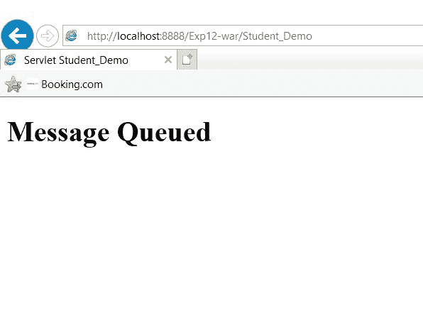

消息被排队到 glassfish 服务器* *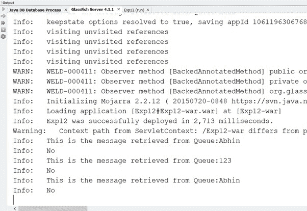

消息排队信息*