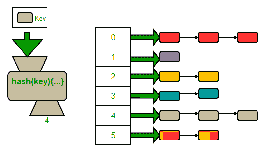

# 用 Java 实现我们自己的独立链接哈希表

> 原文:[https://www . geeksforgeeks . org/实现我们自己的哈希表，带有单独的 java 链接/](https://www.geeksforgeeks.org/implementing-our-own-hash-table-with-separate-chaining-in-java/)

所有的数据结构都有自己的特殊特征，例如，当需要快速搜索一个元素(在 log(n)中)时，使用一个 BST。当需要在恒定时间内提取最小或最大元素时，使用堆或优先级队列。类似地，哈希表用于在恒定时间内获取、添加和移除元素。在进入实现方面之前，任何人都必须清楚哈希表的工作原理。这里有一个哈希表工作的简单背景，也应该注意到我们将交替使用哈希表和哈希表术语，尽管在 Java 中哈希表是线程安全的，而哈希表不是。

我们要实现的代码可在[链接 1](https://github.com/ishaan007/Data-Structures/blob/master/HashMaps/Map.java) 和[链接 2](https://github.com/ishaan007/Data-Structures/blob/master/HashMaps/HashNode.java) 获得

但是强烈建议你必须完整地阅读这篇博客，并尝试破译实现哈希映射的细节，然后尝试自己编写代码。

**背景**

每个哈希表都以(键、值)组合的形式存储数据。有趣的是，哈希表中的每个键都是唯一的，但是值可以重复，这意味着对于哈希表中的不同键，值可以是相同的。现在，当我们观察一个数组以获取一个值时，我们提供了与该数组中的值相对应的位置/索引。在哈希表中，我们使用一个键来获取对应于该键的值，而不是索引。现在整个过程描述如下

每次生成密钥时。密钥被传递给哈希函数。每个哈希函数都有两个部分一个**哈希代码和一个压缩器**。

*哈希码为整数*(随机或非随机)。在 Java 中，每个对象都有自己的哈希代码。我们将在我们的哈希函数中使用 JVM 生成的哈希代码，并根据哈希表的大小对哈希代码进行模(%)压缩。*所以模运算符是我们实现中的*一个*压缩器。*

整个过程确保了对于任何键，我们在哈希表的大小内获得一个整数位置来插入相应的值。

因此，过程很简单，用户给出一个(键，值)对集作为输入，并基于哈希函数生成的值，生成一个索引，指向对应于特定键的值的存储位置。所以每当我们需要获取一个对应于某个键的值时，那就是 O(1)。

当哈希冲突的概念被引入时，这幅图就不再那么美好和完美了。想象一下，对于不同的键值，散列表的相同块现在被分配，它们先前存储的值对应于先前的某个键值。我们当然不能取代它。那将是灾难性的！为了解决这个问题，我们将使用单独链接技术，请注意，还有其他开放寻址技术，如双哈希和线性探测，其效率几乎与单独链接相同，您可以在[链接 1](http://geeksquiz.com/hashing-set-1-introduction/) [链接 2](http://geeksquiz.com/hashing-set-2-separate-chaining/) [链接 3](http://geeksquiz.com/hashing-set-3-open-addressing/) 了解更多信息

现在我们要做的是创建一个对应于哈希表中特定桶的链表，以容纳映射到同一桶的不同键对应的所有值。



现在可能会有这样一种情况，所有的键都被映射到同一个桶，我们有一个来自单个桶的 n(哈希表的大小)大小的链表，所有其他桶都是空的，这是哈希表充当链表并且搜索是 O(n)的最坏情况。那我们该怎么办？

**负载系数**

如果 n 是我们最初决定填充的铲斗总数，比如说 10 个，假设现在填充了 7 个，那么负载系数是 7/10=0.7。

**在我们的实现中**每当我们向哈希表添加键值对时，我们都会检查加载因子，如果它大于 0.7，我们会将哈希表的大小增加一倍。

**实施**

**哈希节点数据类型**

我们将尝试在不对键和值的数据类型施加任何限制的情况下制作一个通用映射。此外，每个散列节点都需要知道它在链表中指向的下一个节点，因此也需要下一个指针。

我们计划保留在哈希映射中的函数有

*   **get(K 键)**:如果键存在于**HT**(**H**ast**T**able)中，则返回该键对应的值
*   **getSize()** :返回 HT 的大小
*   **add()** :向 HT 添加新的有效密钥、值对，如果已经存在则更新该值
*   **移除()**:移除键、值对
*   **isEmpty()** :如果大小为零，则返回 true

```
ArrayList<HashNode<K, V>> bucket = new ArrayList<>();
```

实现了一个**助手函数**来获取密钥的索引，避免了获取、添加、删除等其他函数的冗余。这个函数使用内置的 java 函数来生成一个哈希代码，我们按照 HT 的大小来压缩哈希代码，这样索引就在 HT 的大小范围内

**get()**

get 函数只接受一个键作为输入，如果该键存在于表中，则返回相应的值，否则返回 null。步骤如下:

*   检索输入键以在 HT 中找到索引
*   如果找到值，遍历与 HT 对应的喜欢的列表，然后返回它，否则如果完全遍历列表而不返回，这意味着该值不在表中，不能被提取，因此返回 null

**移除()**

*   使用助手函数获取对应于输入键的索引
*   链表的遍历类似于 get()中的遍历，但是这里的特殊之处在于，需要在找到键的同时移除它，并且出现了两种情况
*   如果要删除的关键字出现在链表的头部
*   如果要取出的钥匙不在头部而是在其他地方

**添加()**

现在来看看整个实现中最有趣和最具挑战性的功能。这很有趣，因为当负载系数高于我们指定的值时，我们需要动态增加列表的大小。

*   就像删除步骤，直到遍历和添加，两种情况(头部点或非头部点的添加)保持不变。
*   最后，如果负载系数大于 0.7
*   我们将数组列表的大小加倍，然后对现有的键递归调用 add 函数，因为在我们的例子中，生成的哈希值使用数组的大小来压缩我们使用的内置 JVM 哈希代码，所以我们需要为现有的键获取新的索引。理解这一点非常重要，请重新阅读这一段，直到你掌握 add 函数中正在发生的事情。

如果对应于特定存储桶的链表太长，Java 在自己的哈希表实现中使用二叉查找树。

## Java 语言(一种计算机语言，尤用于创建网站)

```
// Java program to demonstrate implementation of our
// own hash table with chaining for collision detection
import java.util.ArrayList;
import java.util.Objects;

// A node of chains
class HashNode<K, V> {
    K key;
    V value;
      final int hashCode;

    // Reference to next node
    HashNode<K, V> next;

    // Constructor
    public HashNode(K key, V value, int hashCode)
    {
        this.key = key;
        this.value = value;
          this.hashCode = hashCode;
    }
}

// Class to represent entire hash table
class Map<K, V> {
    // bucketArray is used to store array of chains
    private ArrayList<HashNode<K, V> > bucketArray;

    // Current capacity of array list
    private int numBuckets;

    // Current size of array list
    private int size;

    // Constructor (Initializes capacity, size and
    // empty chains.
    public Map()
    {
        bucketArray = new ArrayList<>();
        numBuckets = 10;
        size = 0;

        // Create empty chains
        for (int i = 0; i < numBuckets; i++)
            bucketArray.add(null);
    }

    public int size() { return size; }
    public boolean isEmpty() { return size() == 0; }

      private final int hashCode (K key) {
        return Objects.hashCode(key);
    }

    // This implements hash function to find index
    // for a key
    private int getBucketIndex(K key)
    {
        int hashCode = hashCode(key);
        int index = hashCode % numBuckets;
        // key.hashCode() coule be negative.
        index = index < 0 ? index * -1 : index;
        return index;
    }

    // Method to remove a given key
    public V remove(K key)
    {
        // Apply hash function to find index for given key
        int bucketIndex = getBucketIndex(key);
        int hashCode = hashCode(key);
        // Get head of chain
        HashNode<K, V> head = bucketArray.get(bucketIndex);

        // Search for key in its chain
        HashNode<K, V> prev = null;
        while (head != null) {
            // If Key found
            if (head.key.equals(key) && hashCode == head.hashCode)
                break;

            // Else keep moving in chain
            prev = head;
            head = head.next;
        }

        // If key was not there
        if (head == null)
            return null;

        // Reduce size
        size--;

        // Remove key
        if (prev != null)
            prev.next = head.next;
        else
            bucketArray.set(bucketIndex, head.next);

        return head.value;
    }

    // Returns value for a key
    public V get(K key)
    {
        // Find head of chain for given key
        int bucketIndex = getBucketIndex(key);
          int hashCode = hashCode(key);

        HashNode<K, V> head = bucketArray.get(bucketIndex);

        // Search key in chain
        while (head != null) {
            if (head.key.equals(key) && head.hashCode == hashCode)
                return head.value;
            head = head.next;
        }

        // If key not found
        return null;
    }

    // Adds a key value pair to hash
    public void add(K key, V value)
    {
        // Find head of chain for given key
        int bucketIndex = getBucketIndex(key);
          int hashCode = hashCode(key);
        HashNode<K, V> head = bucketArray.get(bucketIndex);

        // Check if key is already present
        while (head != null) {
            if (head.key.equals(key) && head.hashCode == hashCode) {
                head.value = value;
                return;
            }
            head = head.next;
        }

        // Insert key in chain
        size++;
        head = bucketArray.get(bucketIndex);
        HashNode<K, V> newNode
            = new HashNode<K, V>(key, value, hashCode);
        newNode.next = head;
        bucketArray.set(bucketIndex, newNode);

        // If load factor goes beyond threshold, then
        // double hash table size
        if ((1.0 * size) / numBuckets >= 0.7) {
            ArrayList<HashNode<K, V> > temp = bucketArray;
            bucketArray = new ArrayList<>();
            numBuckets = 2 * numBuckets;
            size = 0;
            for (int i = 0; i < numBuckets; i++)
                bucketArray.add(null);

            for (HashNode<K, V> headNode : temp) {
                while (headNode != null) {
                    add(headNode.key, headNode.value);
                    headNode = headNode.next;
                }
            }
        }
    }

    // Driver method to test Map class
    public static void main(String[] args)
    {
        Map<String, Integer> map = new Map<>();
        map.add("this", 1);
        map.add("coder", 2);
        map.add("this", 4);
        map.add("hi", 5);
        System.out.println(map.size());
        System.out.println(map.remove("this"));
        System.out.println(map.remove("this"));
        System.out.println(map.size());
        System.out.println(map.isEmpty());
    }
}
```

整个代码可在[https://github . com/ishaan 007/Data-Structures/blob/master/hashmap . Java](https://github.com/ishaan007/Data-Structures/blob/master/HashMaps/Map.java)上获得

本文由**伊桑·阿罗拉供稿。**如果你喜欢 GeeksforGeeks 并想投稿，你也可以写一篇文章，把你的文章邮寄到 contribute@geeksforgeeks.org。看到你的文章出现在极客博客主页上，帮助其他极客。

如果您发现任何不正确的地方，或者您想分享更多关于上面讨论的主题的信息，请写评论