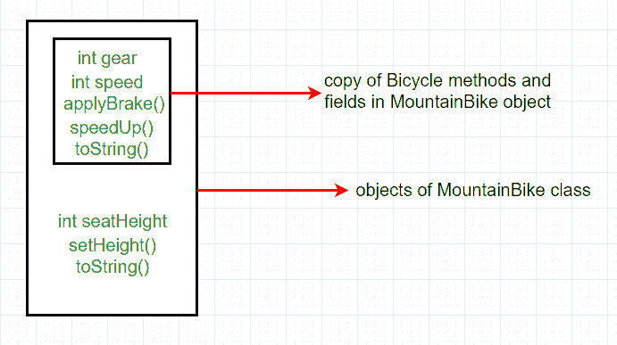

# Java 中的继承

> 原文:[https://www.geeksforgeeks.org/inheritance-in-java/](https://www.geeksforgeeks.org/inheritance-in-java/)

继承是面向对象编程的重要支柱。这是 java 中允许一个类继承另一个类的特性(字段和方法)的机制。

**重要术语:**

*   **超类:**特征被继承的类称为超类(或基类或父类)。
*   **子类:**继承另一个类的类称为子类(或派生类、扩展类或子类)。除了超类字段和方法之外，子类还可以添加自己的字段和方法。
*   **可重用性:**继承支持“可重用性”的概念，即当我们想要创建一个新的类，并且已经有一个类包含了我们想要的一些代码时，我们可以从现有的类中派生出我们的新类。通过这样做，我们重用了现有类的字段和方法。

**如何在 Java 中使用继承**

用于继承的关键字是**扩展**。

**语法:**

```java
class derived-class extends base-class  
{  
   //methods and fields  
}  
```

**示例:**在下面的继承示例中，class Bicycle 是基类，class MountainBike 是扩展 Bicycle 类的派生类，class Test 是运行程序的驱动类。

## Java 语言(一种计算机语言，尤用于创建网站)

```java
// Java program to illustrate the
// concept of inheritance

// base class
class Bicycle {
    // the Bicycle class has two fields
    public int gear;
    public int speed;

    // the Bicycle class has one constructor
    public Bicycle(int gear, int speed)
    {
        this.gear = gear;
        this.speed = speed;
    }

    // the Bicycle class has three methods
    public void applyBrake(int decrement)
    {
        speed -= decrement;
    }

    public void speedUp(int increment)
    {
        speed += increment;
    }

    // toString() method to print info of Bicycle
    public String toString()
    {
        return ("No of gears are " + gear + "\n"
                + "speed of bicycle is " + speed);
    }
}

// derived class
class MountainBike extends Bicycle {

    // the MountainBike subclass adds one more field
    public int seatHeight;

    // the MountainBike subclass has one constructor
    public MountainBike(int gear, int speed,
                        int startHeight)
    {
        // invoking base-class(Bicycle) constructor
        super(gear, speed);
        seatHeight = startHeight;
    }

    // the MountainBike subclass adds one more method
    public void setHeight(int newValue)
    {
        seatHeight = newValue;
    }

    // overriding toString() method
    // of Bicycle to print more info
    @Override public String toString()
    {
        return (super.toString() + "\nseat height is "
                + seatHeight);
    }
}

// driver class
public class Test {
    public static void main(String args[])
    {

        MountainBike mb = new MountainBike(3, 100, 25);
        System.out.println(mb.toString());
    }
}
```

**Output**

```java
No of gears are 3
speed of bicycle is 100
seat height is 25

```

在上面的程序中，当一个登山自行车类的对象被创建时，超类的所有方法和字段的副本都在这个对象中获得内存。这就是为什么通过使用子类的对象，我们也可以访问超类的成员。

请注意，在继承过程中，只创建子类的对象，而不是超类。更多信息，请参考[继承类的 Java 对象创建](https://www.geeksforgeeks.org/gfact-52-java-object-creation-of-inherited-classes/)。

**节目说明图:**

[](https://media.geeksforgeeks.org/wp-content/uploads/inheritence1.png)

在实践中，继承和[多态性](https://www.geeksforgeeks.org/overriding-in-java/)在 java 中一起使用，以实现代码的快速性能和可读性。

**Java 中的继承类型**

下面是 Java 支持的不同类型的继承。

**1。单一继承:**在单一继承中，子类继承一个超类的特征。在下图中，类 A 作为派生类 b 的基类

## Java 语言(一种计算机语言，尤用于创建网站)

```java
// Java program to illustrate the
// concept of single inheritance
import java.io.*;
import java.lang.*;
import java.util.*;

class one {
    public void print_geek()
    {
        System.out.println("Geeks");
    }
}

class two extends one {
    public void print_for() { System.out.println("for"); }
}
// Driver class
public class Main {
    public static void main(String[] args)
    {
        two g = new two();
        g.print_geek();
        g.print_for();
        g.print_geek();
    }
}
```

**Output**

```java
Geeks
for
Geeks

```

[](https://media.geeksforgeeks.org/wp-content/uploads/inheritance1.png)

**2。多级继承:**在多级继承中，一个派生类将继承一个基类，并且该派生类也作为其他类的基类。在下图中，类 A 作为派生类 B 的基类，而派生类 B 又作为派生类 c 的基类。在 Java 中，类不能直接访问[祖父母的成员](https://www.geeksforgeeks.org/g-fact-91/)。

## Java 语言(一种计算机语言，尤用于创建网站)

```java
// Java program to illustrate the
// concept of Multilevel inheritance
import java.io.*;
import java.lang.*;
import java.util.*;

class one {
    public void print_geek()
    {
        System.out.println("Geeks");
    }
}

class two extends one {
    public void print_for() { System.out.println("for"); }
}

class three extends two {
    public void print_geek()
    {
        System.out.println("Geeks");
    }
}

// Drived class
public class Main {
    public static void main(String[] args)
    {
        three g = new three();
        g.print_geek();
        g.print_for();
        g.print_geek();
    }
}
```

**Output**

```java
Geeks
for
Geeks

```

[](https://media.geeksforgeeks.org/wp-content/uploads/inheritance3.png)

**3。层次继承:**在层次继承中，一个类充当多个子类的超类(基类)。在下图中，类 A 用作派生类 B、C 和 d 的基类

## Java 语言(一种计算机语言，尤用于创建网站)

```java
// Java program to illustrate the
// concept of Hierarchical  inheritance

class A {
    public void print_A() { System.out.println("Class A"); }
}

class B extends A {
    public void print_B() { System.out.println("Class B"); }
}

class C extends A {
    public void print_C() { System.out.println("Class C"); }
}

class D extends A {
    public void print_D() { System.out.println("Class D"); }
}

// Driver Class
public class Test {
    public static void main(String[] args)
    {
        B obj_B = new B();
        obj_B.print_A();
        obj_B.print_B();

        C obj_C = new C();
        obj_C.print_A();
        obj_C.print_C();

        D obj_D = new D();
        obj_D.print_A();
        obj_D.print_D();
    }
}
```

**Output**

```java
Class A
Class B
Class A
Class C
Class A
Class D

```