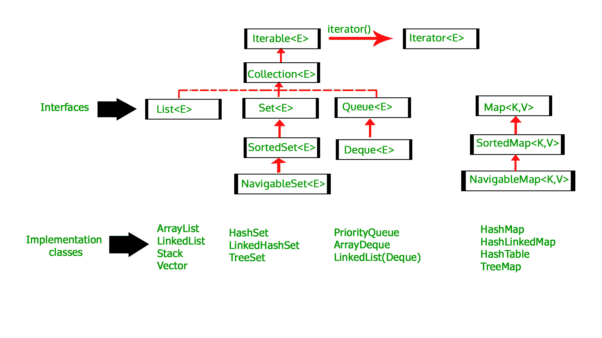

# 用 Java 初始化一个数组列表

> 原文:[https://www . geesforgeks . org/initialize-an-ArrayList-in-Java/](https://www.geeksforgeeks.org/initialize-an-arraylist-in-java/)

[数组列表](https://www.geeksforgeeks.org/arraylist-in-java/)是[集合框架](https://www.geeksforgeeks.org/collections-in-java-2/)的一部分，存在于 [java.util 包](https://www.geeksforgeeks.org/java-util-package-java/)中。它用 Java 为我们提供了动态数组。尽管它可能比标准数组慢，但在需要对数组进行大量操作的程序中会很有帮助。

*   数组列表继承抽象列表类，实现列表接口。
*   数组列表由一个大小初始化，但是如果集合变大，则该大小会增加；如果对象从集合中移除，则该大小会缩小。
*   Java ArrayList 允许我们随机访问列表。
*   ArrayList 不能用于基本类型，如 int、char 等。对于这种情况，我们需要一个包装类(详见[这个](https://www.geeksforgeeks.org/array-vs-arraylist-in-java/))。
*   Java 中的 ArrayList 可以看作类似于 C++中的[向量](https://www.geeksforgeeks.org/vector-in-cpp-stl/)。



下面是用 Java 初始化数组列表的各种方法:

1.  ### 使用 add()初始化

    **语法:**

    ```java
    ArrayList<Type> str = new ArrayList<Type>();
           str.add("Geeks");
           str.add("for");
           str.add("Geeks");

    ```

    **示例:**

    ```java
    // Java code to illustrate initialization
    // of ArrayList using add() method

    import java.util.*;

    public class GFG {
        public static void main(String args[])
        {

            // create a ArrayList String type
            ArrayList<String> gfg = new ArrayList<String>();

            // Initialize an ArrayList with add()
            gfg.add("Geeks");
            gfg.add("for");
            gfg.add("Geeks");

            // print ArrayList
            System.out.println("ArrayList : " + gfg);
        }
    }
    ```

    **Output:**

    ```java
    ArrayList : [Geeks, for, Geeks]

    ```

    **示例:**使用该方法的速记版本

    ```java
    // Java code to illustrate initialization
    // of ArrayList using add() method

    import java.util.*;

    public class GFG {
        public static void main(String args[])
        {

            // create a ArrayList String type
            // and Initialize an ArrayList with add()
            ArrayList<String> gfg = new ArrayList<String>() {
                {
                    add("Geeks");
                    add("for");
                    add("Geeks");
                }
            };

            // print ArrayList
            System.out.println("ArrayList : " + gfg);
        }
    }
    ```

    **Output:**

    ```java
    ArrayList : [Geeks, for, Geeks]

    ```

2.  ### 使用 asList()初始化

    **语法:**

    ```java
    ArrayList<Type> obj = new ArrayList<Type>(
          Arrays.asList(Obj A, Obj B, Obj C, ....so on));

    ```

    **示例:**

    ```java
    // Java code to illustrate initialization
    // of ArrayList using asList method

    import java.util.*;

    public class GFG {
        public static void main(String args[])
        {

            // create a ArrayList String type
            // and Initialize an ArrayList with asList()
            ArrayList<String> gfg = new ArrayList<String>(
                Arrays.asList("Geeks",
                              "for",
                              "Geeks"));

            // print ArrayList
            System.out.println("ArrayList : " + gfg);
        }
    }
    ```

    **Output:**

    ```java
    ArrayList : [Geeks, for, Geeks]

    ```

3.  ### 使用 List.of()方法初始化

    **语法:**

    ```java
    List<Type> obj = new ArrayList<>(
            List.of(Obj A, Obj B, Obj C, ....so on));

    ```

    **示例:**

    ```java
    // Java code to illustrate initialization
    // of ArrayList using List.of() method

    import java.util.*;

    public class GFG {
        public static void main(String args[])
        {

            // create a ArrayList String type
            // and Initialize an ArrayList with List.of()
            List<String> gfg = new ArrayList<>(
                List.of("Geeks",
                        "for",
                        "Geeks"));

            // print ArrayList
            System.out.println("ArrayList : " + gfg);
        }
    }
    ```

    **Output:**

    ```java
    ArrayList : [Geeks, for, Geeks]

    ```

4.  ### 使用另一个集合初始化

    **语法:**

    ```java
    List gfg = new ArrayList(collection);

    ```

    **示例:**

    ```java
    // Java code to illustrate initialization
    // of ArrayList using another collection

    import java.util.*;

    public class GFG {
        public static void main(String args[])
        {

            // create another collection
            List<Integer> arr = new ArrayList<>();
            arr.add(1);
            arr.add(2);
            arr.add(3);
            arr.add(4);
            arr.add(5);

            // create a ArrayList Integer type
            // and Initialize an ArrayList with arr
            List<Integer> gfg = new ArrayList<Integer>(arr);

            // print ArrayList
            System.out.println("ArrayList : " + gfg);
        }
    }
    ```

    **Output:**

    ```java
    ArrayList : [1, 2, 3, 4, 5]

    ```