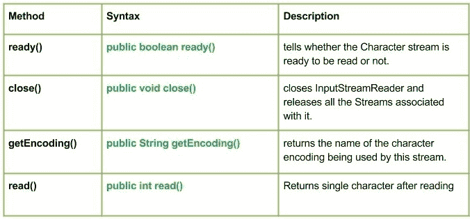

# Java 中的 InputStreamReader 类

> 原文:[https://www . geeksforgeeks . org/inputstreamreader-class-in-Java/](https://www.geeksforgeeks.org/inputstreamreader-class-in-java/)

[](https://media.geeksforgeeks.org/wp-content/uploads/InputStreamReader-class.jpg)

输入流阅读器是从[字节流到字符流](https://www.geeksforgeeks.org/character-stream-vs-byte-stream-java/)的桥梁。它读取字节，并使用指定的字符集将其解码为字符。它使用的字符集可以通过名称指定，也可以显式给出，或者可以接受平台的默认字符集。
T3】申报:

```java
public class InputStreamReader
   extends Reader
```

**施工人员:**

*   **输入流阅读器(InputStream in_strm) :** 创建使用默认字符集的输入流阅读器。
*   **InputStreamReader(InputStream in _ strm，Charset cs) :** 创建一个使用给定字符集的 InputStreamReader。
*   **输入流阅读器(InputStream in_strm，charset decer):**创建使用给定字符集解码器的输入流阅读器。
*   **输入流阅读器(InputStream in_strm，String charsetName) :** 创建使用命名字符集的输入流阅读器

**方法:**

*   **ready():Java . io . inputstreamreader . ready()**告知 Character 流是否准备好被读取。如果输入缓冲区不为空，或者可以从基础字节流中读取字节，那么输入流读取器就准备好了。
    **语法:**

```java
public boolean ready()
Returns :
True : if the Character stream is ready to be read
False : if the Character stream is not ready to be read
```

*   **close():Java . io . InputStreamReader . close()**关闭 InputStreamReader 并释放与其关联的所有流。一旦流被关闭，进一步的 read()、ready()、mark()、reset()或 skip()调用将引发 IOException。
    **语法:**

```java
public void close()
Returns :
No value is returned
```

*   **实施就绪()和关闭()方法:**

## Java 语言(一种计算机语言，尤用于创建网站)

```java
// Java program illustrating ready() and close() method

import java.io.*;
public class NewClass
{
    public static void main(String[] args)
    {

        try
        {
            // initializing FileInputStream
            FileInputStream geek = new FileInputStream("ABC.txt");

            // Initializing InputStreamReader object
            InputStreamReader in_strm = new InputStreamReader(geek);

            int t;
            while((t=in_strm.read())!= -1)
            {
                // convert the integer tue to character
                char r = (char)t;
                System.out.println("Character : "+r);

                // check if the stream in_strm ready
                boolean b = in_strm.ready();
                // Use of ready() methods
                System.out.println("Ready? : "+b);

            }

            // Use of close() method to Close InputStreamReader
            in_strm.close();

            // Closing FileInputStream
            geek.close();
        }
        catch (FileNotFoundException fnfe)
        {
            System.out.println("NO Such File Exists");
        }
        catch (IOException except)
        {
            System.out.println("IOException occured");
        }
    }
}
```

*   **注意:**
    由于不存在‘ABC’文件，本文中的所有程序都不会在联机 IDE 上运行。您可以在系统的 Java 编译器上检查这些代码。
    要检查此代码，请在您的系统上创建一个文件“ABC”。
    《ABC》文件包含:
    极客
    为
    极客
    T9】输出:

```java
Character : G
Ready? : true
Character : e
Ready? : true
Character : e
Ready? : true
Character : k
Ready? : true
Character : s
Ready? : true
Character :  
Ready? : true
Character : 
Ready? : true
Character : 

Ready? : true
Character : F
Ready? : true
Character : o
Ready? : true
Character : r
Ready? : true
Character :  
Ready? : true
Character : 
Ready? : true
Character : 

Ready? : true
Character : G
Ready? : true
Character : e
Ready? : true
Character : e
Ready? : true
Character : k
Ready? : true
Character : s
Ready? : false
```

*   **getEncoding():Java . io . inputstreamreader . getEncoding()**返回该流正在使用的字符编码的名称。
    **语法:**

```java
public String getEncoding()
Parameters : 
Returns :
No value is returned
```

*   **getEncoding()方法的实现:**

## Java 语言(一种计算机语言，尤用于创建网站)

```java
// Java program illustrating getEncoding() method

import java.io.*;
public class NewClass
{
    public static void main(String[] args)
    {

        try
        {
            // initializing FileInputStream
            FileInputStream geek = new FileInputStream("ABC.txt");

            // Initializing InputStreamReader object
            InputStreamReader in_strm = new InputStreamReader(geek);

            // Use of getEncoding() method
            // to get the character encoding present in the stream
            String encoding = in_strm.getEncoding();

            System.out.println("Encoding used : "+encoding);

            // Closing InputStreamReader
            in_strm.close();

            // Closing FileInputStream
            geek.close();
        }
        catch (FileNotFoundException fnfe)
        {
            System.out.println("NO Such File Exists");
        }
        catch (IOException except)
        {
            System.out.println("IOException occured");
        }
    }
}
```

*   **输出:**

```java
Encoding used : UTF8
```

*   **read():Java . io . inputstreamreader . read()**读取后返回单个字符。
    **语法:**

```java
public int read()
Returns :
Returns single character after reading or -1 if the end of the stream has been reached
```

*   **实施:**

## Java 语言(一种计算机语言，尤用于创建网站)

```java
// Java program illustrating read() method

import java.io.*;
public class NewClass
{
    public static void main(String[] args) throws FileNotFoundException, IOException
    {

        // initializing FileInputStream
        FileInputStream geek = new FileInputStream("ABC.txt");

        // Initializing InputStreamReader object
        InputStreamReader in_strm = new InputStreamReader(geek);

        int t;
        String read_reslt="";

        // Use of read() method
        while((t = in_strm.read()) != -1)
        {
            read_reslt = read_reslt+(char)t;
        }

        // print the result read from the file
        System.out.println(read_reslt);
    }
}
```

*   **注:**T2【ABC】文件包含:
    1
    极客
    2
    为
    3
    极客
    T10】输出:

```java
1
Geeks 
2
For 
3
Geeks
```

*   本文由 **莫希特·古普塔供稿🙂** 。如果你喜欢 GeeksforGeeks 并想投稿，你也可以使用[write.geeksforgeeks.org](https://write.geeksforgeeks.org)写一篇文章或者把你的文章邮寄到 review-team@geeksforgeeks.org。看到你的文章出现在极客博客主页上，帮助其他极客。
    如果发现有不正确的地方，或者想分享更多关于上述话题的信息，请写评论。