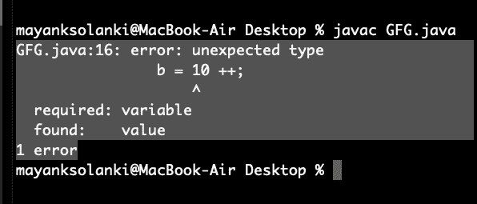
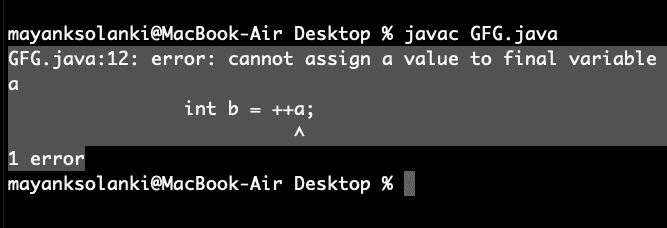

# Java 中关于递增和递减运算符的有趣事实

> 原文:[https://www . geesforgeks . org/interest-facts-increment-减量-operators-java/](https://www.geeksforgeeks.org/interesting-facts-increment-decrement-operators-java/)

**递增运算符**用于将一个值递增 1。增量运算符有两种:

*   **后递增:**值首先用于计算结果，然后递增。
*   **预增量:**值首先递增，然后计算结果。

**递减运算符**用于将数值递减 1。减量运算符有两种。

*   **后递减:**值首先用于计算结果，然后递减。
*   **预递减:**值先递减，然后计算结果。

**现在让我们来看看关于递增和递减运算符的有趣事实:**

*   只能应用于变量
*   不允许两个运算符嵌套
*   它们不是对最终变量进行操作的
*   递增和递减运算符不能应用于布尔值。

让我们讨论上面列出的这 4 个事实，并按如下方式实现它们:

**事实 1:** 只能应用于变量

我们只能对变量应用++和——运算符，而不能对常量值应用。如果我们试图在常量值上应用++和——运算符，那么我们将会得到一个编译时错误，我们将在下面的示例之后的示例 1B 中看到如下:

**例 1:**

## Java 语言(一种计算机语言，尤用于创建网站)

```java
// Java program to illustrate Increment
// and Decrement Operators
// Can be Applied to Variables Only

// Main class
public class GFG {

    // main driver method
    public static void main(String[] args)
    {

        int a = 10;
        int b = ++a;

       // Printing value inside variable
        System.out.println(b);
    }
}
```

**Output**

```java
11
```

**例 2:**

## Java 语言(一种计算机语言，尤用于创建网站)

```java
// Java program to Illustrate Increment and Decrement
// operators Can be applied to variables only

// Main class
public class GFG {

    // main driver method
    public static void main(String[] args)
    {
        // Declaring and initializing variable
        int a = 10;

        int b = ++a;

        // This is change made in above program
        // which reflects error during compilation
        b = 10 ++;

        // Printing its value
        System.out.println(b);
    }
}
```

**输出:**



**事实 2:** 不允许++和——运算符嵌套

**例**

## Java 语言(一种计算机语言，尤用于创建网站)

```java
// Java program to Illustrate Nesting Can Not be Applied
// to Increment and Decrement Operators

// Main class
public class GFG {

    // Main driver method
    public static void main(String[] args)
    {
        int a = 10;
        int b = ++(++a);

        // Printing the value inside variable
        System.out.println(b);
    }
}
```

**输出:**


**事实 3:** [最终变量](https://www.geeksforgeeks.org/g-fact-48/)不能应用递增和递减运算符

增量和减量运算符不能应用于最终变量，原因很简单，它们的值不能更改。

**例**

## Java 语言(一种计算机语言，尤用于创建网站)

```java
// Java Program to Illustrate Increment and Decrement
// Operators Can not be applied to final variables

// Main class
public class GFG {

    // MAin driver method
    public static void main(String[] args)
    {
        // Declaring and initializing final variable
        final int a = 10;

        int b = ++a;

        // Trying to print the updated value inside variable
        System.out.println(b);
    }
}
```

**输出:**



**事实 4:** 递增和递减运算符不能应用于布尔值

我们可以对除布尔类型之外的所有[原始数据类型](https://www.geeksforgeeks.org/data-types-in-java/)应用++和——运算符，因为它只有真和假，这听起来甚至不切实际。

**例**

## Java 语言(一种计算机语言，尤用于创建网站)

```java
// Java program to Illustrate Increment and Decrement
// Operators Can not be applied boolean data type

// Main class
public class GFG {

    // Main driver method
    public static void main(String[] args)
    {
        // Initially declaring boolean as false
        boolean b = false;
        b++;

        // Trying printing the bool value
        System.out.println(b);
    }
}
```

**输出:**


本文由**比沙尔·库马尔·杜贝**供稿。如果你喜欢 GeeksforGeeks 并想投稿，你也可以使用[write.geeksforgeeks.org](https://write.geeksforgeeks.org)写一篇文章或者把你的文章邮寄到 review-team@geeksforgeeks.org。看到你的文章出现在极客博客主页上，帮助其他极客。如果你发现任何不正确的地方，或者你想分享更多关于上面讨论的话题的信息，请写评论。