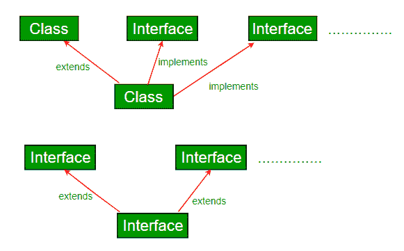
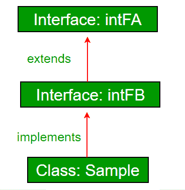

# Java 中的接口和继承

> 原文:[https://www . geesforgeks . org/interfaces-and-inheritation-in-Java/](https://www.geeksforgeeks.org/interfaces-and-inheritance-in-java/)

**先决条件:**[Java 中的接口](https://www.geeksforgeeks.org/interfaces-in-java/)[Java 和多重继承](https://www.geeksforgeeks.org/java-and-multiple-inheritance/)

一个类可以扩展另一个类，并且/可以实现一个和多个接口。
[](https://media.geeksforgeeks.org/wp-content/cdn-uploads/extends.png)

```
// Java program to demonstrate that a class can
// implement multiple interfaces
import java.io.*;
interface intfA
{
    void m1();
}

interface intfB
{
    void m2();
}

// class implements both interfaces
// and provides implementation to the method.
class sample implements intfA, intfB
{
    @Override
    public void m1()
    {
        System.out.println("Welcome: inside the method m1");
    }

    @Override
    public void m2()
    {
        System.out.println("Welcome: inside the method m2");
    }
}

class GFG
{
    public static void main (String[] args)
    {
        sample ob1 = new sample();

        // calling the method implemented
        // within the class.
        ob1.m1();
        ob1.m2();
    }
}
```

输出；

```
Welcome: inside the method m1
Welcome: inside the method m2

```

**接口继承:**一个接口可以扩展其他接口。
[](https://media.geeksforgeeks.org/wp-content/cdn-uploads/interfaceee.png)

```
// Java program to demonstrate inheritance in 
// interfaces.
import java.io.*;
interface intfA
{
    void geekName();
}

interface intfB extends intfA
{
    void geekInstitute();
}

// class implements both interfaces and provides
// implementation to the method.
class sample implements intfB
{
    @Override
    public void geekName()
    {
        System.out.println("Rohit");
    }

    @Override
    public void geekInstitute()
    {
        System.out.println("JIIT");
    }

    public static void main (String[] args)
    {
        sample ob1 = new sample();

        // calling the method implemented
        // within the class.
        ob1.geekName();
        ob1.geekInstitute();
    }
}
```

输出:

```
Rohit
JIIT

```

**一个接口也可以扩展多个接口。**

```
// Java program to demonstrate multiple inheritance 
// in interfaces
import java.io.*;
interface intfA
{
    void geekName();
}

interface intfB 
{
    void geekInstitute();
}

interface intfC extends intfA, intfB 
{
    void geekBranch();
}

// class implements both interfaces and provides
// implementation to the method.
class sample implements intfC
{
    public void geekName()
    {
        System.out.println("Rohit");
    }

    public void geekInstitute()
    {
        System.out.println("JIIT");
    }

    public void geekBranch()
    {
        System.out.println("CSE");
    }

    public static void main (String[] args)
    {
        sample ob1 = new sample();

        // calling the method implemented
        // within the class.
        ob1.geekName();
        ob1.geekInstitute();
        ob1.geekBranch();
    }
}
```

输出:

```
Rohit
JIIT
CSE

```

**为什么 Java 中一个类不支持多重继承，但是可以通过接口实现？**
由于歧义，类不支持多重继承。在接口的情况下，没有歧义，因为方法的实现是由实现类提供的，直到 Java 7。从 Java 8 开始，接口也有方法的实现。因此，如果一个类实现了两个或多个具有相同方法签名的接口，那么它也必须在类中实现该方法。详见 [Java 和多重继承](https://www.geeksforgeeks.org/java-and-multiple-inheritance/)。

本文由 **Nitsdheerendra** 供稿。如果你喜欢 GeeksforGeeks 并想投稿，你也可以使用[write.geeksforgeeks.org](https://write.geeksforgeeks.org)写一篇文章或者把你的文章邮寄到 review-team@geeksforgeeks.org。看到你的文章出现在极客博客主页上，帮助其他极客。

如果你发现任何不正确的地方，或者你想分享更多关于上面讨论的话题的信息，请写评论。