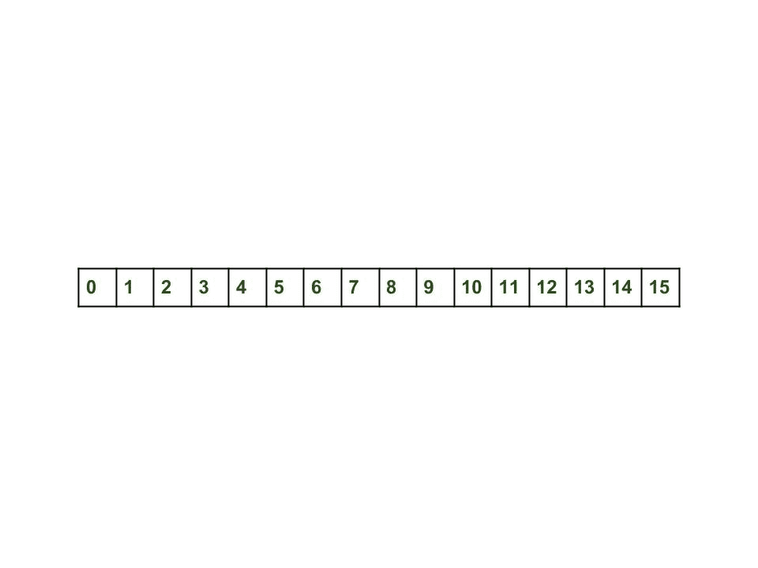

# Java 中 HashMap 的内部工作

> 原文:[https://www . geesforgeks . org/internal-work-of-hashmap-Java/](https://www.geeksforgeeks.org/internal-working-of-hashmap-java/)

在本文中，我们将看到 hashmap 的 get 和 put 方法是如何在内部工作的。执行什么操作。散列是如何完成的。如何通过键获取值。键值对的存储方式。
与[上一篇文章](https://www.geeksforgeeks.org/java-util-hashmap-in-java)一样，HashMap 包含一个 Node 的数组，Node 可以表示一个具有以下对象的类:

1.  int hash
2.  k 键
3.  v 值
4.  节点下一个

现在我们来看看这是如何工作的。首先，我们将看到散列过程。

**散列**

哈希是使用方法 hashCode()将对象转换为整数形式的过程。为了提高 HashMap 的性能，有必要适当地编写 hashCode()方法。这里我使用我自己的类的键，这样我就可以覆盖 hashCode()方法来显示不同的场景。我的重点班是

```java
//custom Key class to override hashCode()
// and equals() method
class Key
{
  String key;
  Key(String key)
  {
    this.key = key;
  }

  @Override
  public int hashCode() 
  {
     return (int)key.charAt(0);
  }

  @Override
  public boolean equals(Object obj)
  {
    return key.equals((String)obj);
  }
}

```

这里 overrided hashCode()方法返回第一个字符的 ASCII 值作为哈希代码。因此，只要密钥的第一个字符相同，哈希代码就会相同。你不应该在你的程序中接近这个标准。这只是为了演示。由于 HashMap 也允许空键，所以空的 hash 码总是为 0。

[**hashCode()方法**](https://www.geeksforgeeks.org/equals-hashcode-methods-java/)

hashCode()方法用于获取对象的哈希代码。object 类的 hashCode()方法以整数形式返回对象的内存引用。hashCode()方法的定义是公共本机 hashCode()。它表明 hashCode()的实现是本机的，因为在 java 中没有任何直接的方法来获取对象的引用。可以提供自己的 hashCode()实现。
在 HashMap 中，hashCode()用于计算桶，从而计算索引。

[**等于()法**](https://www.geeksforgeeks.org/equals-hashcode-methods-java/)

方法用于检查两个对象是否相等。此方法由对象类提供。您可以在类中重写它，以提供自己的实现。
HashMap 使用 equals()来比较键是否相等。如果 equals()方法返回 true，则它们相等，否则不相等。

**铲斗**

桶是 HashMap 数组的一个元素。它用于存储节点。两个或多个节点可以有同一个桶。在这种情况下，链接列表结构用于连接节点。水桶的容量不同。铲斗和容量之间的关系如下:

```java
capacity = number of buckets * load factor

```

一个桶可以有多个节点，这取决于 hashCode()方法。hashCode()方法越好，桶的利用率就越高。

**哈希表中的指数计算**

密钥的哈希代码可能大到足以创建数组。生成的哈希代码可能在整数范围内，如果我们为这样的范围创建数组，那么很容易导致 outOfMemoryException。所以我们生成索引来最小化数组的大小。基本上执行以下操作来计算指数。

```java
index = hashCode(key) & (n-1).

```

其中 n 是桶的数量或数组的大小。在我们的示例中，我将把 n 视为默认大小，即 16。

**为什么用上述方法计算指标**

使用按位“与”运算符类似于进行位屏蔽，其中只考虑哈希整数的低位，这反过来提供了一种基于哈希映射长度计算模数的非常有效的方法。

*   **初始清空 hashMap:** 这里 hashMap 的大小取为 16。

```java
HashMap map = new HashMap();

```

*   哈希映射 ：

[](https://media.geeksforgeeks.org/wp-content/uploads/Hashmap_working.jpg)

*   **插入键值对:**将一个键值对放入上面的 HashMap

```java
map.put(new Key("vishal"), 20);

```

*   **步骤:**
    1.  计算密钥{“vishal”}的哈希代码。它将生成为 118。
    2.  用指数法计算指数，它将是 6。
    3.  将节点对象创建为:

```java
{
  int hash = 118

  // {"vishal"} is not a string but 
  // an object of class Key
  Key key = {"vishal"}

  Integer value = 20
  Node next = null
}

```

2.  如果索引 6 中没有其他对象，则将该对象放在索引 6 中。

*   **插入另一个键值对:**现在，放入另一个键值对，即

```java
map.put(new Key("sachin"), 30);

```

*   **步骤:**
    1.  计算密钥{“sachin”}的哈希码。它将生成为 115。
    2.  用指数法计算指数，它将是 3。
    3.  将节点对象创建为:

```java
{
  int hash = 115
  Key key = {"sachin"}
  Integer value = 30
  Node next = null
}

```

*   **发生碰撞时:**现在，再放一对即

```java
map.put(new Key("vaibhav"), 40);

```

*   **步骤:**
    1.  计算密钥{“vaibhav”}的哈希代码。它将生成为 118。
    2.  用指数法计算指数，它将是 6。
    3.  将节点对象创建为:

```java
 {
  int hash = 118
  Key key = {"vaibhav"}
  Integer value = 40
  Node next = null
}

```

1.  如果索引 6 中没有其他对象，则将该对象放在那里。
2.  在这种情况下，节点对象是在索引 6 处找到的**–这是一个碰撞的情况。**
3.  在这种情况下，通过 hashCode()和 equals()方法检查这两个键是否相同。
4.  如果键相同，用当前值替换该值。
5.  否则，通过链表将这个节点对象连接到前一个节点对象，两者都存储在索引 6 中。
    现在 HashMap 变成了:

[](https://media.geeksforgeeks.org/wp-content/uploads/Hashmap_working_3.jpg)

**使用 get 方法()**

现在让我们尝试一些 get 方法来获取一个值。get(K key)方法用于通过其键获取一个值。如果你不知道密钥，那么就不可能得到一个值。

*   **获取密钥包的数据:**

```java
map.get(new Key("sachin"));

```

*   **步骤:**
    1.  计算密钥{“sachin”}的哈希代码。它将生成为 115。
    2.  用指数法计算指数，它将是 3。
    3.  转到数组的索引 3，将第一个元素的键与给定的键进行比较。如果两者相等，则返回值，否则检查下一个元素是否存在。
    4.  在我们的例子中，它被发现是第一个元素，返回值是 30。
*   获取密钥 vaibahv 的数据:

```java
map.get(new Key("vaibhav"));

```

*   **步骤:**
    1.  计算密钥{“vaibhav”}的哈希代码。它将生成为 118。
    2.  用指数法计算指数，它将是 6。
    3.  转到数组的索引 6，将第一个元素的键与给定的键进行比较。如果两者相等，则返回值，否则检查下一个元素是否存在。
    4.  在我们的例子中，它不是第一个元素，节点对象的下一个不是空的。
    5.  如果下一个节点为空，则返回空。
    6.  如果下一个节点不为空，遍历第二个元素并重复过程 3，直到找不到键或下一个不为空。
    7.  对于 put 和 get 方法，时间复杂度几乎是恒定的，直到重新散列没有完成。
    8.  在冲突的情况下，即两个或多个节点的索引相同，节点通过链表连接，即第二个节点由第一个节点引用，第三个节点由第二个引用，以此类推。
    9.  如果给定的键已经存在于 HashMap 中，该值将被新值替换。
    10.  空键的哈希代码为 0。
    11.  获取带有关键字的对象时，遍历链表，直到关键字匹配或在下一个字段中找到 null。