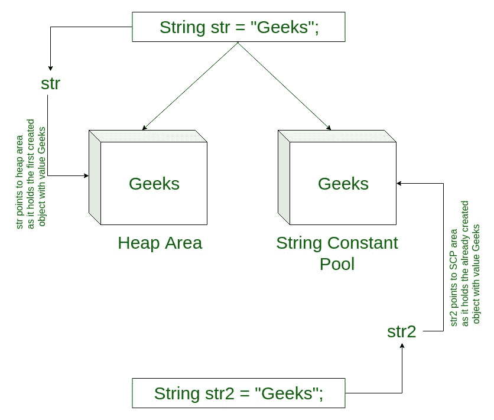
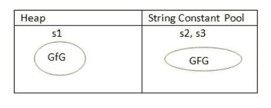
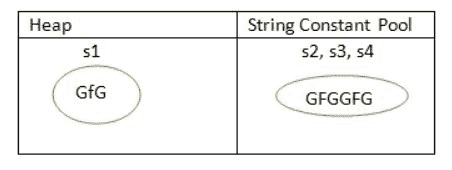

# Java 中字符串的内部化

> 原文:[https://www.geeksforgeeks.org/interning-of-string/](https://www.geeksforgeeks.org/interning-of-string/)

字符串内部化是一种只存储每个不同字符串值的一个副本的方法，该值必须是不可变的。
通过在几个字符串上应用 String.intern()将确保所有具有相同内容的字符串共享相同的内存。例如，如果一个名字“艾米”出现 100 次，通过实习，你可以确保只有一个“艾米”实际上被分配了内存。

[](https://media.geeksforgeeks.org/wp-content/cdn-uploads/20191106170808/Interning-of-String-in-Java.jpg)

这对于降低程序的内存需求非常有用。但是请注意，缓存是由 JVM 在永久内存池中维护的，与堆相比，永久内存池的大小通常是有限的，因此如果没有太多重复值，就不应该使用 intern

**intern()方法:**在 Java 中，当我们使用 intern()方法执行任何操作时，它都会返回字符串对象的规范表示。池由字符串类管理。

*   当执行 intern()方法时，它会检查与该字符串对象相等的字符串是否在池中。
*   如果可用，则返回池中的字符串。否则，此字符串对象将被添加到池中，并返回对此字符串对象的引用。
*   因此，对于任意两个字符串 s 和 t，s.intern() == t.intern()为真，当且仅当 s.equals(t)为真。

建议使用 equals()，而不是==，来比较两个字符串。这是因为==运算符比较内存位置，而 equals()方法比较存储在两个对象中的内容。

```
// Java program to illustrate 
// intern() method 
class GFG { 
    public static void main(String[] args) 
    { 
        // S1 refers to Object in the Heap Area 
        String s1 = new String("GFG"); // Line-1 

        // S2 refers to Object in SCP Area
        String s2 = s1.intern(); // Line-2 

        // Comparing memory locations
        // s1 is in Heap
        // s2 is in SCP
        System.out.println(s1 == s2);

        // Comparing only values
        System.out.println(s1.equals(s2));

        // S3 refers to Object in the SCP Area 
        String s3 = "GFG"; // Line-3 

        System.out.println(s2 == s3); 
    } 
} 
```

输出:

```
false
true
true

```

**说明:**每当我们创建一个 String Object 时，都会创建两个对象，即一个在堆区，一个在 String 常量池，String 对象引用总是指向堆区对象。当第 1 行执行时，它将创建两个对象，并指向堆区域创建的对象。现在，当第 2 行执行时，它将引用 SCP 中的对象。同样，当第 3 行执行时，它指的是 SCP 区域中的同一对象，因为该内容在 SCP 区域中已经可用。不需要创建新的一个对象。

[](https://media.geeksforgeeks.org/wp-content/cdn-uploads/String-interning-in-Java-1.jpg)

如果相应的字符串常量池(SCP)对象不可用，那么 intern()方法本身将创建相应的 SCP 对象。

```
// Java program to illustrate 
// intern() method 
class GFG { 
    public static void main(String[] args) 
    { 
        // S1 refers to Object in the Heap Area 
        String s1 = new String("GFG"); // Line-1 

        // S2 now refers to Object in SCP Area 
        String s2 = s1.concat("GFG"); // Line-2 

        // S3 refers to Object in SCP Area
        String s3 = s2.intern(); // Line-3 

        System.out.println(s2 == s3); 

        // S4 refers to Object in the SCP Area 
        String s4 = "GFGGFG"; // Line-4 

        System.out.println(s3 == s4); 
    } 
} 
```

输出:

```
true
true

```

**说明:**我们用 intern()方法得到对应 SCP 对象的引用。在这种情况下，当第 2 行执行时，s2 将具有值“GFGGFG”，因为它只创建一个对象。在第 3 行中，我们尝试实习 s3，它再次与 s2 在 SCP 区域。s4 也在 SCP 中，所以当比较时，所有给出的输出都是真的。
[](https://media.geeksforgeeks.org/wp-content/cdn-uploads/String-Interning-in-Java-2.jpg)