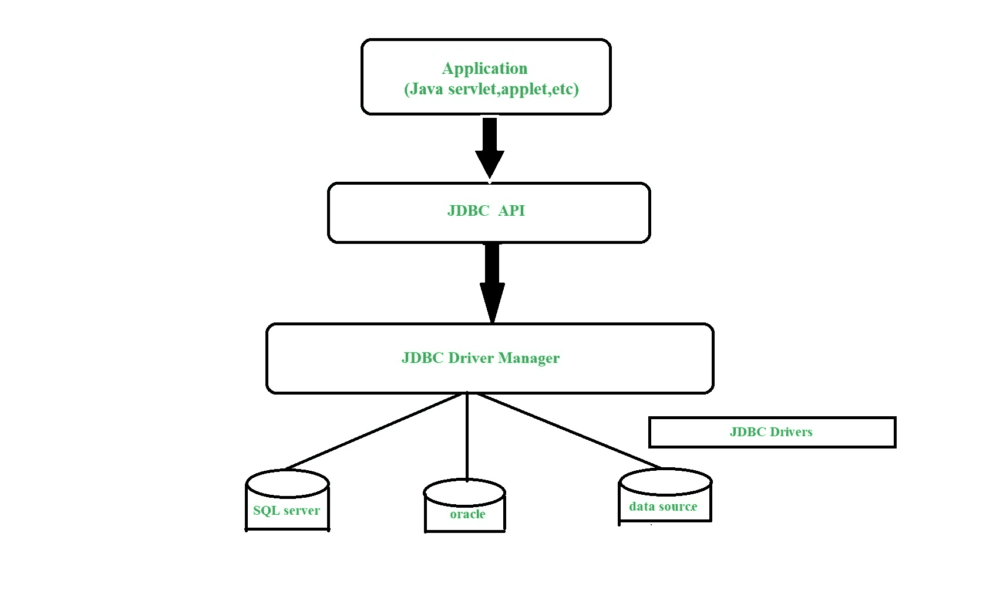

# JDBC 简介

> 原文:[https://www.geeksforgeeks.org/introduction-to-jdbc/](https://www.geeksforgeeks.org/introduction-to-jdbc/)

**<u>简介</u>**
JDBC 或 java 数据库连接性是来自 Sun 微系统公司的一个规范，它为 Java 应用程序与各种数据库通信提供了一个标准的抽象(即 API 或 Protocol)。它为该语言提供了 java 数据库连接标准。它用于编写访问数据库所需的程序。JDBC 连同数据库驱动程序能够访问数据库和电子表格。存储在关系数据库(RDB)中的企业数据可以在 JDBC API 的帮助下访问。

**<u>定义 JDBC(Java 数据库连接)</u>**
JDBC 是一个 API(Application programming interface)，用于 Java 编程中与数据库进行交互。
*JDBC 的[类](https://www.geeksforgeeks.org/classes-objects-java/)和[接口](https://www.geeksforgeeks.org/interfaces-in-java/)允许应用程序将用户的请求发送到指定的数据库。*

**<u>JDBC 的目的</u>**
使用 JAVA EE 技术创建的企业应用程序需要与数据库交互来存储特定于应用程序的信息。因此，与数据库交互需要高效的数据库连接，这可以通过使用 [ODBC](https://www.geeksforgeeks.org/difference-odbc-jdbc/) (开放数据库连接)驱动程序来实现。该驱动程序与 JDBC 一起用于与各种数据库交互或通信，如甲骨文、微软 Access、Mysql 和 SQL server 数据库。

**<u>JDBC 的组件</u>**
JDBC 一般有四个主要组件，通过它们可以与数据库进行交互。它们如下所述:

1.  **JDBC API:** It provides various methods and interfaces for easy communication with the database.It provides two packages as follows which contains the java SE and java EE platforms to exhibit WORA(write once run everywhere) capabilities.

    ```
    1\. java.sql.*;
    2\. javax.sql.*;

    ```

    它还提供了将数据库连接到客户端应用程序的标准。

2.  **[JDBC 驱动程序管理器](https://www.geeksforgeeks.org/jdbc-drivers/) :** 它在应用程序中加载特定于数据库的驱动程序，以建立与数据库的连接。它用于对数据库进行特定于数据库的调用，以处理用户请求。
3.  **JDBC 测试套件:**用于测试 JDBC 驱动正在执行的操作(如插入、删除、更新)。
4.  **JDBC-ODBC Bridge Drivers**: It connects database drivers to the database.This bridge translates JDBC method call to the ODBC function call.It makes the use of

    ```
    sun.jdbc.odbc
    ```

    包含本机库以访问 ODBC 特性的包。

**<u>[JDBC 建筑](https://www.geeksforgeeks.org/dbms-architecture-2-level-3-level/)</u>T5】**



**描述:**

1.  **应用程序:**它是一个 java 小程序或 servlet，与数据源进行通信。
2.  **JDBC API:**JDBC API 允许 Java 程序执行 SQL 语句和检索结果。JDBC 应用编程接口中定义的一些重要类和接口如下:

3.  **DriverManager:** 它在 JDBC 架构中扮演着重要的角色。它使用一些特定于数据库的驱动程序来有效地将企业应用程序连接到数据库。
4.  **JDBC 驱动程序:**要通过 JDBC 与数据源通信，您需要一个 JDBC 驱动程序，它可以智能地与相应的数据源通信。

**<u>[JDBC 架构的类型(2 层和 3 层)](https://www.geeksforgeeks.org/dbms-architecture-2-level-3-level/)</u>**
JDBC 架构由两层和三层处理模型组成，用于访问数据库。它们如下所述:

1.  **双层模型:**一个 java 应用程序直接与数据源通信。JDBC 驱动程序支持应用程序和数据源之间的通信。当用户向数据源发送查询时，这些查询的答案会以结果的形式发送回用户。
    数据源可以位于用户所连接的网络上的不同机器上。这被称为**客户机/服务器配置**，其中用户的机器充当客户机，运行数据源的机器充当服务器。
2.  **三层模型:**在这种情况下，用户的查询被发送到中间层服务，命令再次从中间层服务发送到数据源。结果被发送回中间层，并从那里发送给用户。
    管理信息系统主管发现这种模式非常有用。

**<u>[JDBC 的工作](https://www.geeksforgeeks.org/establishing-jdbc-connection-in-java/)</u>**
需要与数据库通信的 Java 应用程序必须使用 JDBC API 进行编程。必须在 java 应用程序中添加支持 Oracle 和 SQL server 等数据源的 JDBC 驱动程序，以获得 JDBC 支持，这可以在运行时动态完成。这个 JDBC 驱动程序智能地与各自的数据源通信。
**创建简单的 JDBC 应用程序**

```
package com.vinayak.jdbc;
import java.sql.*;
public class JDBCDemo {
    public static void main(
        String args[]) throws SQLException,
                              ClassNotFoundException
    {
        String driverClassName
            = "sun.jdbc.odbc.JdbcOdbcDriver";
        String url = "jdbc:odbc:XE";
        String username = "scott";
        String password = "tiger";
        String query
            = "insert into students values(109, 'bhatt')";

        // Load driver class
        Class.forName(driverClassName);

        // Obtain a connection
        Connection con = DriverManager.getConnection(
            url, username, password);

        // Obtain a statement
        Statement st = con.createStatement();

        // Execute the query
        int count = st.executeUpdate(query);
        System.out.println(
            "number of rows affected by this query= " + count);

        // Closing the connection as per the
        // requirement with connection is completed
        con.close();
    }
} // class
```

上面的例子演示了使用 JDBC 访问数据库的基本步骤。应用程序使用 JDBC-ODBC 桥驱动程序连接到数据库。您必须导入 **java.sql** 包来提供基本的 sql 功能并使用包的类。