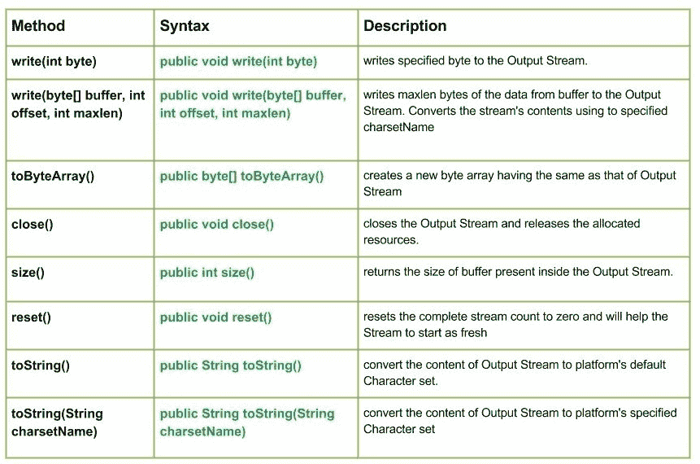

# Java 中的 Java.io.ByteArrayOutputStream()类

> 哎哎哎:# t0]https://www . geeksforgeeks . org/io-bytearray output stream-class-Java/

[](https://media.geeksforgeeks.org/wp-content/uploads/io.ByteArrayOutputStream-Class-in-Java.jpg)

**Java . io . BytearrayOutputStream**类创建一个输出流，用于将数据写入字节数组。当数据写入缓冲区时，缓冲区的大小会自动增长。关闭字节数组输出流对其方法的工作没有影响。他们甚至可以在关闭课程后被调用。
因此，没有方法抛出 IO 异常。

**申报:**

```
public class ByteArrayOutputStream
   extends OutputStream
```

**字段:** 

*   **受保护字节[]buf**–存储数据的缓冲区。*   **protected int count** – The number of valid bytes in the buffer.

    **施工人员:**

    *   **BytearrayOutStream():**创建一个新的 BytearrayOutStream 来写入字节
    *   **字节数组输出流(int buffer versize):**用 **buferrsize** 创建一个新的字节数组输出流来写入字节。

    **方法:**

    *   **写(int byte):****Java . io . bytearyoutputstream . write(int byte)**将指定的字节写入输出流。
        **语法:**

        ```
        public void write(int byte)
        Parameters : 
        byte : byte to be written
        Return :                                               
        void

        ```

    *   **写(byte【】buffer，int offset，int maxlen):****Java . io . bytearayoutputstream . write(byte【】buffer，int offset，int maxlen)** 从缓冲区向输出流写入 maxlen 字节的数据。它使用指定的**字符集名称**(十六位 Unicode 代码单元序列和字节序列之间的命名映射)转换流的内容。)
        **语法:**

        ```
        public void write(byte[] buffer, int offset, int maxlen)
        Parameters : 
        buffer : data of the buffer
        offset : starting in the destination array - 'buffer'.
        maxlen : maximum length of array to be read
        Return :                                               
        void

        ```

    *   **toByteArray() :** **java.io.ByteArrayOutputStream.toByteArray()** creates a new byte array having the same as that of Output Stream
        **Syntax :**

        ```
        public byte[] toByteArray()
        Parameters : 
        ----------
        Return :                                               
        new byte array having the same as that of Output Stream

        ```

        **Java 程序解释写(byte[]缓冲区，int offset，int maxlen)和 toByteArray()方法的使用:**

        ```
        // Java program illustrating the working of ByteArrayOutputStream
        // write(byte[] buffer, int offset, int maxlen), toByteArray()

        import java.io.*;
        public class NewClass
        {
            public static void main(String[] args) throws IOException
            {
                ByteArrayOutputStream geek_output = new ByteArrayOutputStream();

                byte[] buffer = {'J', 'A', 'V', 'A'};

                // Use of write(byte[] buffer, int offset, int maxlen)
                geek_output.write(buffer, 0, 4);
                System.out.print("Use of write(buffer, offset, maxlen) by toByteArray() : ");

                // Use of toByteArray() :
                for (byte b: geek_output.toByteArray())
                {
                    System.out.print(" " + b);
                }
            }
        }
        ```

        **输出:**

        ```
        Use of write(buffer, offset, maxlen) by toByteArray() :  74 65 86 65
        ```

    *   **close():****Java . io . BytearrayOutputStream . close()**关闭输出流并释放分配的资源。
        **语法:**

    ```
    public void close()
    Parameters : 
    --------------
    Return :                                               
    void

    ```

    *   **size():****Java . io . BytearrayOutputStream . size()**返回输出流内存在的缓冲区大小。
    **语法:**

    ```
    public int size()
    Parameters : 
    --------------
    Return :                                               
    size of buffer present inside the Output Stream. 

    ```

    *   **reset():****Java . io . bytearayooutputstream . reset()**将完整的流计数重置为零，并将帮助流重新开始
    **语法:**

    ```

    public void reset()
    Parameters : 
    --------------
    Return :                                               
    void. 

    ```

    *   **toString():****Java . io . bytearyoutputstream . tostrign()**将输出流的内容转换为平台的默认字符集
    **语法:**

    ```

    public String toString()
    Parameters : 
    --------------
    Return :                                               
    the content of Output Stream by converting it to platform's default Character set

    ```

    *   **toString(String charsetName) :** **java.io.ByteArrayOutputStream.toStrign(String charsetName)** convert the content of Output Stream to platform’s specified Character set
    **Syntax :**

    ```

    public String toString(String charsetName)
    Parameters : 
    --------------
    Return :                                               
    the content of Output Stream by converting it to platform's default Character set

    ```

    **演示使用字节数组输出流类方法的 Java 程序:**

    ```
    // Java program illustrating the working of ByteArrayOutputStream
    // write(), size(), toString(String charsetName),
    // close(), toString(), reset()

    import java.io.*;
    public class NewClass
    {
        public static void main(String[] args) throws IOException
        {
            ByteArrayOutputStream geek_output = new ByteArrayOutputStream();

            byte[] buffer = {'J', 'A', 'V', 'A'};

            for (byte a : buffer)
            {
                // Use of write(int byte) :
                geek_output.write(a);
            }

            // Use of size() :
            int size = geek_output.size();
            System.out.println("Use of size() : " + size);

            // Use of reset() :
            System.out.println("Use of reset()");

            // USe of toString() :
            String geek = geek_output.toString();
            System.out.println("Use of toString() : "+ geek);

            // Use of toString(String charsetName)
            String geek1 = geek_output.toString("UTF-8");
            System.out.println("Use of toString(String charsetName) : "+ geek1);

            // Closing the stream
            geek_output.close();

        }
    }
    ```

    **输出:**

    ```
    Use of size() : 4
    Use of reset()
    Use of toString() : JAVA
    Use of toString(String charsetName) : JAVA
    ```

     **下一篇:** [io。Java 中的 ByteArrayInputStream 类](https://www.geeksforgeeks.org/io-bytearrayinputstream-class-java/)
    本文由 <font color="green">**Mohit Gupta 供稿🙂**</font> 。如果你喜欢 GeeksforGeeks 并想投稿，你也可以使用[contribute.geeksforgeeks.org](http://www.contribute.geeksforgeeks.org)写一篇文章或者把你的文章邮寄到 contribute@geeksforgeeks.org。看到你的文章出现在极客博客主页上，帮助其他极客。

    如果你发现任何不正确的地方，或者你想分享更多关于上面讨论的话题的信息，请写评论。