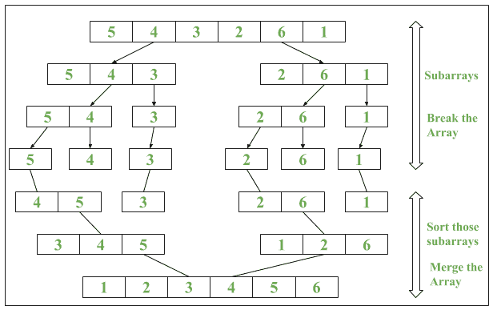

# Java 8 |数组 parallelSort()方法示例

> 原文:[https://www . geesforgeks . org/Java-8-arrays-parallels art-method-with-examples/](https://www.geeksforgeeks.org/java-8-arrays-parallelsort-method-with-examples/)

Java 8 在 **java.util.Arrays** 类中引入了一个名为**parallels art()**的新方法。它使用数组元素的并行排序

**并行算法()**

```
1. The array is divided into sub-arrays and that 
   sub-arrays is again divided into their sub-arrays, 
   until the minimum level of detail in a set of array.
2. Arrays are sorted individually by multiple thread. 
3. The parallel sort uses Fork/Join Concept for sorting.
4\. Sorted sub-arrays are then merged.
```

**语法:**

1.  **按升序排序数据:**

    ```
    public static void parallelSort(Object obj[])

    ```

2.  **按升序对指定范围内的数据进行排序:**

    ```
    public static void parallelSort(Object obj[], int from, int to)
    ```

**优势:**
parallels art()方法使用**多线程**的概念，这使得排序**比正常排序方法更快**。

**例**


下面是说明数组使用的程序:

**程序 1:** 演示并行排序的使用

```
// Java program to demonstrate
// Arrays.parallelSort() method

import java.util.Arrays;

public class ParallelSort {
    public static void main(String[] args)
    {
        // Creating an array
        int numbers[] = { 9, 8, 7, 6, 3, 1 };

        // Printing unsorted Array
        System.out.print("Unsorted Array: ");
        // Iterating the Elements using stream
        Arrays.stream(numbers)
            .forEach(n -> System.out.print(n + " "));
        System.out.println();

        // Using Arrays.parallelSort()
        Arrays.parallelSort(numbers);

        // Printing sorted Array
        System.out.print("Sorted Array: ");
        // Iterating the Elements using stream
        Arrays.stream(numbers)
            .forEach(n -> System.out.print(n + " "));
    }
}
```

**Output:**

```
Unsorted Array: 9 8 7 6 3 1 
Sorted Array: 1 3 6 7 8 9

```

**时间复杂度**为 O(nlogn)

**程序 2:** 演示并行排序的使用

```
// Java program to demonstrate impact 
// of Parallel Sort vs Serial Sort 

import java.util.Arrays; 
import java.util.Random; 

public class ParallelSort { 
    public static void main(String[] args) 
    { 
        // Creating an array 
        int numbers[] = new int[100]; 

        // Iterating Loop till i = 1000 
        // with interval of 10 
        for (int i = 0; i < 1000; i += 10) { 

            System.out.println("\nFor iteration number: "
                            + (i / 10 + 1)); 

            // Random Int Array Generation 
            Random rand = new Random(); 

            for (int j = 0; j < 100; j++) { 
                numbers[j] = rand.nextInt(); 
            } 

            // Start and End Time of Arrays.sort() 
            long startTime = System.nanoTime(); 

            // Performing Serial Sort 
            Arrays.sort(numbers); 

            long endTime = System.nanoTime(); 

            // Printing result of Serial Sort 
            System.out.println("Start and End Time in Serial (in ns): "
                            + startTime + ":" + endTime); 
            System.out.println("Time taken by Serial Sort(in ns): "
                            + (endTime - startTime)); 

            // Start and End Time of Arrays.parallelSort() 
            startTime = System.nanoTime(); 

            // Performing Parallel Sort 
            Arrays.parallelSort(numbers); 

            endTime = System.nanoTime(); 

            // Printing result of Parallel Sort 
            System.out.println("Start and End Time in parallel (in ns): "
                            + startTime + ":" + endTime); 
            System.out.println("Time taken by Parallel Sort(in ns): "
                            + (endTime - startTime)); 
            System.out.println(); 
        } 
    } 
} 
```

**Output:**

```
For iteration number: 1
Start and End Time in Serial (in ns): 3951000637977:3951000870361
Time taken by Serial Sort(in ns): 232384
Start and End Time in parallel (in ns): 3951000960823:3951000971044
Time taken by Parallel Sort(in ns): 10221

For iteration number: 2
Start and End Time in Serial (in ns): 3951001142284:3951001201757
Time taken by Serial Sort(in ns): 59473
Start and End Time in parallel (in ns): 3951001256643:3951001264039
Time taken by Parallel Sort(in ns): 7396
.
.
.
For iteration number: 99
Start and End Time in Serial (in ns): 3951050723541:3951050731520
Time taken by Serial Sort(in ns): 7979
Start and End Time in parallel (in ns): 3951050754238:3951050756130
Time taken by Parallel Sort(in ns): 1892

For iteration number: 100
Start and End Time in Serial (in ns): 3951050798392:3951050804741
Time taken by Serial Sort(in ns): 6349
Start and End Time in parallel (in ns): 3951050828544:3951050830582
Time taken by Parallel Sort(in ns): 2038

```

注意:不同的时间间隔将被打印，但平行排序将在正常排序之前完成。

**环境:** 2.6 GHz 英特尔酷睿 i7，java 版本 8