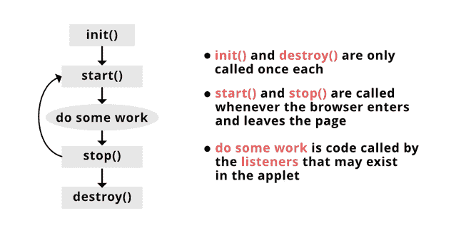
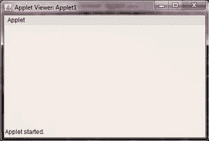

# Java 小程序类

> 原文:[https://www.geeksforgeeks.org/java-applet-class/](https://www.geeksforgeeks.org/java-applet-class/)

Java Applet 是一种嵌入在网页中生成动态内容的特殊类型的小型 Java 程序。Java 小程序的特点是它在浏览器内部运行，在客户端(用户界面端)工作。

### Java 小程序类

为了用 Java 创建任何小程序，我们使用 **java.applet.Applet 类。**它在 Java 小程序的生命周期中有四种方法。可以使用 JDK 提供的 applet viewer 实用程序来执行 applet。使用 Applet 类创建了一个 Java Applet，即 java.applet 包的一部分。

Applet 类提供了 Applet 及其环境之间的标准接口。小程序类是嵌入在网页中或由 Java 小程序查看器查看的小程序的超类。Java applet 类给出了几个有用的方法来让你完全控制 applet 的运行。像初始化和销毁小程序一样，它还提供了加载和显示网页彩色全图像的方法，以及加载和播放音频和视频剪辑和电影视频的方法。

#### 在 Java 中，有两种类型的 Applet

1.  基于抽象窗口工具包的 Java 小程序通过扩展其小程序类来打包
2.  Java 小程序是基于 Swing 包，在其中扩展了它的 JApplet 类。

现在我们看到了小程序的生命周期和它的方法

#### 如何运行小程序？

有两种方法可以执行 Java 小程序:

*   通过使用一个 HTML 文件
*   通过使用 appletviewer 工具

### java 小程序类的生命周期

java 小程序类的生命周期有四个主要方法



1.  init()
2.  开始()
3.  停止()
4.  销毁()

#### 解释:

**1。** **void init():** 这个 init()方法是 java 小程序的第一个方法。这用于在小程序开始执行时初始化小程序

**2。void start():** void start()该方法在 init()方法之后自动调用，用于启动 applet 和 Applet 的实现

**3。void stop():** void stop()用于停止 applet 或停止正在运行的 Applet

**4。void destroy():** void destroy()用于销毁 Applet /终止 Applet。

#### 小程序类中的其他方法:

**5。这个方法在 appletviewer 中工作，而不是在浏览器中，它会自动打开一个输出窗口。**

**6。ShowStatus(字符串):**这个方法在小程序的状态行中显示字符串，每次调用都会覆盖之前的调用，并且您必须留出时间来读取该行。

**7。字符串获取参数(字符串参数名):**返回当前小程序中定义的参数值。

**8。Image getImage(URL url):** 这个方法返回一个 Image 对象，它包含一个在它的位置 URL 指定的图像。

**9。void play(URL url):** 此方法可以播放在指定位置、URL 找到的音频片段。

**10。setStub:** 它设置这个小程序的 Stub，由系统自动完成。

**11 时。** **活动:**此方法确定当前小程序是否活动。然后，在调用 Applet 的 start 方法之前，Applet 被标记为活动的。然后，当它被初始化时，在它的 stop 方法之后，它立即变得不活动。

### **小程序类的构造器**

小程序类就像任何其他类一样，因为小程序构造器只是小程序类的子类构造器。因此，因为小程序构造函数就像或任何其他构造函数一样，它不能被重写，所以构造函数为新对象执行任何必要的初始化或为其创建新对象。

**小程序()**–它构建一个新的小程序。

**小程序示例:**使用 appletviewer-的小程序程序

## Java 语言(一种计算机语言，尤用于创建网站)

```java
// This is a Simple Java Applet
// program using appletviewer

import java.applet.*;
import java.awt.*;

/*
<applet  code="AppletExp1" width=600 height=300>
</applet>
*/

public class AppletExp1 extends Applet {
    public void init()
    {
        System.out.println("Initializing an applet");
    }

    public void start()
    {
        System.out.println("Starting an applet");
    }
    public void stop()

    {
        System.out.println("Stopping an applet");
    }
    public void destroy()

    {
        System.out.println("Destroying an applet");
    }
}
```

通过使用 Appletviewer，在命令提示符下键入以下命令-


**输出:**

然后在一个窗口打开最终小程序输出小程序窗口后-



#### 小程序的优点

*   它在浏览器内部运行，在客户端工作，因此响应时间更短。
*   它更安全
*   它可以由任何浏览器的多平台执行，即视窗、苹果操作系统、Linux 操作系统。

#### 小程序的缺点

*   客户端浏览器(用户端)需要一个插件来执行小程序。