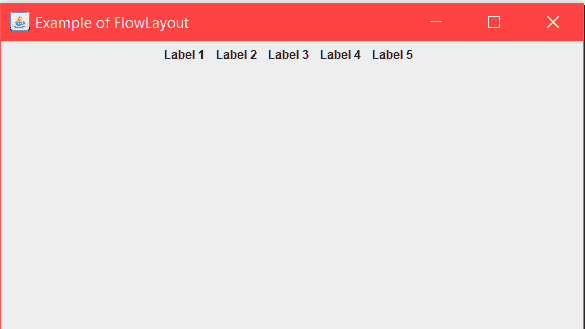
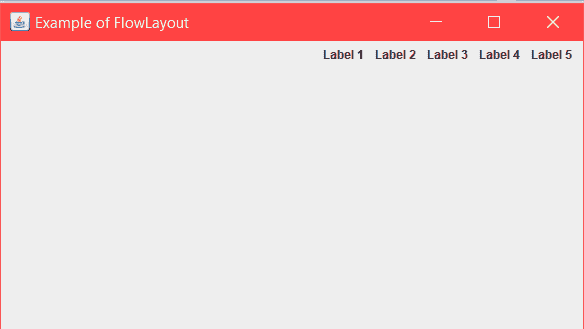

# Java awt | flow layout

> 哎哎哎:# t0]https://www . geeksforgeeks . org/Java-awt-flow layout/

FlowLayout 用于按顺序一个接一个地排列组件。小程序和面板的默认布局是 FlowLayout。

**施工人员**:

1.  **流程布局()**:将构建一个居中对齐的新流程布局。水平和垂直间隙将为 5 像素。
2.  **流程布局(int align)** :它将以给定的对齐方式构建一个新的流程布局。水平和垂直间隙将为 5 像素。
3.  **流程布局(int align，int HorizontalGap，int VerticalGap )** :它将构建一个新的流程布局，给定组件之间的对齐、给定水平和垂直间隙。
4.  **JLabel(字符串文本)**:它将用指定的文本创建一个 JLabel 实例。

**常用方法:**

1.  **设置(字符串文本)**:此方法用于设置 JFrame 的标题。您要设置的标题作为字符串传递。
2.  **getAlignment()** :返回此布局的对齐方式。
3.  **设置对齐方式(int align)** :用于设置该布局的对齐方式。
4.  **removeLayoutComponent(Component comp)**:用于从布局中移除作为参数传递的组件。

下面的程序将说明 java 中的 FlowLayout 示例。

1.  **Program 1:** The following program illustrates the use of FlowLayout by arranging several JLabel components in a JFrame, whose instance class is named as “Example”. We create 5 JLabel components named “l1”, “l2″… “l5” and then add them to the JFrame by the method this.add(). We set the title and bounds of the frame by method setTitle and setBounds.
    The layout is set by the method setLayout();

    ```
    // Java program to show Example of FlowLayout.
    // in java. Importing different Package.
    import java.awt.*;
    import java.awt.event.*;
    import javax.swing.*;

    class Example extends JFrame {
        // Declaration of objects of JLabel class.
        JLabel l1, l2, l3, l4, l5;

        // Constructor of Example class.
        public Example()
        {
            // Creating Object of "FlowLayout" class
            FlowLayout layout = new FlowLayout();

            // this Keyword refers to current object.
            // Function to set Layout of JFrame.
            this.setLayout(layout);

            // Initialization of object "l1" of JLabel class.
            l1 = new JLabel("Label 1  ");

            // Initialization of object "l2" of JLabel class.
            l2 = new JLabel("Label 2  ");

            // Initialization of object "l3" of JLabel class.
            l3 = new JLabel("Label 3  ");

            // Initialization of object "l4" of JLabel class.
            l4 = new JLabel("Label 4  ");

            // Initialization of object "l5" of JLabel class.
            l5 = new JLabel("Label 5  ");

            // this Keyword refers to current object.
            // Adding Jlabel "l1" on JFrame.
            this.add(l1);

            // Adding Jlabel "l2" on JFrame.
            this.add(l2);

            // Adding Jlabel "l3" on JFrame.
            this.add(l3);

            // Adding Jlabel "l4" on JFrame.
            this.add(l4);

            // Adding Jlabel "l5" on JFrame.
            this.add(l5);
        }
    }

    class MainFrame {
        // Driver code
        public static void main(String[] args)
        {
            // Creating Object of Example class.
            Example f = new Example();

            // Function to set title of JFrame.
            f.setTitle("Example of FlowLayout");

            // Function to set Bounds of JFrame.
            f.setBounds(200, 100, 600, 400);

            // Function to set visible status of JFrame.
            f.setVisible(true);
        }
    }
    ```

    **输出** :
    

    通过使用这些流程布局字段，我们可以**控制流程布局排列中组件**的对齐。
    1) **右**:每排组件向右移动。
    2) **左侧** :-每行部件向左移动。

2.  **Program 2:** The following program illustrates the use of FlowLayout using Right alignment by passing the argument FlowLayout.RIGHT in the constructor of FLowLayout. We create 5 JLabel components named “l1”, “l2″… “l5” and then add them to the JFrame by the method this.add(). We set the title and bounds of the frame by method setTitle and setBounds.
    The layout is set by the method setLayout();

    ```
    // Java program to show example of
    // FlowLayout and using RIGHT alignment
    import java.awt.*;
    import java.awt.event.*;
    import javax.swing.*;

    class Example extends JFrame {
        // Declaration of objects of JLabel class.
        JLabel l1, l2, l3, l4, l5;

        // Constructor of Example class.
        public Example()
        {
            // Creating Object of "FlowLayout" class, passing
            // RIGHT alignment through constructor.
            FlowLayout layout = new FlowLayout(FlowLayout.RIGHT);

            // this Keyword refers to current object.
            // Function to set Layout of JFrame.
            this.setLayout(layout);

            // Initialization of object "l1" of JLabel class.
            l1 = new JLabel("Label 1  ");

            // Initialization of object "l2" of JLabel class.
            l2 = new JLabel("Label 2  ");

            // Initialization of object "l3" of JLabel class.
            l3 = new JLabel("Label 3  ");

            // Initialization of object "l4" of JLabel class.
            l4 = new JLabel("Label 4  ");

            // Initialization of object "l5" of JLabel class.
            l5 = new JLabel("Label 5  ");

            // this Keyword refers to current object.
            // Adding Jlabel "l1" on JFrame.
            this.add(l1);

            // Adding Jlabel "l2" on JFrame.
            this.add(l2);

            // Adding Jlabel "l3" on JFrame.
            this.add(l3);

            // Adding Jlabel "l4" on JFrame.
            this.add(l4);

            // Adding Jlabel "l5" on JFrame.
            this.add(l5);
        }
    }

    class MainFrame {
        // Driver code
        public static void main(String[] args)
        {
            // Creating Object of Example class.
            Example f = new Example();

            // Function to set title of JFrame.
            f.setTitle("Example of FlowLayout");

            // Function to set Bounds of JFrame.
            f.setBounds(200, 100, 600, 400);

            // Function to set visible status of JFrame.
            f.setVisible(true);
        }
    }
    ```

    **输出** :
    

**参考**:[https://www.geeksforgeeks.org/message-dialogs-java-gui/](https://www.geeksforgeeks.org/message-dialogs-java-gui/)