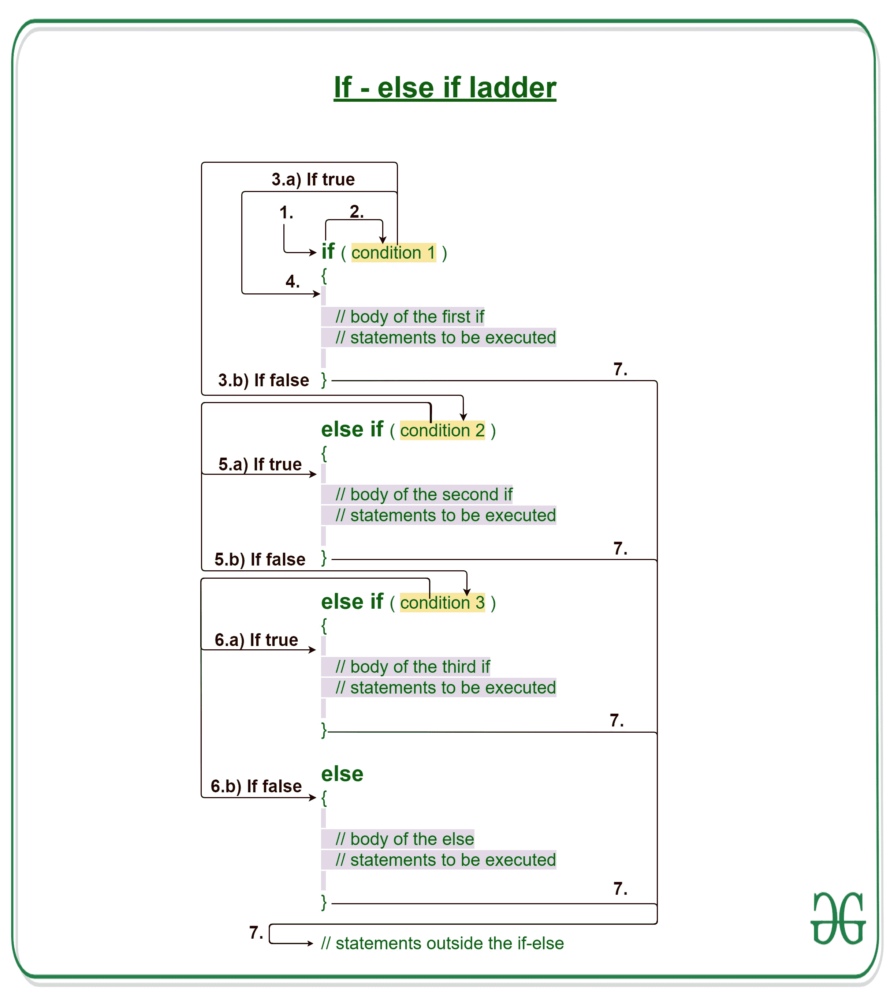

# Java if-else-if 阶梯示例

> 原文:[https://www . geeksforgeeks . org/Java-if-else-if-ladder-with-examples/](https://www.geeksforgeeks.org/java-if-else-if-ladder-with-examples/)

[**Java 中的决策制定**](https://www.geeksforgeeks.org/decision-making-javaif-else-switch-break-continue-jump/) 有助于编写决策驱动的语句，并根据特定条件执行特定的一组代码。

**Java if-else-if 阶梯**用于在多个选项中进行决策。if 语句从上到下执行。一旦控制 if 的条件之一为真，就执行与该 if 关联的语句，并绕过阶梯的其余部分。如果这些条件都不成立，那么将执行最后的 else 语句。

[](https://media.geeksforgeeks.org/wp-content/uploads/20191114112014/If-else-if-ladder-GeeksforGeeks-1.jpg)

**语法:**

```java
if (condition)
    statement 1;
else if (condition)
    statement 2;
.
.
else
    statement;
```

**if-else-if 梯子的工作:**

1.  控件落入 if 块。
2.  流程跳转到条件 1。
3.  测试条件。
    1.  如果条件为真，转到步骤 4。
    2.  如果条件为假，转到步骤 5。
4.  执行当前块。转到步骤 7。
5.  流程跳转到条件 2。
    1.  如果条件为真，转到步骤 4。
    2.  如果条件为假，转到步骤 6。
6.  流程跳转到条件 3。
    1.  如果条件为真，转到步骤 4。
    2.  如果条件为假，则执行 else 块。
        转到步骤 7。
7.  退出 if-else-if 梯子。

**流程图 if-else-if 阶梯:**
[](https://media.geeksforgeeks.org/wp-content/uploads/20191119124152/c-cpp-if-else-if.png)

**例 1:**

```java
// Java program to illustrate if-else-if ladder

import java.io.*;

class GFG {
    public static void main(String[] args)
    {
        // initializing expression
        int i = 20;

        // condition 1
        if (i == 10)
            System.out.println("i is 10\n");

        // condition 2
        else if (i == 15)
            System.out.println("i is 15\n");

        // condition 3
        else if (i == 20)
            System.out.println("i is 20\n");

        else
            System.out.println("i is not present\n");

        System.out.println("Outside if-else-if");
    }
}
```

**Output:**

```java
i is 20

Outside if-else-if

```

**干运转例 1:**

```java
1\. Program starts.
2\. i is initialized to 20.
3\. condition 1 is checked. 20 == 10, yields false.
4\. condition 2 is checked. 20 == 15, yields false.
5\. condition 3 is checked. 20 == 20, yields true.
  5.a) "i is 20" gets printed.
6\. "Outside if-else-if" gets printed.
7\. Program ends.
```

**例 2:**

```java
// Java program to illustrate if-else-if ladder

import java.io.*;

class GFG {
    public static void main(String[] args)
    {

        // initializing expression
        int i = 20;

        // condition 1
        if (i < 10)
            System.out.println("i is less than 10\n");

        // condition 2
        else if (i < 15)
            System.out.println("i is less than 15\n");

        // condition 3
        else if (i < 20)
            System.out.println("i is less than 20\n");

        else
            System.out.println("i is greater than "
                               + "or equal to 20\n");

        System.out.println("Outside if-else-if");
    }
}
```

**Output:**

```java
i is greater than or equal to 20

Outside if-else-if

```

**相关文章:**

1.  [Java 中的决策](https://www.geeksforgeeks.org/decision-making-javaif-else-switch-break-continue-jump/)
2.  [带示例的 Java if 语句](https://www.geeksforgeeks.org/java-if-statement-with-examples/)
3.  [带有示例的 Java if-else 语句](https://www.geeksforgeeks.org/java-if-else-statement-with-examples/)
4.  [Java 中的 Switch 语句](https://www.geeksforgeeks.org/switch-statement-in-java/)
5.  [Java 中的 Break 语句](https://www.geeksforgeeks.org/break-statement-in-java/)
6.  [返回 Java 中的关键字](https://www.geeksforgeeks.org/return-keyword-java/)