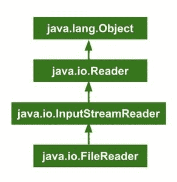

# Java IO 文件阅读器类

> 原文:[https://www.geeksforgeeks.org/java-io-filereader-class/](https://www.geeksforgeeks.org/java-io-filereader-class/)

**文件阅读器**是 **java.io** 包中的一个类，可以用来从文件中读取字符流。此类使用指定的字符集或平台的默认字符集来解码字节到字符。

**字符集:**字符集类用于定义产生编码器和解码器的方法，以及恢复与字符集结合的几个名称的方法。

**默认字符集:**默认字符集是在隐式计算机启动期间定义的，它取决于底层操作系统的区域设置和字符集。

下图显示了文件阅读器类的层次流。



**文件阅读器类的分层流程**

### 构造器

文件阅读器内部的**构造函数**如下表所示。

<figure class="table">

| 

**构造器**

 | 

**描述**

 |
| --- | --- |
| **file reader (file)** | Read with the given file (using the default character set) |
| **文件阅读器(文件描述符 fd)** 【T33 字符集】 | Create a new file reader with the given file to read (using the given Charset) |
| **File reader (string file name)** | Create a new file reader with the given file name to read (using the default Charset) |
| **File reader (character string file name, charset)** | Create a new file reader with the given file to read (using the given file) |

</figure>

### 方法

文件阅读器下的**方法**如下表所示。

*   **read():**read()方法读取并传递单个字符，如果流结束，则传递-1。
*   **read(char[] charBuffer，int offset，int length):** 它读取一个字符流，并将它们存储在给定的字符缓冲区中。Offset 是开始读取的位置，Length 是要读取的字符总数。如果流结束，它会传递大量读取的字符或-1。
*   **ready():** 告知流是否准备好被读取。如果一个流的输入缓冲区不是空的或空的，那么这个流就是就绪的。
*   **getEncoding():**getEncoding()用于返回流正在使用的字符编码的标题。
*   **close():** 它关闭流并释放与之关联的系统资源。

## Java 语言(一种计算机语言，尤用于创建网站)

```java
// Java program to show the usage of 
// IO FileReader Class
import java.io.*;

class GFG {
    public static void main(String[] args)
    {
        try {
            FileReader fileReader
                = new FileReader("gfg.txt");

            System.out.println("Reading char by char : \n");
            int i;
            while ((i = fileReader.read()) != -1) {
                System.out.print((char)i);
            }

            System.out.println("Reading using array : \n");
            char[] charArray = new char[10];
            fileReader.read(charArray);
            System.out.print(charArray);

            fileReader.close();
            System.out.println("FileReader closed!");
        }
        catch (Exception e) {
            System.out.println(e);
        }
    }
}
```

**输出:**

```java
Reading char by char :
GeeksForGeeks
Reading using array : 
GeeksForGeeks
FileReader closed!
```