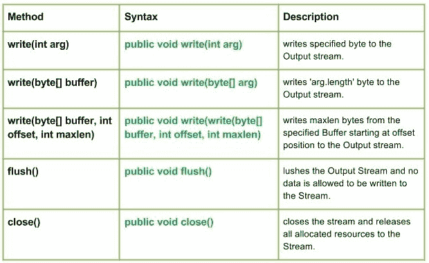

# Java 中的 Java.io.FilterOutputStream 类

> 原文:[https://www . geesforgeks . org/Java-io-filteroutputstream-class-Java/](https://www.geeksforgeeks.org/java-io-filteroutputstream-class-java/)

[java 中的 java.io.FilterInputStream 类](http://java-io-filterinputstream-class-java)



**Java . io . filteroutputstream**类是所有过滤输出流的类的超类。FilterOutputStream 类的 write()方法过滤数据并将其写入基础流，过滤是根据流来完成的。

**申报:**

```java
public class FilterOutputStream
   extends OutputStream
```

**施工人员:**

*   **FilterOutputStream(OutputStream geek out):**创建输出流过滤器。

**方法:**

*   **write(int arg):Java . io . filteroutputstream . write(int arg)**将指定的字节写入输出流。
    **语法:**

```java
public void write(int arg)
Parameters : 
arg : Source Bytes
Return  :
void
Exception : 
In case any I/O error occurs.
```

*   **实施:**

## Java 语言(一种计算机语言，尤用于创建网站)

```java
// Java program illustrating the working of work(int arg)
// method
import java.io.*;
import java.lang.*;

public class NewClass
{
    public static void main(String[] args) throws IOException
    {
        // OutputStream, FileInputStream & FilterOutputStream
        // initially null
        OutputStream geek_out = null;
        FilterOutputStream geek_filter = null;

        // FileInputStream used here
        FileInputStream geekinput = null;

        char c;
        int a;
        try
        {
            // create output streams
            geek_out = new FileOutputStream("GEEKS.txt");
            geek_filter = new FilterOutputStream(geek_out);

            // write(int arg) : Used to write 'M' in the file
            // - "ABC.txt"
            geek_filter.write(77);

            // Flushes the Output Stream
            geek_filter.flush();

            // Creating Input Stream
            geekinput = new FileInputStream("GEEKS.txt");

            // read() method of FileInputStream :
            // reading the bytes and converting next bytes to int
            a = geekinput.read();

            /* Since, read() converts bytes to int, so we
               convert int to char for our program output*/
            c = (char)a;

            // print character
            System.out.println("Character written by" +
                              " FilterOutputStream : " + c);

        }
        catch(IOException except)
        {
            // if any I/O error occurs
            System.out.print("Write Not working properly");
        }
        finally{

            // releases any system resources associated with
            // the stream
            if (geek_out != null)
                geek_out.close();
            if (geek_filter != null)
                geek_filter.close();
        }
    }
}
```

*   **注意:**
    在我用过的程序中 **GEEKS.txt** 文件，程序会新建一个代码中给定名称的文件并写入其中。
    **输出:**

```java
Character written by FilterOutputStream : M
```

*   **写入(字节[]缓冲区):Java . io . filteroutputstream . write(字节[]缓冲区)**将**‘arg . length’**字节写入输出流。
    **语法:**

```java
public void write(byte[] arg)
Parameters : 
buffer : Source Buffer to be written to the Output Stream
Return  :
void
Exception : 
In case any I/O error occurs.
```

*   **实施:**

## Java 语言(一种计算机语言，尤用于创建网站)

```java
// Java program illustrating the working of work(byte
// buffer) method
import java.io.*;
import java.lang.*;

public class NewClass
{
    public static void main(String[] args) throws IOException
    {
        // OutputStream, FileInputStream & FilterOutputStream
        // initially null
        OutputStream geek_out = null;
        FilterOutputStream geek_filter = null;

        // FileInputStream used here
        FileInputStream geekinput = null;

        byte[] buffer = {77, 79, 72, 73, 84};
        char c;
        int a;
        try
        {
         // create output streams
         geek_out = new FileOutputStream("ABC.txt");
         geek_filter = new FilterOutputStream(geek_out);

         // writes buffer to the output stream
         geek_filter.write(buffer);

         // forces byte contents to written out to the stream
         geek_filter.flush();

         // create input streams
         geekinput = new FileInputStream("ABC.txt");

         while ((a=geekinput.read())!=-1)
         {
            // converts integer to the character
            c = (char)a;

            // prints
            System.out.print(c);
         }
        }
        catch(IOException except)
        {
            // if any I/O error occurs
            System.out.print("Write Not working properly");
        }
        finally
        {
            // releases any system resources associated
            // with the stream
            if (geek_out != null)
                geek_out.close();
            if (geek_filter != null)
                geek_filter.close();
        }
    }
}
```

*   **注意:**
    在我已经使用的程序中 **GEEKS.txt** 文件，程序会创建一个新文件的名字在代码中给出并写入其中。

**输出:**

```java
MOHIT
```

*   **write(byte[] buffer，int offset，int maxlen):Java . io . filteroutputstream . write(byte[]buffer，int offset，int maxlen)** 将 maxlen 字节从指定 Buffer 的偏移量位置开始写入输出流。

**语法:**

```java
public void write(write(byte[] buffer, int offset, int maxlen)
Parameters : 
buffer : Source Buffer to be written to the Output Stream
Return  :
buffer : Source Buffer to be written
offset : Starting offset 
maxlen : max no. of bytes to bewriten to the Output Stream
Exception : 
In case any I/O error occurs.
```

*   **flush():Java . io . filteroutputstream . flush()**刷新输出流，不允许向流中写入任何数据。
    **语法:**

```java
public void flush()
Parameters : 
------
Return  :
void
Exception : 
In case any I/O error occurs.
```

*   **close():Java . io . filteroutputStream . close()**关闭流并将所有分配的资源释放给该流。
    **语法:**

```java
public void close()
Parameters : 
------
Return  :
void
Exception : 
In case any I/O error occurs.
```

**Java 程序说明:write(byte[]缓冲区，int offset，int maxlen)，flush()，close()方法**

## Java 语言(一种计算机语言，尤用于创建网站)

```java
// Java program illustrating the working of
// write(byte[] buffer, int offset, int maxlen),
// flush(), close() method
import java.io.*;
import java.lang.*;

public class NewClass
{
    public static void main(String[] args) throws IOException
    {
        // OutputStream, FileInputStream & FilterOutputStream
        // initially null
        OutputStream geek_out = null;
        FilterOutputStream geek_filter = null;

        // FileInputStream used here
        FileInputStream geekinput = null;

        byte[] buffer = {65, 66, 77, 79, 72, 73, 84};
        char c;
        int a;
        try
        {
            // create output streams
            geek_out = new FileOutputStream("ABC.txt");
            geek_filter = new FilterOutputStream(geek_out);

            // write(byte[] buffer, int offset, int maxlen) :
            // writes buffer to the output stream
            // Here offset = 2, so it won't read first two bytes
            // then maxlen = 5, so it will print max of 5 characters
            geek_filter.write(buffer, 2, 5);

            // forces byte contents to written out to the stream
            geek_filter.flush();

            // create input streams
            geekinput = new FileInputStream("ABC.txt");

            while ((a = geekinput.read())!=-1)
            {
                // converts integer to the character
                c = (char)a;

                // prints
                System.out.print(c);
            }
        }
        catch(IOException except)
        {
            // if any I/O error occurs
            System.out.print("Write Not working properly");
        }
        finally
        {
            // releases any system resources associated
            // with the stream
            if (geek_out != null)
                geek_out.close();
            if (geek_filter != null)
                geek_filter.close();
        }
    }
}
```

**注意:**
在我已经使用的程序中 **GEEKS.txt** 文件，程序会创建一个新文件的名字在代码中给出并写入其中。

**输出:**

```java
MOHIT
```

本文由 **莫希特·古普塔供稿🙂** 。如果你喜欢 GeeksforGeeks 并想投稿，你也可以使用[write.geeksforgeeks.org](https://write.geeksforgeeks.org)写一篇文章或者把你的文章邮寄到 review-team@geeksforgeeks.org。看到你的文章出现在极客博客主页上，帮助其他极客。
如果发现有不正确的地方，或者想分享更多关于上述话题的信息，请写评论。