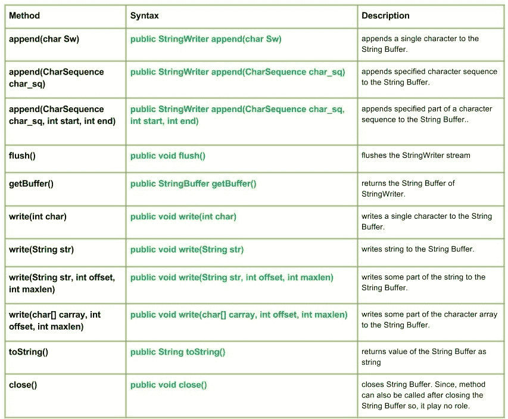

# Java 中的 Java.io.StringWriter 类

> 原文:[https://www . geesforgeks . org/Java-io-stringwriter-class-in-Java/](https://www.geeksforgeeks.org/java-io-stringwriter-class-in-java/)

[](https://media.geeksforgeeks.org/wp-content/uploads/StringWriter.jpg)

**java.io.StringWriter 类**从字符串缓冲区流的字符创建字符串。也可以在关闭流后调用 StringWriter 类的方法，因为这不会引发 IO 异常。

**申报:**

```
public class StringWriter
  extends Writer
```

**施工人员:**

*   **字符串写入器():**使用字符串缓冲区的初始或默认大小创建新的字符串写入器
*   **字符串写入器(int size) :** 使用上述字符串缓冲区的大小创建一个新的字符串写入器

**方法:**

*   **write(int char):Java . io . stringwriter . write(int char)**将单个字符写入 String Buffer。
    **语法:**

```
public void write(int char)
Parameters : 
char : int value of the character to be written.
Return  :
void
```

*   **write(String str):Java . io . stringwriter . write(String str)**将字符串写入字符串缓冲区。
    **语法:**

```
public void write(String str)
Parameters : 
str : string to be written to the String Buffer.
Return  :
void
```

*   **write(String str，int offset，int maxlen):Java . io . stringwriter . write(String str，int offset，int maxlen)** 将字符串的某一部分写入 String Buffer。
    **语法:**

```
public void write(String str, int offset, int maxlen)
Parameters : 
str : string to be written to the String Buffer.
offset : start position of the String
maxlen : maximum length upto which string has to written
Return  :
void
```

*   **write(char[] carray，int offset，int maxlen):Java . io . stringwriter . write(char[]carray，int offset，int maxlen)** 将字符数组的某个部分写入 String Buffer。
    **语法:**

```
public void write(char[] carray, int offset, int maxlen)
Parameters : 
carray : character to be written to the String Buffer
offset : start position of the character array
maxlen : maximum no. of the character of the carray has to written
Return  :
void
```

*   **toString():Java . io . stringwriter . toString()**将字符串缓冲区的值作为字符串返回
    **语法:**

```
public String toString()
Parameters : 
-----------
Return  :
string value of the String Buffer
```

*   **close():Java . io . stringwriter . close()**关闭 String Buffer。因为方法也可以在关闭字符串缓冲区后调用，所以它不起作用。
    **语法:**

```
public void close()
Parameters : 
-----------
Return  :
void
```

**说明使用 StringWriter 类方法的 Java 程序:**

## Java 语言(一种计算机语言，尤用于创建网站)

```
// Java program illustrating the working of StringWriter class methods
// write(int char), write(String str), close()
// write(String str, int offset, int maxlen), toString()
// write(char[] carray, int offset, int maxlen)

import java.io.*;

public class NewClass
{
    public static void main(String[] args) throws IOException
    {
        // Initializing String Writer
        StringWriter geek_writer1 = new StringWriter();
        StringWriter geek_writer2 = new StringWriter();
        StringWriter geek_writer3 = new StringWriter();
        StringWriter geek_writer4 = new StringWriter();

        // Use of write(int char) : to write a character
        geek_writer1.write(71);
        geek_writer1.write(70);
        geek_writer1.write(71);

        // Use of toString() : Value written by write(int char)
        System.out.println("Using write(int char) : "+ geek_writer1.toString());

        String str = "Hello Geeks";
        // Use of write(String str) : to write string
        geek_writer2.write(str);

        // Value written by write(String str)
        System.out.println("Using write(String str) : "+ geek_writer2.toString());

        // Use of write(String str, int offset, int maxlen) : to write part of string
        geek_writer3.write(str, 2, 4);
        geek_writer3.write(str, 5, 6);

        // Value written by write(String str, int offset, int maxlen)
        System.out.println("Using write(str, offset, maxlen) : "
                                                + geek_writer3.toString());

        try
        {
            // Use of Close() method : to close the geek_writer4
            // But no use as String Writer method is still working with it
            geek_writer4.close();
        }

        catch (IOException except)
        {
            System.out.println("ERROR");
            except.printStackTrace();;
        }

        // Initializing character array
        char[] carray = str.toCharArray();

        // Use of write(char[] carray, int offset, int maxlen):
        // to write part of char array
        geek_writer4.write(carray, 4, 6);

        // Value written by write(String str, int offset, int maxlen)
    System.out.println("Using write(carray, offset, maxlen) : "
                                        + geek_writer4.toString());

    }
}
```

**输出:**

```
Using write(int char) : GFG
Using write(String str) : Hello Geeks
Using write(str, offset, maxlen) : llo  Geeks
Using write(carray, offset, maxlen) : o Geek
```

*   **追加(char Sw):Java . io . stringwriter . append(char Sw)**向字符串缓冲区追加一个字符。
    **语法:**

```
public StringWriter append(char Sw)
Parameters : 
Sw : character to be append
Return  :
StringWriter
```

*   **追加(CharSequence char _ sq):Java . io . stringwriter . append(CharSequence char _ sq)**将指定的字符序列追加到字符串缓冲区。
    **语法:**

```
public StringWriter append(CharSequence char_sq)
Parameters : 
char_sq : Character sequence to append. 
Return  :
StringWriter, if char sequence is null, then NULL appends to the StringWriter.
```

*   **追加(CharSequence char_sq，int start，int end):Java . io . stringwriter . append(CharSequence char _ sq，int start，int end)** 将字符序列的指定部分追加到字符串缓冲区。
    **语法:**

```
public StringWriter append(CharSequence char_sq, int start, int end)
Parameters : 
char_sq : Character sequence to append.
start : start of character in the Char Sequence
end : end of character in the Char Sequence
Return  :
void
```

*   **flush():Java . io . StringWriter . flush()**刷新 StringWriter 流
    **语法:**

```
public void flush()
Parameters : 
-----
Return  :
void
```

*   **getBuffer():Java . io . StringWriter . getBuffer()**返回 StringWriter 的字符串缓冲区。
    **语法:**

```
public StringBuffer getBuffer()
Parameters : 
-----------
Return  :
String Buffer with its current value.
```

**Java 程序，演示了 StringWriter 类方法的使用:append(CharSequence char_sq)、append(char Sw)、append(CharSequence char_sq、int start、int end)、flush()、getgetBuffer()**

## Java 语言(一种计算机语言，尤用于创建网站)

```
// Java program illustrating the working of StringWriter class methods
// append(CharSequence char_sq), append(char Sw)
// append(CharSequence char_sq, int start,int end)
// flush(), getgetBuffer()

import java.io.*;

public class NewClass
{
    public static void main(String[] args) throws IOException
    {
        // Initializing String Writer
        StringWriter geek_writer1 = new StringWriter();
        StringWriter geek_writer2 = new StringWriter();
        StringWriter geek_writer3 = new StringWriter();

        // Use of write(int char) : to write a character
        geek_writer1.write(71);
        geek_writer1.write(70);
        geek_writer1.write(71);

        // Use of toString() : Value written by write(int char)
        System.out.println("Using write(int char) : "+ geek_writer1.toString());

        // Using flush() method
        geek_writer1.flush();
        System.out.println("Using flush() : "+geek_writer1.toString());

        // Use of append(char Sw)
        System.out.println("append(char Sw) : " + geek_writer1.append(" 1GFG1"));

        // Use of getBuffer() :
        System.out.println("Using geek_writer1 : " + geek_writer1.getBuffer());

        // Initializing Character Sequence
        CharSequence char_sq1 = "1 Hello 1";
        CharSequence char_sq2 = " : 2 Geeks 2";

        // Use of append(CharSequence char_sq)
        geek_writer2.append(char_sq1);
        geek_writer2.append(char_sq2);

        System.out.println("append(char_sq) : " + geek_writer2.toString());

        // Use of append(CharSequence char_sq,int start,int end)
        geek_writer3.append(char_sq1, 0, 3);
        geek_writer3.append(char_sq2, 3, 6);

     System.out.println("append(char_sq,start,end) : " + geek_writer3.toString());

    }
}
```

**输出:**

```
Using write(int char) : GFG
Using flush() : GFG
append(char Sw) : GFG 1GFG1
Using geek_writer1 : GFG 1GFG1
append(char_sq) : 1 Hello 1 : 2 Geeks 2
append(char_sq,start,end) : 1 H2 G
```

本文由**莫希特·古普塔**供稿。如果你喜欢 GeeksforGeeks，愿意投稿，也可以使用[<u>【write.geeksforgeeks.org】</u>](https://write.geeksforgeeks.org/)<u>写一篇文章，或者把文章邮寄到 review-team@geeksforgeeks.org。看到你的文章出现在极客博客主页上，帮助其他极客。</u>