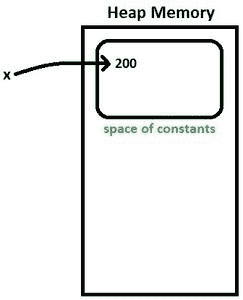
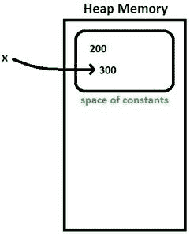
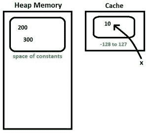
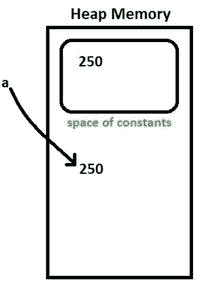
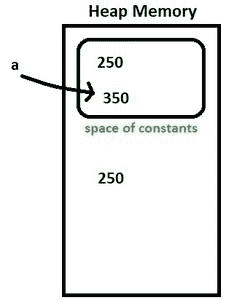

# Java 中的 Java.lang.Integer 类

> 原文:[https://www.geeksforgeeks.org/java-lang-integer-class-java/](https://www.geeksforgeeks.org/java-lang-integer-class-java/)

整数类是一个用于原语类型 int 的[包装类](https://www.geeksforgeeks.org/wrapper-classes-java/)，它包含几个有效处理 int 值的方法，比如将其转换为字符串表示，反之亦然。整数类的对象可以保存一个整数值。

**施工人员:**

*   **整数(int b):** 创建一个用提供的值初始化的整数对象。

**语法:**

```
public Integer(int b)
```

**参数:**

```
b : value with which to initialize
```

*   **整数(字符串):**创建一个用字符串表示提供的 int 值初始化的整数对象。默认基数为 10。

**语法:**

```
public Integer(String s) throws NumberFormatException
```

**参数:**

```
s : string representation of the int value 
```

**投掷:**

```
NumberFormatException : 
If the string provided does not represent any int value.
```

**方法:**

[**1。**](https://www.geeksforgeeks.org/integer-tostring-in-java/) **:** 返回 int 值对应的字符串。

**语法:**

```
public String toString(int b)
```

**参数:**

```
b : int value for which string representation required.
```

[**2。**](https://www.geeksforgeeks.org/java-lang-integer-tohexstring-method-examples/) **:** 以十六进制形式返回 int 值对应的字符串，即返回以十六进制字符-[0-9][a-f]表示 int 值的字符串

**语法:**

```
public String toHexString(int b)
```

**参数:**

```
b : int value for which hex string representation required.
```

**3。**[**toOctalString()**](https://www.geeksforgeeks.org/integer-tooctalstring-method-in-java/)**:**以八进制形式返回 int 值对应的字符串，即返回一个以八进制字符表示 int 值的字符串-[0-7]

**语法:**

```
public String toOctalString(int b)
```

**参数:**

```
b : int value for which octal string representation required.
```

**4。**[**toBinaryString()**](https://www.geeksforgeeks.org/java-lang-integer-tobinarystring-method/)**:**以二进制数字返回 int 值对应的字符串，即返回以十六进制字符表示 int 值的字符串-[0/1]

**语法:**

```
public String toBinaryString(int b)
```

**参数:**

```
b : int value for which binary string representation required.
```

[**5。valueOf()**](https://www.geeksforgeeks.org/integer-valueof-method-in-java/) **:** 返回用提供的值初始化的整数对象。

**语法:**

```
public static Integer valueOf(int b)
```

**参数:**

```
b : a int value
```

*   [**valueOf(String val，int radix)**](https://www.geeksforgeeks.org/integer-valueof-method-in-java/) **:** 另一个重载函数，提供类似于新整数(Integer.parseInteger(val，radix))的函数

**语法:**

```
public static Integer valueOf(String val, int radix)
throws NumberFormatException
```

**参数:**

```
val : String to be parsed into int value
radix : radix to be used while parsing
```

**投掷:**

```
NumberFormatException : if String cannot be parsed to a int value in given radix.
```

*   [**value of(String val)**](https://www.geeksforgeeks.org/integer-valueof-method-in-java/)**:**另一个重载函数，它提供了类似于新 Integer(Integer . parsent(val，10))的函数

**语法:**

```
public static Integer valueOf(String s)
throws NumberFormatException
```

**参数:**

```
s : a String object to be parsed as int
```

**投掷:**

```
NumberFormatException : if String cannot be parsed to a int value in given radix.
```

[**6。parseInt()**](https://www.geeksforgeeks.org/string-to-integer-in-java-parseint/) **:** 通过解析提供的基数字符串返回 Int 值。不同于()的值，因为它返回一个基元整数值，而()的值返回一个整数对象。

**语法:**

```
public static int parseInt(String val, int radix)
throws NumberFormatException
```

**参数:**

```
val : String representation of int 
radix : radix to be used while parsing
```

**投掷:**

```
NumberFormatException : if String cannot be parsed to a int value in given radix.
```

*   另一个重载方法只包含字符串作为参数，默认情况下基数设置为 10。

**语法:**

```
public static int parseInt(String val)
throws NumberFormatException
```

**参数:**

```
val : String representation of int 
```

**投掷:**

```
NumberFormatException : if String cannot be parsed to a int value in given radix.
```

**7。getInteger():** 返回 Integer 对象，表示与给定系统属性关联的值，如果不存在，则返回 null。

**语法:**

```
public static Integer getInteger(String prop)
```

**参数:**

```
prop : System property
```

*   另一个重载方法，如果属性不存在，则返回第二个参数，也就是说，它不返回 null，而是返回用户提供的默认值。

**语法:**

```
public static Integer getInteger(String prop, int val)
```

**参数:**

```
prop : System property
val : value to return if property does not exist.
```

*   另一种根据返回值解析值的重载方法，即如果返回值以“#”开头，则解析为十六进制，如果以“0”开头，则解析为八进制，否则解析为十进制。

**语法:**

```
public static Integer getInteger(String prop, Integer val)
```

**参数:**

```
prop : System property
val : value to return if property does not exist.
```

[**8。decode()**](https://www.geeksforgeeks.org/integer-decode-method-in-java/) **:** 返回一个 Integer 对象，保存所提供字符串的解码值。提供的字符串必须是以下形式否则将引发 Number format 异常-
十进制-(符号)十进制 _ 数字
十六进制-(符号)“0x”十六进制 _ 数字
十六进制-(符号)“0X”十六进制 _ 数字
八进制-(符号)“0”八进制 _ 数字

**语法:**

```
public static Integer decode(String s)
throws NumberFormatException
```

**参数:**

```
s : encoded string to be parsed into int val
```

**投掷:**

```
NumberFormatException : If the string cannot be decoded into a int value
```

[**9。rotateLeft()**](https://www.geeksforgeeks.org/integer-rotateleft-method-in-java/) **:** 通过旋转给定值的二进制补码形式中给定距离留下的位，返回一个基元 int。向左旋转时，最高有效位移至右侧，或最低有效位，即发生位的循环移动。负距离表示向右旋转。

**语法:**

```
public static int rotateLeft(int val, int dist)
```

**参数:**

```
val : int value to be rotated
dist : distance to rotate
```

[**10。rotateRight()**](https://www.geeksforgeeks.org/integer-rotateright-method-in-java/) **:** 通过将给定值的二进制补码形式的位向右旋转给定距离，返回一个基元 int。当向右旋转时，最低有效位移动到左手边，或者最高有效位置，即发生位的循环移动。负距离表示向左旋转。

**语法:**

```
public static int rotateRight(int val, int dist)
```

**参数:**

```
val : int value to be rotated
dist : distance to rotate
```

## Java 语言(一种计算机语言，尤用于创建网站)

```
// Java program to illustrate
// various Integer methods
public class Integer_test {
    public static void main(String args[])
    {
        int b = 55;
        String bb = "45";

        // Construct two Integer objects
        Integer x = new Integer(b);
        Integer y = new Integer(bb);

        // toString()
        System.out.println("toString(b) = "
                           + Integer.toString(b));

        // toHexString(),toOctalString(),toBinaryString()
        // converts into hexadecimal, octal and binary
        // forms.
        System.out.println("toHexString(b) ="
                           + Integer.toHexString(b));
        System.out.println("toOctalString(b) ="
                           + Integer.toOctalString(b));
        System.out.println("toBinaryString(b) ="
                           + Integer.toBinaryString(b));

        // valueOf(): return Integer object
        // an overloaded method takes radix as well.
        Integer z = Integer.valueOf(b);
        System.out.println("valueOf(b) = " + z);
        z = Integer.valueOf(bb);
        System.out.println("ValueOf(bb) = " + z);
        z = Integer.valueOf(bb, 6);
        System.out.println("ValueOf(bb,6) = " + z);

        // parseInt(): return primitive int value
        // an overloaded method takes radix as well
        int zz = Integer.parseInt(bb);
        System.out.println("parseInt(bb) = " + zz);
        zz = Integer.parseInt(bb, 6);
        System.out.println("parseInt(bb,6) = " + zz);

        // getInteger(): can be used to retrieve
        // int value of system property
        int prop
            = Integer.getInteger("sun.arch.data.model");
        System.out.println(
            "getInteger(sun.arch.data.model) = " + prop);
        System.out.println("getInteger(abcd) ="
                           + Integer.getInteger("abcd"));

        // an overloaded getInteger() method
        // which return default value if property not found.
        System.out.println(
            "getInteger(abcd,10) ="
            + Integer.getInteger("abcd", 10));

        // decode() : decodes the hex,octal and decimal
        // string to corresponding int values.
        String decimal = "45";
        String octal = "005";
        String hex = "0x0f";

        Integer dec = Integer.decode(decimal);
        System.out.println("decode(45) = " + dec);
        dec = Integer.decode(octal);
        System.out.println("decode(005) = " + dec);
        dec = Integer.decode(hex);
        System.out.println("decode(0x0f) = " + dec);

        // rotateLeft and rotateRight can be used
        // to rotate bits by specified distance
        int valrot = 2;
        System.out.println(
            "rotateLeft(0000 0000 0000 0010 , 2) ="
            + Integer.rotateLeft(valrot, 2));
        System.out.println(
            "rotateRight(0000 0000 0000 0010,3) ="
            + Integer.rotateRight(valrot, 3));
    }
}
```

**输出:**

```
toString(b) = 55
toHexString(b) =37
toOctalString(b) =67
toBinaryString(b) =110111
valueOf(b) = 55
ValueOf(bb) = 45
ValueOf(bb,6) = 29
parseInt(bb) = 45
parseInt(bb,6) = 29
getInteger(sun.arch.data.model) = 64
getInteger(abcd) =null
getInteger(abcd,10) =10
decode(45) = 45
decode(005) = 5
decode(0x0f) = 15
rotateLeft(0000 0000 0000 0010 , 2) =8
rotateRight(0000 0000 0000 0010,3) =1073741824
```

[**11。**](https://www.geeksforgeeks.org/java-integer-bytevalue-method/) **:** 返回该整数对象对应的字节值。

**语法:**

```
public byte byteValue()
```

[**12。shortValue()**](https://www.geeksforgeeks.org/integer-shortvalue-method-in-java/) **:** 返回该整数对象对应的短值。

**语法:**

```
public short shortValue()
```

[**13。intValue()**](https://www.geeksforgeeks.org/integer-intvalue-method-in-java/) **:** 返回与该整数对象对应的 int 值。

**语法:**

```
public int intValue()
```

**13。longValue() :** 返回与该整数对象对应的长值。

**语法:**

```
public long longValue()
```

[**14。**](https://www.geeksforgeeks.org/integer-doublevalue-method-in-java/) **:** 返回与该整数对象对应的双精度值。

**语法:**

```
public double doubleValue()
```

[**15。**](https://www.geeksforgeeks.org/integer-floatvalue-method-in-java/) **:** 返回该整数对象对应的浮点值。

**语法:**

```
public float floatValue()
```

[**16。**](https://www.geeksforgeeks.org/integer-hashcode-method-in-java/) **:** 返回该整数对象对应的 hashCode。

**语法:**

```
public int hashCode()
```

[**17。bitcount()**](https://www.geeksforgeeks.org/java-integer-bitcount-method/) **:** 返回给定整数的二进制补码的设置位数。

**语法:**

```
public static int bitCount(int i)
```

**参数:**

```
i : int value whose set bits to count
```

[**18。number of leading zerows()**](https://www.geeksforgeeks.org/integer-numberofleadingzeros-method-in-java-with-example/)**:**返回该值的二进制补码形式的最高 1 位之前的 0 位数，即如果二进制补码形式的数字是 0000 1010 0000 0000，则该函数将返回 4。

**语法:**

```
public static int numberofLeadingZeroes(int i)
```

**参数:**

```
i : int value whose leading zeroes to count in twos complement form
```

[**19。number of trailing zerows()**](https://www.geeksforgeeks.org/integer-numberoftrailingzeros-method-in-java-with-example/)**:**返回值的二进制补码形式的最后 1 位之后的 0 位数，即如果二进制补码形式的数字是 0000 1010 0000 0000，则此函数将返回 9。

**语法:**

```
public static int numberofTrailingZeroes(int i)
```

**参数:**

```
i : int value whose trailing zeroes to count in twos complement form
```

[**20。**](https://www.geeksforgeeks.org/integer-highestonebit-method-in-java/) **:** 返回一个值，在给定值中最高一位的位置最多有一位。如果给定值为 0，即如果数字为 0000 0000 0000 1111，则返回 0，然后此函数返回 0000 0000 0000 1000(给定数字中最高的一位)

**语法:**

```
public static int highestOneBit(int i)
```

**参数:**

```
i : int value 
```

[**21。**](https://www.geeksforgeeks.org/integer-lowestonebit-method-in-java/) **:** 返回一个值，在给定值中最低一位的位置最多有一个单个一位。如果给定的值为 0，即如果数字为 0000 0000 0000 1111，则返回 0，然后此函数返回 0000 0000 0000 0001(给定数字中最高的一位)

**语法:**

```
public static int LowestOneBit(int i)
```

**参数:**

```
i : int value 
```

**22。equals() :** 用于比较两个 Integer 对象的相等性。如果两个对象包含相同的 int 值，则此方法返回 true。仅当检查是否相等时才应使用。在所有其他情况下，应该首选 compareTo 方法。

**语法:**

```
public boolean equals(Object obj)
```

**参数:**

```
obj : object to compare with
```

[**23。**](https://www.geeksforgeeks.org/java-integer-compareto-method/) **:** 用于比较两个整数对象的数值是否相等。当比较两个整数值是否相等时，应该使用这种方法，因为它可以区分较小值和较大值。返回小于 0，0 的值，对于小于、等于和大于，返回大于 0 的值。

**语法:**

```
public int compareTo(Integer b)
```

**参数:**

```
b : Integer object to compare with
```

[**24。比较()**](https://www.geeksforgeeks.org/java-integer-compare-method/) **:用于比较两个原始 int 值的数值相等性。由于它是一个静态方法，因此可以在不创建任何整数对象的情况下使用。**

**语法:**

```
public static int compare(int x,int y)
```

**参数:**

```
x : int value
y : another int value
```

[**25。signum()**](https://www.geeksforgeeks.org/integer-signum-method-in-java/) **:** 返回-1 表示负值，0 表示 0，大于 0 的值返回+1。

**语法:**

```
public static int signum(int val)
```

**参数:**

```
val : int value for which signum is required.
```

[**26。reverse()**](https://www.geeksforgeeks.org/integer-reverse-method-in-java/) **:** 返回一个原语 int 值，该值反转给定 int 值的二进制补码形式中的位顺序。

**语法:**

```
public static int reverseBytes(int val)
```

**参数:**

```
val : int value whose bits to reverse in order.
```

[**27。reverseBytes()**](https://www.geeksforgeeks.org/integer-reversebytes-method-in-java/) **:** 返回一个原始 int 值，该值反转给定 int 值的二进制补码形式中的字节顺序。

**语法:**

```
public static int reverseBytes(int val)
```

**参数:**

```
val : int value whose bits to reverse in order.
```

[**28。static int compareUnsigned(int x，int y)**](https://www.geeksforgeeks.org/java-integer-compareunsigned-method/) :这个方法比较两个 int 值，数值上把值当作无符号。

**语法:**

```
public static int compareUnsigned(int x, int y)
```

**29。static int divideUnsigned(int 被除数，int 除数)**:此方法返回第一个参数除以第二个参数的无符号商，其中每个参数和结果都被解释为无符号值。

**语法:**

```
public static int divideUnsigned(int dividend, int divisor)
```

**30。static int max(int a，int b)** :这个方法返回两个 int 值中较大的一个，就像调用 Math.max 一样。

**语法:**

```
public static int max(int a, int b)
```

**31。静态 int min(int a，int b)** :这个方法返回两个 int 值中较小的一个，就好像是通过调用 Math.min 一样。

**语法:**

```
public static int min(int a, int b)
```

**32。static int parseUnsignedInt(CharSequence s，int beginIndex，int endIndex，int radix)** :此方法将 CharSequence 参数解析为指定基数中的无符号 int，从指定的 beginIndex 开始，扩展到 endIndex–1。

**语法:**

```
public static int parseUnsignedInt(CharSequence s,
                                   int beginIndex,
                                   int endIndex,
                                   int radix)
                            throws NumberFormatException
```

**33。static int parsunsignedint(String s)**:此方法将字符串参数解析为无符号十进制整数。

**语法:**

```
public static int parseUnsignedInt(String s)
throws NumberFormatException
```

**34。static int parsensingedint(String s，int radix)** :此方法将字符串参数解析为第二个参数指定的基数中的无符号整数。

**语法:**

```
public static int parseUnsignedInt(String s,
                                   int radix)
                            throws NumberFormatException
```

**35。static int reminderunsigned(int 被除数，int 除数)**:此方法返回第一个参数除以第二个参数得到的无符号余数，其中每个参数和结果都被解释为无符号值。

**语法:**

```
public static int remainderUnsigned(int dividend, int divisor)
```

[**36。静态 int sum(int a，int b)**](https://www.geeksforgeeks.org/integer-sum-method-in-java/) :这个方法按照+运算符将两个整数相加。

**语法:**

```
public static int sum(int a, int b)
```

**37。静态 long toUnsignedLong(int x)** :此方法通过无符号转换将参数转换为 long。

**语法:**

```
public static long toUnsignedLong(int x)    
```

**38。static String to nsignedstring(int I)**:此方法将参数的字符串表示形式作为无符号十进制值返回。

**语法:**

```
public static String toUnsignedString(int i, int radix) 
```

## Java 语言(一种计算机语言，尤用于创建网站)

```
// Java program to illustrate
// various Integer class methods
public class Integer_test {
    public static void main(String args[])
    {
        int b = 55;
        String bb = "45";

        // Construct two Integer objects
        Integer x = new Integer(b);
        Integer y = new Integer(bb);

        // xxxValue can be used to retrieve
        // xxx type value from int value.
        // xxx can be int,byte,short,long,double,float
        System.out.println("bytevalue(x) = "
                           + x.byteValue());
        System.out.println("shortvalue(x) = "
                           + x.shortValue());
        System.out.println("intvalue(x) = " + x.intValue());
        System.out.println("longvalue(x) = "
                           + x.longValue());
        System.out.println("doublevalue(x) = "
                           + x.doubleValue());
        System.out.println("floatvalue(x) = "
                           + x.floatValue());

        int value = 45;

        // bitcount() : can be used to count set bits
        // in twos complement form of the number
        System.out.println("Integer.bitcount(value)="
                           + Integer.bitCount(value));

        // numberOfTrailingZeroes and numberOfLeadingZeroes
        // can be used to count prefix and postfix sequence
        // of 0
        System.out.println(
            "Integer.numberOfTrailingZeros(value)="
            + Integer.numberOfTrailingZeros(value));
        System.out.println(
            "Integer.numberOfLeadingZeros(value)="
            + Integer.numberOfLeadingZeros(value));

        // highestOneBit returns a value with one on highest
        // set bit position
        System.out.println("Integer.highestOneBit(value)="
                           + Integer.highestOneBit(value));

        // highestOneBit returns a value with one on lowest
        // set bit position
        System.out.println("Integer.lowestOneBit(value)="
                           + Integer.lowestOneBit(value));

        // reverse() can be used to reverse order of bits
        // reverseytes() can be used to reverse order of
        // bytes
        System.out.println("Integer.reverse(value)="
                           + Integer.reverse(value));
        System.out.println("Integer.reverseBytes(value)="
                           + Integer.reverseBytes(value));

        // signum() returns -1,0,1 for negative,0 and
        // positive values
        System.out.println("Integer.signum(value)="
                           + Integer.signum(value));

        // hashcode() returns hashcode of the object
        int hash = x.hashCode();
        System.out.println("hashcode(x) = " + hash);

        // equals returns boolean value representing
        // equality
        boolean eq = x.equals(y);
        System.out.println("x.equals(y) = " + eq);

        // compare() used for comparing two int values
        int e = Integer.compare(x, y);
        System.out.println("compare(x,y) = " + e);

        // compareTo() used for comparing this value with
        // some other value
        int f = x.compareTo(y);
        System.out.println("x.compareTo(y) = " + f);
    }
}
```

**输出:**

```
bytevalue(x) = 55
shortvalue(x) = 55
intvalue(x) = 55
longvalue(x) = 55
doublevalue(x) = 55.0
floatvalue(x) = 55.0
Integer.bitcount(value)=4
Integer.numberOfTrailingZeros(value)=0
Integer.numberOfLeadingZeros(value)=26
Integer.highestOneBit(value)=32
Integer.lowestOneBit(value)=1
Integer.reverse(value)=-1275068416
Integer.reverseBytes(value)=754974720
Integer.signum(value)=1
hashcode(x) = 55
x.equals(y) = false
compare(x,y) = 1
x.compareTo(y) = 1
```

**Java 中整数包装类的初始化:**

类型 1:直接初始化:

整数类的常量对象将在堆内存中的常量空间内创建。常量的空间:只是为了更好地理解，在堆内存中有一些常量的空间。

**示例:**

```
Integer x = 200;  //initializing directly
x = 300;      //modifying x
x = 10;           //modifying x again
```

**整数 x = 200**

*   编译器将上述语句转换为:**整数 x =整数.值 Of(200)。**这里被称为**“自动装箱”**。原始整数值 200 被转换成对象。

*(要了解自动装箱&这里的拆箱检查:*[*【https://www.geeksforgeeks.org/autoboxing-unboxing-java/】*](https://www.geeksforgeeks.org/autoboxing-unboxing-java/)*)*

*   x 指向常数空间中的 200。参考图 1。



图 1

**x = 300**

*   自动装箱再次完成，因为 x 是一个直接初始化的整数类对象。
*   **注意:**直接初始化的对象(x)是常量，不能修改。当我们试图通过指向新常数(300)来修改对象时，旧常数(200)将出现在堆内存中，但对象将指向新常数。
*   x 指向常数空间中的 300。参考图 2。



图 2

**x = 10**

*   **注意:**默认情况下对于-128 到 127 的值，Integer.valueOf()方法不会创建 Integer 的新实例。它从缓存中返回一个值。
*   缓存中的 x 点 10。



图 3

如果我们下次指定 x = 200 或 x=300，它将指向常量空间中已经存在的值 200 或 300。如果我们给 x 赋值而不是这两个值，那么它会创建一个新的常数。

*(查看整数包装器类比较主题以便更好地理解)*

类型 2:动态初始化:

不是常数的整数类对象将在常数空间之外创建。它还在常量空间中创建一个整数常量。变量将指向整数对象&而不是整数常量。

**示例:**

```
Integer a = new Integer(250);   //Initializing dynamically
a = 350;            //Type 1 initialization
```

**整数 a =新整数(250)**

*   250 是在常量空间内外创建的。变量“a”将指向常量空间之外的值。参考图 4。



图 4

**a = 350；**

*   自动装箱后，a 将指向 350。参考图 5。



图 5

如果我们下次分配 a = 250，它将不会指向已经存在的具有相同值的对象，它将创建一个新的对象。

如果你发现任何不正确的地方，或者你想分享更多关于上面讨论的话题的信息，请写评论。
**参考文献:** [官方 Java 文档](https://docs.oracle.com/javase/7/docs/api/java/lang/Integer.html)

本文由**里沙布·马赫塞**供稿。如果你喜欢 GeeksforGeeks 并想投稿，你也可以使用[write.geeksforgeeks.org](https://write.geeksforgeeks.org)写一篇文章或者把你的文章邮寄到 review-team@geeksforgeeks.org。看到你的文章出现在极客博客主页上，帮助其他极客。