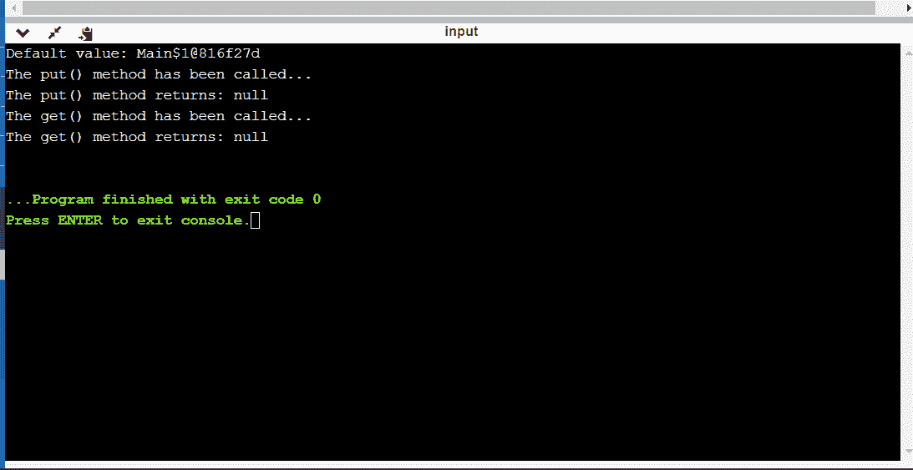

# java 中的 java.net.ResponseCache 类

> 原文:[https://www . geesforgeks . org/Java-net-response cache-class-in-Java/](https://www.geeksforgeeks.org/java-net-responsecache-class-in-java/)

java 中的 ResponseCache 用于构建 URLConnection 缓存的实现，它指定了必须缓存哪个资源，以及需要缓存资源的持续时间。

通过执行以下操作，可以使用系统创建响应缓存的实例:

> **回答。setDefault(回答)**

使用上述语句创建的实例将调用 ResponseCache 的对象，以便:

1.  用于将从外部源检索的资源数据存储到缓存中。
2.  用于应请求获取已存储在缓存中的资源。
3.  响应缓存可以通过 java.net 包导入

> **java.net。回答**

**response cache 类的方法:**

<figure class="table">

| way | describe |
| --- | --- |
| 获取(URI uri，字符串查询方法，地图< String，List<string>>查询)</string> | This method is used to retrieve the cached response according to the URI of the request, the request method and the request header. |
| getDefault（） | This method is used to retrieve system-wide cached responses. |
| put(URI uri，URLConnection conn) | Whenever a resource is retrieved, the protocol handler calls this method, and ResponseCache must decide whether to store the resource in its cache. |
| 设置默认值(响应缓存响应缓存) | This method is used to set or unset the system-level cache. |

</figure>

**response cache 类的应用:**

1.在[java.net](https://www.geeksforgeeks.org/tag/java-net-package/)包中，ResponseCache 用于实现各种网络应用的资源缓存，例如:

1.  电子邮件
2.  文件传输
3.  远程终端访问
4.  加载网页

> **java.net。回答**

2.在 java.net，响应缓存用于取出系统范围的响应缓存。

> **公共静态 ResponseCache.getDefault()**

3.在 java.net，ResponseCcahe 用于设置或取消设置系统范围的缓存。

> **公众静态视线应答。setDefault(应答应答应答)**

用于实现 java.net.ResponseCache 的 Java 程序:

## Java 语言(一种计算机语言，尤用于创建网站)

```
import java.io.IOException;
import java.net.*;
import java.util.HashMap;
import java.util.LinkedList;
import java.util.List;
import java.util.Map;
public class JavaResponseCacheExample1 {
    public static void main(String args[]) throws Exception
    {

        // passing the string uri
        String uri = "https://www.onlinegdb.com";

        // Calling the constructor of the URI class
        URI uri1 = new URI(uri);

        // passing the url
        URL url = new URL("http://www.onlinegdb.com");

        // calling the constructor of the URLConnection
        URLConnection urlcon = url.openConnection();
        ResponseCache responseCache = new ResponseCache() {
            // calling the abstract methods
            @Override
            public CacheResponse get(
                URI uri, String rqstMethod,
                Map<String, List<String> > rqstHeaders)
                throws IOException
            {
                return null;
            }

            @Override
            public CacheRequest put(URI uri,
                                    URLConnection conn)
                throws IOException
            {
                return null;
            }
        };

        // The sets the system-wide response cache.
        ResponseCache.setDefault(responseCache);

        // The getDefault() method returns
        // the system-wide ResponseCache .
        System.out.println("Default value: "
                           + ResponseCache.getDefault());
        Map<String, List<String> > maps
            = new HashMap<String, List<String> >();
        List<String> list = new LinkedList<String>();
        list.add("REema");

        // put() method sets all the applicable cookies,
        // present in the response headers into a cookie
        // cache
        maps.put("1", list);
        System.out.println(
            "The put() method has been called...");

        // The put() method returns the
        // CacheRequest for recording
        System.out.println(
            "The put() method returns: "
            + responseCache.put(uri1, urlcon));
        System.out.println(
            "The get() method has been called...");

        // The get() method returns a CacheResponse
        // instance if it is available
        System.out.println(
            "The get() method returns: "
            + responseCache.get(uri1, uri, maps));
    }
}
```

**输出:**

