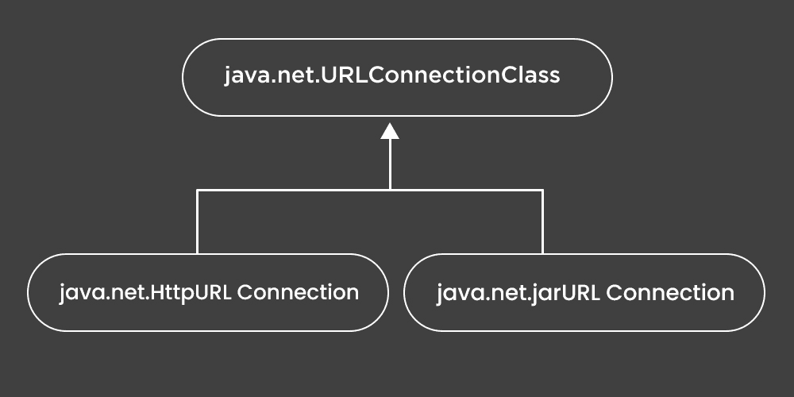

# java 中的 java.net.URLConnection 类

> 原文:[https://www . geesforgeks . org/Java-net-URL connection-class-in-Java/](https://www.geeksforgeeks.org/java-net-urlconnection-class-in-java/)

**URLConnection 类**在 Java 中是一个抽象类，表示由相应 URL 指定的资源的连接。由*java.net*包装进口。 [URLConnection 类](https://www.geeksforgeeks.org/reading-url-using-urlconnection-class/)用于服务两个不同但相关的目的，首先，它提供对与服务器(尤其是 HTTP 服务器)交互的控制，而不是 URL 类。其次，通过一个 URLConnection，我们可以检查服务器发送的报头并做出相应的响应，我们可以配置客户端请求中使用的报头字段。我们也可以使用 URLConnection 下载二进制文件。



让我们讨论一下这门课的主要方法

<figure class="table">

| 方法 | 描述 |
| --- | --- |
| 添加请求属性(字符串键，字符串值) | 此方法用于添加由键值对指定的常规请求属性。 |
| 连接() | 此方法用于建立到由 URL 指定的资源的连接，如果这种连接尚未建立的话。 |
| getAllowUserInteraction() | 此方法返回对象的 allowUserInteraction 字段。 |
| getConnectTimeout() | 此方法返回连接超时的设置。 |
| getContent() | 此方法用于检索 URLConnection 的内容。 |
| 获取内容(类[]类) | 检索此网址连接的内容。 |
| getContentEncoding() | 返回内容编码头字段的值 |
| getContentLength() | 返回内容长度标题字段的值。 |
| getContentLengthLong() | 将内容长度标头字段的值作为长整型返回。 |
| getContentType() | 返回内容类型标题字段的值 |
| getDate（） | 返回日期标题字段的值。 |
| getDefaultAllowUserInteraction() | 返回 allowUserInteraction 字段的默认值。 |
| getDefaultRequestProperty（String key） | 获取适当的 URLConnection 实例后，应使用特定于实例的 getRequestProperty 方法。 |
| getDefaultUseCaches() | 返回 URLConnection 的 useCaches 标志的默认值。 |
| getDoInput() | 返回此 URLConnection 的 doInput 标志的值。 |
| getDoOutput() | 返回此 URLConnection 的输出标志的值。 |
| getExpiration() | 返回过期标题字段的值。 |
| getFileNameMap() | 从数据文件中加载文件名映射(模拟表) |
| getHeaderField(int n) | 获取第 n 个标头字段的值。 |
| getHeaderField（String name） | 返回命名标题字段的值。 |
| getHeaderFieldDate（字符串名称，长默认值） | 返回解析为日期的命名字段的值 |
| getHeaderFieldInt(字符串名称，int Default) | 返回解析为数字的命名字段的值。 |
| getHeaderFieldKey(int n) | 返回第 n 个标题字段的键。 |
| getHeaderFieldLong（字符串名称，长默认值） | 返回解析为数字的命名字段的值。 |
| getHeaderFields() | 返回标题字段的不可修改的映射。 |
| getIfModifiedSince() | 返回此对象的 ifModifiedSince 字段的值。 |
| getInputStream() | 返回从此打开的连接读取的输入流 |
| getLastModified() | 返回上次修改的标题字段的值。 |
| getOutputStream() | 返回写入此连接的输出流 |
| getPermission() | 返回一个权限对象，该对象表示建立由该对象表示的连接所需的权限。 |
| getReadTimeout() | 返回读取超时的设置。 |
| getRequestProperties() | 返回此连接的常规请求属性的不可修改的映射 |
| getrepoint property(string key) | 返回此连接的命名常规请求属性值 |
| getURL() | 返回此网址连接的网址字段的值。 |
| getUseCaches() | 返回此 URLConnection 的 useCaches 字段的值。 |
| guessContentTypeFromName（String fname） | 尝试根据 URL 的指定“文件”组件来确定对象的内容类型 |
| guessContentTypeFromStream（InputStream is） | 尝试根据输入流开头的字符来确定输入流的类型。 |
| setAllowUserInteraction（boolean allowuserinteraction | 设置此 URLConnection 的 allowUserInteraction 字段的值 |
| setConnectTimeout(int timeout) | 设置一个指定的超时值，以毫秒为单位，在打开到此 URLConnection 引用的资源的通信链接时使用 |
| setContentHandlerFactory(ContentHandlerFactory fac) | 设置应用程序的 ContentHandlerFactory。 |
| setDefaultAllowUserInteraction（boolean defaultallowuserinteraction） | 将所有未来 URLConnection 对象的 allowUserInteraction 字段的默认值设置为指定值。 |
| setDefaultRequestProperty（String key， String value） | 获取适当的 URLConnection 实例后，应使用实例特定的 setRequestProperty 方法。调用此方法不会有任何效果。 |
| setdefaultusecache(boolean defaultusecache) | 将“使用缓存”字段的默认值设置为指定值。 |
| setDoInput（boolean doinput） | 将此 URLConnection 的 doInput 字段的值设置为指定值。 |
| setDoOutput（boolean dooutput） | 将此 URLConnection 的输出字段的值设置为指定值。 |
| setFileNameMap(FileNameMap) | 设置文件名映射。 |
| setIfModifiedSince(长 ifmodifiedsince) | 将此 URLConnection 的 ifModifiedSince 字段的值设置为指定值 |
| setReadTimeout(int 超时) | 将读取超时设置为指定的超时，以毫秒为单位 |
| 设置请求属性(字符串键，字符串值) | 设置常规请求属性 |
| setusecache(boolean usecache | 将此 URLConnection 的 useCaches 字段的值设置为指定值。 |
| toString() | 返回此网址连接的字符串表示形式。 |

</figure>

**实施:**

**例**

## Java 语言(一种计算机语言，尤用于创建网站)

```java
// Java Program to demonstrate URLConnection class

// Importing input output classes
import java.io.*;
// Importing java.net package
// consisting of all network classes
import java.net.*;

// Main class
// URLConnectionExample
public class GFG {

    // Main driver method
    public static void main(String[] args) throws Exception
    {
        // Try block to check for exceptions
        try {

            // Creating an object of URL class

            // Custom input URL is passed as an argument
            URL u = new URL("www.geeksforgeeks.com");

            // Creating an object of URLConnection class to
            // communicate between application and URL
            URLConnection urlconnect = u.openConnection();

            // Creating an object of InputStream class
            // for our application streams to be read
            InputStream stream
                = urlconnect.getInputStream();

            // Declaring an integer variable
            int i;

            // Till the time URL is being read
            while ((i = stream.read()) != -1) {

                // Continue printing the stream
                System.out.print((char)i);
            }
        }

        // Catch block to handle the exception
        catch (Exception e) {

            // Print the exception on the console
            System.out.println(e);
        }
    }
}
```

**Output**

```java
java.net.MalformedURLException: no protocol: www.geeksforgeeks.com
```