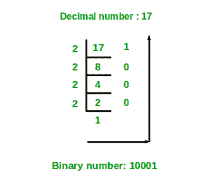

# 十进制到二进制转换的 Java 程序

> 原文:[https://www . geesforgeks . org/Java-十进制到二进制转换程序/](https://www.geeksforgeeks.org/java-program-for-decimal-to-binary-conversion/)

给定一个十进制数作为输入，我们需要编写一个程序，将给定的十进制数转换成等价的二进制数。

**示例:**

```
Input : 7
Output : 111
s
Input : 10
Output : 1010

Input: 33
Output: 100001
```

二进制到十进制的转换是将二进制中给定的数字转换成十进制中的等价数字。数字系统是以某种方式表示数字的一种格式。

**二进制数字系统–**二进制数字系统用于计算机和电子系统中表示数据，它只由 0 和 1 两个数字组成。

**十进制数制–**十进制数制是全世界最常用的数制，人们很容易理解。它由 0 到 9 的数字组成。

### 方法

在 Java 中，有许多方法可以将给定的十进制数转换成等效的二进制数。下面列出了其中的一些。

*   使用数组
*   使用按位运算符
*   使用数学幂()函数(不使用数组)

### 1.使用数组

#### **算法**:

1.  当数组中的数字被 2 除时，存储余数。
2.  把这个数除以 2
3.  重复以上两个步骤，直到数字大于零。
4.  现在以相反的顺序打印数组。

下图显示了将十进制数 17 转换为等效二进制数的示例。



## Java 语言(一种计算机语言，尤用于创建网站)

```
// Java program to convert a decimal
// number to binary number
import java.io.*;

class GFG 
{
    // function to convert decimal to binary
    static void decToBinary(int n)
    {
        // array to store binary number
        int[] binaryNum = new int[1000];

        // counter for binary array
        int i = 0;
        while (n > 0) 
        {
            // storing remainder in binary array
            binaryNum[i] = n % 2;
            n = n / 2;
            i++;
        }

        // printing binary array in reverse order
        for (int j = i - 1; j >= 0; j--)
            System.out.print(binaryNum[j]);
    }

    // driver program
    public static void main (String[] args) 
    {
        int n = 17;
          System.out.println("Decimal - " + n);
        System.out.print("Binary - ");
          decToBinary(n);
    }
}

// Contributed by Pramod Kumar
```

**Output**

```
Decimal - 17
Binary - 10001
```

### 2.使用按位运算符

我们可以使用按位运算符来完成上述工作。

> **注意–**按位运算符比上面使用的算术运算符工作更快。

## Java 语言(一种计算机语言，尤用于创建网站)

```
// Java program to Decimal to binary conversion
// using bitwise operator
// Size of an integer is assumed to be 32 bits

class gfg {
    // Function that convert Decimal to binary
    public void decToBinary(int n)
    {
        // Size of an integer is assumed to be 32 bits
        for (int i = 31; i >= 0; i--) {
            int k = n >> i;
            if ((k & 1) > 0)
                System.out.print("1");
            else
                System.out.print("0");
        }
    }
}

class geek {
    // driver code
    public static void main(String[] args)
    {
        gfg g = new gfg();
        int n = 32;
          System.out.println("Decimal - " + n);
         System.out.print("Binary - ");
        g.decToBinary(n);
    }
}
// This code is contributed by mits
```

**Output**

```
Decimal - 32
Binary - 00000000000000000000000000100000
```

### 3.使用数学幂()方法(不使用数组)

十进制到二进制的转换也可以在不使用数组的情况下完成。

## Java 语言(一种计算机语言，尤用于创建网站)

```
// Java implementation of the approach
import java.io.*;

class GFG {

    // Function to return the binary
    // equivalent of decimal value N
    static int decimalToBinary(int N)
    {

        // To store the binary number
        int B_Number = 0;
        int cnt = 0;
        while (N != 0) {
            int rem = N % 2;
            double c = Math.pow(10, cnt);
            B_Number += rem * c;
            N /= 2;

            // Count used to store exponent value
            cnt++;
        }

        return B_Number;
    }

    // Driver code
    public static void main(String[] args)
    {

        int N = 17;
          System.out.println("Decimal - " + N);
          System.out.print("Binary - ");
        System.out.println(decimalToBinary(N));
    }
}

// This code is contributed by ajit.
```

**Output**

```
Decimal - 17
Binary - 10001
```

更多详情请参考[十进制到二进制转换程序](https://www.geeksforgeeks.org/program-decimal-binary-conversion/)的完整文章！