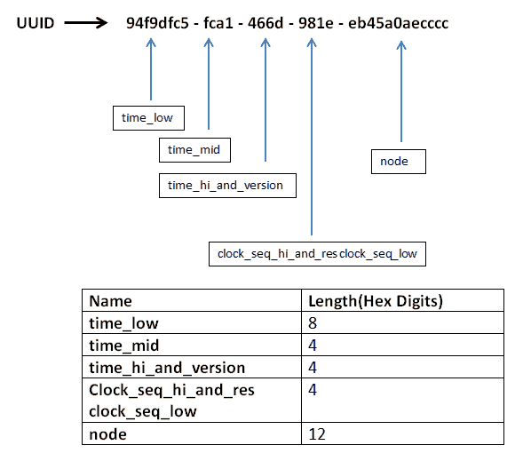

# 获取 Linux 机器系统 UUID 的 Java 程序

> 原文:[https://www . geesforgeks . org/Java-program-for-get-system-uuid-for-Linux-machine/](https://www.geeksforgeeks.org/java-program-for-getting-system-uuid-for-linux-machine/)

**通用唯一标识符(Uuid)**也称为全局唯一标识符(GUID)，它是 128 位数字，在所有本地系统上都是唯一的，它们也是在其他系统中创建的 Uuid 上创建的。Java UUID 类是 **java.util 包**的一部分。Java UUID 类代表一个不可变的通用唯一标识符。UUID 是 **8-4-4-4-12 字符**的组合。

UUID 由十六进制数字(每个 4 个字符)和 4 个“-”符号组成，这使得它的**长度等于 36 个字符**。UUID 可以将所有位设置为零，这也被称为**零 UUID**



UUID 的结构

**UUID 术语的结构**

*   **时间 _ 低:**低 32 位时间
*   **时间 _ 中间:**中间 16 位时间
*   **time _ hi _ and _ version:**MSB 中的 4 位版本，后面是时间的高 12 位
*   **clock _ seq _ hi _ and _ RES _ clock _ seq _ low:**最高有效位的 1-3 位变体，后跟 13-15 位时钟序列
*   **节点:** 48 位节点标识

**爪哇 UUID 的应用**

1.  用于创建网络应用的**会话标识**，也用于创建**交易标识**
2.  它扩展了对象类
3.  用于创建**随机文件名**
4.  实现**可序列化**和**可比较**接口
5.  用于生成数据库表的**主键**

### 生成 Java UUID 的方法

**版本 1:为基于时间的 UUID 生成节点()值**

这里，该方法从 UUID 返回节点的长值，为了获取节点值，我们需要创建一个基于时间的(版本 1) UUID。它返回与 UUID 相关联的节点值。它是一个 48 位的节点值。它保存机器的 IEEE 802 地址。

**示例:**

## Java 语言(一种计算机语言，尤用于创建网站)

```
// Java program for Generating node()
// value for time based UUID

//import UUID package
import java.util.UUID;
public class UUIDMain {
    public static void main(String arg[])
    {
        // returns a UUID with specified value
        UUID uuid = UUID.fromString("237e9877-e79b-12d4-a765-321741963000");

        // returns node value
        System.out.println("Node value: "
            + uuid.node());

      System.out.println("UUID Version : "
                           + uuid.version());
    }
}
```

**Output**

```
Node value: 55075465998336
UUID Version : 1
```

**版本 2:基于名称的 UUID**

静态工厂方法，用于使用指定的字节数组获取基于名称的 UUID。它使用了可以想象到的广播意义上的“名字”和一个 UUID 来表示所使用的名字的类型。

**示例:**

## Java 语言(一种计算机语言，尤用于创建网站)

```
// Java program for generating Name based UUID

import java.util.UUID;
public class Main {

    public static void main(String[] args)
    {

        // initialize byte array
        byte[] bs = { 1, 2, 3 };

        // initialize uuid using byte array
        UUID uuid = UUID.nameUUIDFromBytes(bs);

        System.out.println("UUID : " + uuid);
        System.out.println("UUID Version : "
                           + uuid.version());
    }
}
```

**Output**

```
UUID : 5289df73-7df5-3326-bcdd-22597afb1fac
UUID Version : 3
```

**UUID 换 Linux 机**

以上两种方法可以用来为 Linux 系统生成 UUID。要为 Linux 机器生成系统 UUID，在生成 UUID 之前需要一些先决条件。

*   应该安装 Java 开发工具包(JDK)，最新版本在这里会更好
*   需要设置 Vim 或 Gedit 编辑器来编译和运行代码。
*   编译、保存、运行和编辑程序所需的 Vim 编辑器的基础知识。
*   在 Linux 命令的帮助下在 Vim 编辑器和 Linux 内核/终端中运行代码的知识。

对于下面给出的代码，Vim Editor 用于编译和运行程序。UUID 是分区中使用的唯一标识符，用于在 Linux 操作系统中唯一标识分区。UUID 是磁盘分区本身的属性。

在下面的代码中，我们导入了缓冲区读取器和输入流读取器包，然后我们在 String 方法的帮助下生成一个随机的 UUID，以从其中获取输入并生成 UUID。

## Java 语言(一种计算机语言，尤用于创建网站)

```
// Java Program to get System UUID Number for linux Machine
// (Root User Login is Req for running the code)

import java.io.BufferedReader;
import java.io.InputStreamReader;

public class Main {

    // Method for get System UUID for Linux Machine
    static String getLinuxSystem_UUID()
    {
        String command = "dmidecode -s system-uuid";

        // setting uuid to null first
        String uuid = null;
        try {
            Process SerNumProcess
                = Runtime.getRuntime().exec(command);
            BufferedReader sNumReader
                = new BufferedReader(new InputStreamReader(
                    SerNumProcess.getInputStream()));

            // reads the uuid line by line to separate the
            // uuid into 4 parts
            uuid = sNumReader.readLine().trim();

            SerNumProcess.waitFor();
            sNumReader.close();
        }
        catch (Exception ex) {
            System.err.println("Linux UUID Exp : "
                               + ex.getMessage());
            uuid = null;
        }
        finally {
            return uuid;
        }
    }

    public static void main(String[] args)
    {
        // generates uuid for linux system
        String system_uuid = getLinuxSystem_UUID();

        System.out.println("Linux System UUID Number : "
                           + system_uuid);
    }
}
```

**输出:**


面向 Linux 机器的系统 UUID